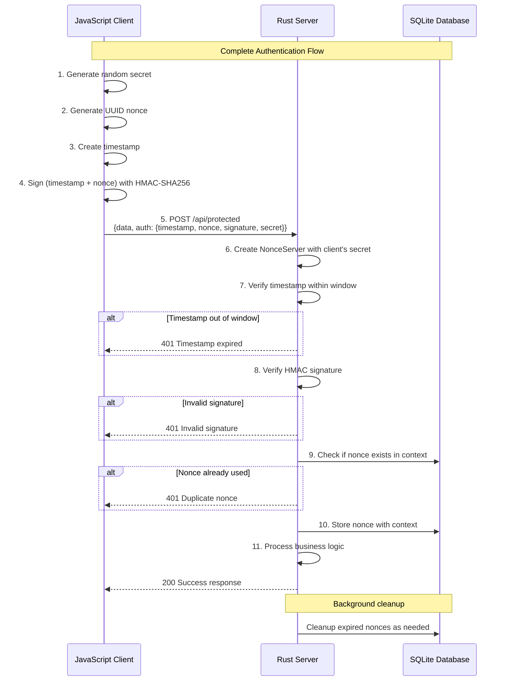

# Nonce Auth

[](https://github.com/USERNAME/nonce-auth/actions)
[](https://codecov.io/github/kookyleo/nonce-auth)
[](https://crates.io/crates/nonce-auth)
[](https://docs.rs/nonce-auth)
[](https://github.com/USERNAME/nonce-auth#license)

A Rust-based secure nonce authentication library that provides one-time token (nonce) generation, signing, and verification functionality to effectively prevent replay attacks.

## Features

- 🔐 **HMAC-SHA256 Signing** - Cryptographic signing of requests using shared secrets
- ⏰ **Timestamp Window Validation** - Prevents replay attacks from expired requests
- 🔑 **One-time Nonce** - Ensures each nonce can only be used once
- 💾 **SQLite Persistence** - Automatic nonce storage and cleanup management
- 🎯 **Context Isolation** - Support for nonce isolation across different business scenarios
- 🚀 **Async Support** - Fully asynchronous API design
- 🛡️ **Security Protection** - Constant-time comparison to prevent timing attacks
- 📦 **Client-Server Separation** - Clean separation of client and server responsibilities

## Architecture

### Client-Server Separation Design

The library provides two independent managers for clear separation of responsibilities:

#### `NonceClient` - Client-side Manager
- Responsible for generating signed requests
- No database dependencies required
- Lightweight design suitable for client-side use

#### `NonceServer` - Server-side Manager  
- Responsible for verifying signed requests
- Manages nonce storage and cleanup
- Includes timestamp validation and replay attack prevention

#### `NonceManager` - Unified Manager (Backward Compatible)
- Contains both client and server functionality
- Suitable for monolithic applications or simple scenarios

### Parameter Explanation

- `default_ttl`: Nonce time-to-live, representing the duration from generation to expiration, defaults to 5 minutes
- `time_window`: Timestamp validation window, defaults to 1 minute

Both work together to prevent replay attacks.

### Important Notes

- The server uses local SQLite for nonce persistence, please consider using with connection sticky policies

## Quick Start

### Add Dependencies

```toml
[dependencies]
nonce-auth = "0.1.0"
tokio = { version = "1", features = ["full"] }
serde = { version = "1.0", features = ["derive"] }
serde_json = "1.0"
```

### Complete Client-Server Example

#### JavaScript Client

```javascript
// client.js
import crypto from 'crypto';

class NonceClient {
    constructor(secret) {
        this.secret = secret;
    }

    createSignedRequest() {
        const timestamp = Math.floor(Date.now() / 1000);
        const nonce = crypto.randomUUID();
        const signature = this.sign(timestamp.toString(), nonce);
        
        return {
            timestamp,
            nonce,
            signature,
            secret: this.secret // Include secret for server verification
        };
    }

    sign(timestamp, nonce) {
        const hmac = crypto.createHmac('sha256', this.secret);
        hmac.update(timestamp);
        hmac.update(nonce);
        return hmac.digest('hex');
    }
}

// Usage example
async function makeAuthenticatedRequest() {
    // Generate a random secret for this session
    const secret = crypto.randomBytes(32).toString('hex');
    const client = new NonceClient(secret);
    
    const signedRequest = client.createSignedRequest();
    
    try {
        const response = await fetch('http://localhost:3000/api/protected', {
            method: 'POST',
            headers: {
                'Content-Type': 'application/json',
            },
            body: JSON.stringify({
                data: 'Hello, secure world!',
                auth: signedRequest
            })
        });
        
        const result = await response.json();
        console.log('Server response:', result);
    } catch (error) {
        console.error('Request failed:', error);
    }
}

makeAuthenticatedRequest();
```

#### Rust Server

```rust
// server.rs
use nonce_auth::NonceServer;
use serde::{Deserialize, Serialize};
use std::time::Duration;
use warp::Filter;

#[derive(Deserialize)]
struct AuthenticatedRequest {
    data: String,
    auth: AuthData,
}

#[derive(Deserialize)]
struct AuthData {
    timestamp: u64,
    nonce: String,
    signature: String,
    secret: String,
}

#[derive(Serialize)]
struct ApiResponse {
    success: bool,
    message: String,
    data: Option<String>,
}

#[tokio::main]
async fn main() {
    // Initialize the nonce server database
    NonceServer::init().await.expect("Failed to initialize database");

    let protected_route = warp::path("api")
        .and(warp::path("protected"))
        .and(warp::post())
        .and(warp::body::json())
        .and_then(handle_protected_request);

    let cors = warp::cors()
        .allow_any_origin()
        .allow_headers(vec!["content-type"])
        .allow_methods(vec!["POST"]);

    println!("Server running on http://localhost:3000");
    
    warp::serve(protected_route.with(cors))
        .run(([127, 0, 0, 1], 3000))
        .await;
}

async fn handle_protected_request(
    req: AuthenticatedRequest,
) -> Result<impl warp::Reply, warp::Rejection> {
    // Create server with client's secret
    let server = NonceServer::new(
        req.auth.secret.as_bytes(),
        Some(Duration::from_secs(300)), // 5 minutes TTL
        Some(Duration::from_secs(60)),  // 1 minute time window
    );

    // Create signed request from auth data
    let signed_request = nonce_auth::SignedRequest {
        timestamp: req.auth.timestamp,
        nonce: req.auth.nonce,
        signature: req.auth.signature,
    };

    // Verify the request
    match server.verify_signed_request(&signed_request, Some("api_call")).await {
        Ok(()) => {
            let response = ApiResponse {
                success: true,
                message: "Request authenticated successfully".to_string(),
                data: Some(format!("Processed: {}", req.data)),
            };
            Ok(warp::reply::json(&response))
        }
        Err(e) => {
            let response = ApiResponse {
                success: false,
                message: format!("Authentication failed: {:?}", e),
                data: None,
            };
            Ok(warp::reply::json(&response))
        }
    }
}
```

### Simple Usage (Client-Server Separation)

```rust
use std::time::Duration;
use nonce_auth::{NonceClient, NonceServer};

#[tokio::main]
async fn main() -> Result<(), Box<dyn std::error::Error>> {
    // Shared secret between client and server
    let secret = b"your_secure_secret_key_here";

    // Initialize server
    NonceServer::init().await?;
    let server = NonceServer::new(
        secret,
        Some(Duration::from_secs(300)), // 5 minutes nonce TTL
        Some(Duration::from_secs(60)),  // 1 minute timestamp validation window
    );

    // Initialize client
    let client = NonceClient::new(secret);

    // Client generates signed request
    let signed_request = client.create_signed_request()?;
    println!("Generated signed request: {:?}", signed_request);
    
    // Server verifies signed request
    match server.verify_signed_request(&signed_request, None).await {
        Ok(()) => println!("✅ Request verified successfully"),
        Err(e) => println!("❌ Verification failed: {}", e),
    }

    // Try to reuse the same nonce (should fail)
    match server.verify_signed_request(&signed_request, None).await {
        Ok(()) => println!("❌ This should not happen - nonce reuse detected"),
        Err(e) => println!("✅ Correctly rejected duplicate nonce: {:?}", e),
    }

    Ok(())
}
```

## Example Authentication Flow Sequence Diagram



## API Documentation

### NonceClient

#### Constructor

```rust
pub fn new(secret: &[u8]) -> Self
```

- `secret`: Secret key used for signing

#### Methods

##### Create Signed Request

```rust
pub fn create_signed_request(&self) -> Result<SignedRequest, NonceError>
```

Generates a complete request containing timestamp, nonce, and signature.

##### Sign

```rust
pub fn sign(&self, timestamp: &str, nonce: &str) -> Result<String, NonceError>
```

Generates HMAC-SHA256 signature for given timestamp and nonce.

### NonceServer

#### Constructor

```rust
pub fn new(
    secret: &[u8], 
    default_ttl: Option<Duration>, 
    time_window: Option<Duration>
) -> Self
```

- `secret`: Secret key used for verification
- `default_ttl`: Default nonce expiration time (default: 5 minutes)
- `time_window`: Allowed time window for timestamp validation (default: 1 minute)

#### Methods

##### Verify Signed Request

```rust
pub async fn verify_signed_request(
    &self, 
    request: &SignedRequest, 
    context: Option<&str>
) -> Result<(), NonceError>
```

Verifies request integrity including time window, nonce validity, and signature correctness.

##### Initialize Database

```rust
pub async fn init() -> Result<(), NonceError>
```

Creates necessary database tables and indexes.

### SignedRequest

```rust
pub struct SignedRequest {
    pub timestamp: u64,    // Unix timestamp
    pub nonce: String,     // UUID format one-time token
    pub signature: String, // HMAC-SHA256 signature
}
```

### Error Types

```rust
pub enum NonceError {
    DuplicateNonce,         // Nonce already used
    ExpiredNonce,           // Nonce expired
    InvalidSignature,       // Invalid signature
    TimestampOutOfWindow,   // Timestamp outside allowed window
    DatabaseError(String),  // Database error
    CryptoError(String),    // Cryptographic error
}
```

## Typical Use Cases

### 1. API Authentication
- Client first obtains authentication token
- Uses token to access protected APIs
- Each token can only be used once

### 2. Form Submission Protection
- Generate nonce when rendering form
- Verify nonce when submitting
- Prevents duplicate form submissions

### 3. Microservice Authentication
- Service A generates nonce for requests
- Service B verifies requests from Service A
- Ensures request uniqueness and authenticity

### 4. Session-based Authentication
- Client generates random secret per session
- Server verifies requests using client's secret
- Provides stateless authentication

## Security Features

### Replay Attack Prevention

1. **Time Window Limitation**: Only accepts requests within specified time window
2. **One-time Nonce**: Each nonce is deleted after verification, ensuring no reuse
3. **Context Isolation**: Nonces from different business scenarios are isolated

### Timing Attack Prevention

- Uses constant-time comparison algorithms for signature verification

### Cryptographic Strength

- Uses HMAC-SHA256 algorithm to ensure signature integrity and authenticity
- Supports custom secret key lengths

## Performance Optimization

- Automatic background cleanup of expired nonce records
- Database index optimization for query performance
- Asynchronous design supports high-concurrency scenarios

## Dependencies

- `hmac` - HMAC signing
- `sha2` - SHA256 hashing
- `turbosql` - SQLite ORM
- `uuid` - UUID generation
- `serde` - Serialization support
- `tokio` - Async runtime
- `thiserror` - Error handling

## License

MIT OR Apache-2.0

## Contributing

Issues and Pull Requests are welcome!
