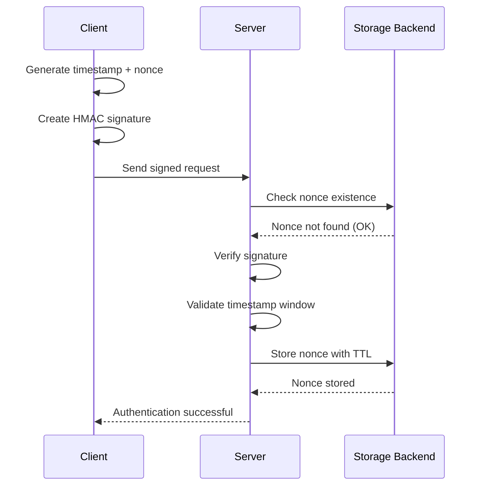
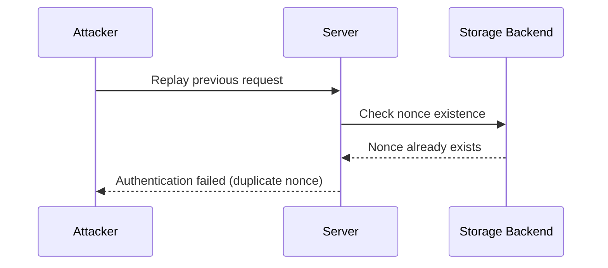

# Nonce Auth

[](https://github.com/kookyleo/nonce-auth/actions)
[](https://codecov.io/github/kookyleo/nonce-auth)
[](https://crates.io/crates/nonce-auth)
[](https://docs.rs/nonce-auth)
[](https://github.com/kookyleo/nonce-auth#license)

A Rust-based secure nonce authentication library that provides generation, signing, and validation of one-time tokens (nonces) to effectively prevent replay attacks.

## Features

- 🔐 **HMAC-SHA256 Signing** - Cryptographic signing of requests using shared keys
- ⏰ **Time Window Validation** - Prevents replay attacks from expired requests
- 🔑 **One-time Nonce** - Ensures each nonce can only be used once
- 💾 **Pluggable Storage** - Support for memory, SQLite, Redis, or custom storage backends
- 🎯 **Context Isolation** - Support for isolated nonces across different business scenarios
- 🚀 **Async Support** - Fully asynchronous API design
- 🛡️ **Security Protection** - Constant-time comparison to prevent timing attacks
- 📦 **Client-Server Separation** - Clear separation of client and server responsibilities
- 🔧 **Flexible Signature Algorithms** - Customizable signature data construction through closures

## Architecture

### Client-Server Separation Design

The library provides two independent managers with clear separation of responsibilities:

#### `NonceClient` - Client Manager
- Responsible for generating signed authentication data
- No database dependencies required
- Lightweight design suitable for client-side use
- Flexible signature algorithms through closures

#### `NonceServer` - Server Manager
- Responsible for verifying signed authentication data
- Manages nonce storage and cleanup with pluggable backends
- Includes timestamp validation and replay attack prevention mechanisms
- Supports context isolation for different business scenarios

### Parameters

- `default_ttl`: Validity period of nonce, time from generation to expiration, default 5 minutes
- `time_window`: Timestamp validation window, default 1 minute

Both work together to prevent replay attacks.

### Notes

- The server uses pluggable storage backends - choose the appropriate backend for your deployment scenario
- Signature algorithms are fully customizable through closures for maximum flexibility

## Quick Start

### Add Dependencies

```toml
[dependencies]
nonce-auth = "0.4.0"
tokio = { version = "1", features = ["full"] }
serde = { version = "1.0", features = ["derive"] }
serde_json = "1.0"
warp = "0.3"
hmac = "0.12"
```

### Simple Usage Example

```rust
use hmac::Mac;
use nonce_auth::{NonceClient, NonceServer, storage::MemoryStorage};
use std::sync::Arc;
use std::time::Duration;

#[tokio::main]
async fn main() -> Result<(), Box<dyn std::error::Error>> {
    // Pre-shared key between client and server
    let psk = b"my-secret-key";

    // Create storage backend
    let storage = Arc::new(MemoryStorage::new());
    
    // Initialize server
    let server = NonceServer::new(
        psk,
        storage,
        Some(Duration::from_secs(300)), // 5 minutes nonce storage TTL
        Some(Duration::from_secs(60)),  // 1 minute timestamp validation window
    );
    
    // Initialize the server
    server.init().await?;

    // Initialize client
    let client = NonceClient::new(psk);

    // Client generates authentication data with custom signature (timestamp + nonce)
    let protection_data = client.create_protection_data(|mac, timestamp, nonce| {
        mac.update(timestamp.as_bytes());
        mac.update(nonce.as_bytes());
    })?;
    println!("Generated protection data: {protection_data:?}");

    // Server verifies authentication data using matching signature algorithm
    match server
        .verify_protection_data(&protection_data, None, |mac| {
            mac.update(protection_data.timestamp.to_string().as_bytes());
            mac.update(protection_data.nonce.as_bytes());
        })
        .await
    {
        Ok(()) => println!("✅ Authentication verification successful"),
        Err(e) => println!("❌ Authentication verification failed: {e:?}"),
    }

    // Try to use the same nonce again (should fail)
    match server
        .verify_protection_data(&protection_data, None, |mac| {
            mac.update(protection_data.timestamp.to_string().as_bytes());
            mac.update(protection_data.nonce.as_bytes());
        })
        .await
    {
        Ok(()) => println!("❌ This should not happen - nonce reuse detected"),
        Err(e) => println!("✅ Correctly rejected duplicate nonce: {e:?}"),
    }

    Ok(())
}
```

### Complete Web Application Example

#### JavaScript Client

```javascript
// client.js
class NonceClient {
    constructor(psk) {
        this.psk = new TextEncoder().encode(psk);
        this.lastRequest = null;
    }

    async createSignedRequest(message) {
        const timestamp = Math.floor(Date.now() / 1000);
        const nonce = this.generateUUID();
        const signature = await this.sign(timestamp.toString(), nonce, message);
        
        const request = {
            timestamp,
            nonce,
            signature
        };
        
        // Save last request for replay testing
        this.lastRequest = { message, auth: {...request} };
        
        return {
            payload: message,
            session_id: sessionId, // From server-embedded variable
            auth: request
        };
    }

    async sign(timestamp, nonce, message) {
        try {
            const key = await crypto.subtle.importKey(
                'raw',
                this.psk,
                { name: 'HMAC', hash: 'SHA-256' },
                false,
                ['sign']
            );
            
            const data = new TextEncoder().encode(timestamp + nonce + message);
            const signature = await crypto.subtle.sign('HMAC', key, data);
            
            return Array.from(new Uint8Array(signature))
                .map(b => b.toString(16).padStart(2, '0'))
                .join('');
        } catch (error) {
            console.error('Signature failed:', error);
            throw error;
        }
    }

    generateUUID() {
        return 'xxxxxxxx-xxxx-4xxx-yxxx-xxxxxxxxxxxx'.replace(/[xy]/g, function(c) {
            const r = Math.random() * 16 | 0;
            const v = c === 'x' ? r : (r & 0x3 | 0x8);
            return v.toString(16);
        });
    }
}

// Usage example
async function makeAuthenticatedRequest() {
    const client = new NonceClient(currentPsk); // PSK embedded from server
    const message = "Hello, secure world!";
    
    try {
        const requestData = await client.createSignedRequest(message);
        
        const response = await fetch('/api/protected', {
            method: 'POST',
            headers: {
                'Content-Type': 'application/json',
            },
            body: JSON.stringify(requestData)
        });
        
        if (response.ok) {
            const result = await response.json();
            console.log('Response:', result);
        } else {
            console.error('Request failed:', response.status);
        }
    } catch (error) {
        console.error('Request error:', error);
    }
}
```

#### Rust Server

```rust
// server.rs
use nonce_auth::{NonceServer, storage::MemoryStorage};
use std::sync::Arc;
use warp::Filter;
use serde::{Deserialize, Serialize};
use hmac::Mac;

#[derive(Deserialize)]
struct AuthData {
    timestamp: u64,
    nonce: String,
    signature: String,
}

#[derive(Deserialize)]
struct ProtectedRequest {
    payload: String,
    session_id: String,
    auth: AuthData,
}

#[derive(Serialize)]
struct ApiResponse {
    success: bool,
    message: String,
    echo: Option<String>,
}

#[tokio::main]
async fn main() {
    // Create storage backend (you can use SQLite, Redis, etc.)
    let storage = Arc::new(MemoryStorage::new());
    
    // Create server
    let server = NonceServer::new(
        b"shared-secret-key",
        storage,
        None, // Use default TTL
        None, // Use default time window
    );
    
    // Initialize server
    server.init().await.expect("Failed to initialize server");
    
    let server = Arc::new(server);

    // Create API route
    let api = warp::path("api")
        .and(warp::path("protected"))
        .and(warp::post())
        .and(warp::body::json())
        .and(warp::any().map(move || server.clone()))
        .and_then(handle_protected_request);

    // Start server
    println!("Server running on http://127.0.0.1:3030");
    warp::serve(api)
        .run(([127, 0, 0, 1], 3030))
        .await;
}

async fn handle_protected_request(
    req: ProtectedRequest,
    server: Arc<NonceServer<MemoryStorage>>,
) -> Result<impl warp::Reply, warp::Rejection> {
    // Create protection data from request
    let protection_data = nonce_auth::ProtectionData {
        timestamp: req.auth.timestamp,
        nonce: req.auth.nonce,
        signature: req.auth.signature,
    };

    // Verify authentication data
    match server.verify_protection_data(&protection_data, Some(&req.session_id), |mac| {
        mac.update(protection_data.timestamp.to_string().as_bytes());
        mac.update(protection_data.nonce.as_bytes());
        mac.update(req.payload.as_bytes());
    }).await {
        Ok(()) => {
            let response = ApiResponse {
                success: true,
                message: "Authentication successful".to_string(),
                echo: Some(req.payload),
            };
            Ok(warp::reply::json(&response))
        }
        Err(e) => {
            let response = ApiResponse {
                success: false,
                message: format!("Authentication failed: {e}"),
                echo: None,
            };
            Ok(warp::reply::json(&response))
        }
    }
}
```

## Storage Backends

The library supports multiple storage backends through the `NonceStorage` trait:

### Built-in Storage Backends

#### Memory Storage
```rust
use nonce_auth::storage::MemoryStorage;
use std::sync::Arc;

let storage = Arc::new(MemoryStorage::new());
```

**Features:**
- Fast in-memory storage using HashMap
- Thread-safe with Arc<Mutex<HashMap>>
- Suitable for single-instance applications
- No persistence across restarts

### Custom Storage Backends

#### SQLite Storage
See `examples/sqlite_storage.rs` for a complete implementation:

```rust
use nonce_auth::examples::SqliteStorage;
use std::sync::Arc;

let storage = Arc::new(SqliteStorage::new("nonce_auth.db")?);
```

#### Redis Storage (Example)
```rust
// You can implement Redis storage similarly
pub struct RedisStorage {
    client: redis::Client,
}

#[async_trait]
impl NonceStorage for RedisStorage {
    // Implementation details...
}
```

## Sequence Diagrams

### Authentication Flow



### Replay Attack Prevention



## Configuration

### Environment Variables

```bash
# Security Configuration
export NONCE_AUTH_DEFAULT_TTL=300                  # Default TTL (seconds)
export NONCE_AUTH_DEFAULT_TIME_WINDOW=60           # Time window (seconds)
```

### Programmatic Configuration

```rust
use nonce_auth::{NonceServer, storage::MemoryStorage};
use std::sync::Arc;
use std::time::Duration;

let storage = Arc::new(MemoryStorage::new());
let server = NonceServer::new(
    b"your-secret-key",
    storage,
    Some(Duration::from_secs(600)),  // Custom TTL
    Some(Duration::from_secs(120)),  // Custom time window
);
```

## Error Types

```rust
pub enum NonceError {
    DuplicateNonce,         // Nonce already used
    ExpiredNonce,           // Nonce expired
    InvalidSignature,       // Invalid signature
    TimestampOutOfWindow,   // Timestamp outside allowed window
    DatabaseError(String),  // Storage backend error
    CryptoError(String),    // Cryptographic error
}
```

## Typical Use Cases

### 1. API Authentication
- Client generates authentication data for each request
- Server verifies each request independently
- Each authentication data can only be used once

### 2. Form Submission Protection
- Generate authentication data when rendering form
- Verify authentication data when submitting
- Prevents duplicate form submissions

### 3. Microservice Authentication
- Service A generates authentication data for requests
- Service B verifies requests from Service A
- Ensures request uniqueness and authenticity

### 4. Session-based Authentication
- Server generates random PSK per session
- Client uses session PSK for all requests
- Provides stateless authentication with session isolation

## Security Features

### Replay Attack Prevention

1. **Time Window Limitation**: Only accepts requests within specified time window
2. **One-time Nonce**: Each nonce is deleted after verification, ensuring no reuse
3. **Context Isolation**: Nonces from different business scenarios are isolated

### Timing Attack Prevention

- Uses constant-time comparison algorithms for signature verification

### Cryptographic Strength

- Uses HMAC-SHA256 algorithm to ensure signature integrity and authenticity
- Supports custom secret key lengths
- Flexible signature algorithms through closures

## Performance Optimization

- Automatic background cleanup of expired nonce records
- Pluggable storage backends for optimal performance
- Asynchronous design supports high-concurrency scenarios

## Dependencies

- `hmac` - HMAC signing
- `sha2` - SHA256 hashing
- `uuid` - UUID generation
- `async-trait` - Async trait support
- `tokio` - Async runtime

Storage backends may have additional dependencies (e.g., `rusqlite` for SQLite storage).

## License

Licensed under either of

- Apache License, Version 2.0 ([LICENSE-APACHE](LICENSE-APACHE) or http://www.apache.org/licenses/LICENSE-2.0)
- MIT license ([LICENSE-MIT](LICENSE-MIT) or http://opensource.org/licenses/MIT)

at your option.
