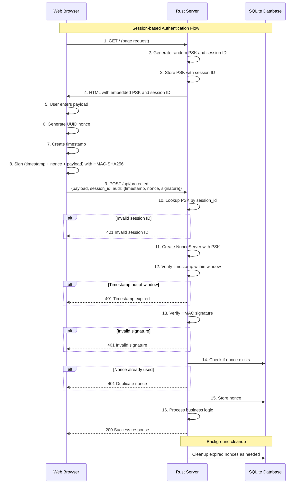

# Nonce Auth

[](https://github.com/kookyleo/nonce-auth/actions)
[](https://codecov.io/github/kookyleo/nonce-auth)
[](https://crates.io/crates/nonce-auth)
[](https://docs.rs/nonce-auth)
[](https://github.com/kookyleo/nonce-auth#license)

A Rust-based secure nonce authentication library that provides one-time token (nonce) generation, signing, and verification functionality to effectively prevent replay attacks.

## Features

- 🔐 **HMAC-SHA256 Signing** - Cryptographic signing of requests using shared secrets
- ⏰ **Timestamp Window Validation** - Prevents replay attacks from expired requests
- 🔑 **One-time Nonce** - Ensures each nonce can only be used once
- 💾 **SQLite Persistence** - Automatic nonce storage and cleanup management
- 🎯 **Context Isolation** - Support for nonce isolation across different business scenarios
- 🚀 **Async Support** - Fully asynchronous API design
- 🛡️ **Security Protection** - Constant-time comparison to prevent timing attacks
- 📦 **Client-Server Separation** - Clean separation of client and server responsibilities
- 🔧 **Flexible Signature Algorithm** - Customizable signature data construction

## Architecture

### Client-Server Separation Design

The library provides two independent managers for clear separation of responsibilities:

#### `NonceClient` - Client-side Manager
- Responsible for generating signed authentication data
- No database dependencies required
- Lightweight design suitable for client-side use
- Flexible signature algorithm through closures

#### `NonceServer` - Server-side Manager  
- Responsible for verifying signed authentication data
- Manages nonce storage and cleanup
- Includes timestamp validation and replay attack prevention
- Supports context isolation for different business scenarios

### Parameter Explanation

- `default_ttl`: Nonce time-to-live, representing the duration from generation to expiration, defaults to 5 minutes
- `time_window`: Timestamp validation window, defaults to 1 minute

Both work together to prevent replay attacks.

### Important Notes

- The server uses local SQLite for nonce persistence, please consider using with connection sticky policies
- Signature algorithms are fully customizable through closures for maximum flexibility

## Quick Start

### Add Dependencies

```toml
[dependencies]
nonce-auth = "0.1.9"
tokio = { version = "1", features = ["full"] }
serde = { version = "1.0", features = ["derive"] }
serde_json = "1.0"
warp = "0.3"
hmac = "0.12"
```

### Simple Usage Example

```rust
use hmac::Mac;
use nonce_auth::{NonceClient, NonceServer};
use std::time::Duration;

#[tokio::main]
async fn main() -> Result<(), Box<dyn std::error::Error>> {
    // Pre-shared key between client and server
    let psk = b"my-secret-key";

    // Initialize server
    NonceServer::init().await?;
    let server = NonceServer::new(
        psk,
        Some(Duration::from_secs(300)), // 5 minutes TTL for nonce storage
        Some(Duration::from_secs(60)),  // 1 minute time window for timestamp validation
    );

    // Initialize client
    let client = NonceClient::new(psk);

    // Client generates authentication data with custom signature (timestamp + nonce)
    let auth_data = client.create_auth_data(|mac, timestamp, nonce| {
        mac.update(timestamp.as_bytes());
        mac.update(nonce.as_bytes());
    })?;
    println!("Generated authentication data: {auth_data:?}");

    // Server verifies the authentication data with matching signature algorithm
    match server
        .verify_auth_data(&auth_data, None, |mac| {
            mac.update(auth_data.timestamp.to_string().as_bytes());
            mac.update(auth_data.nonce.as_bytes());
        })
        .await
    {
        Ok(()) => println!("✅ Authentication verified successfully"),
        Err(e) => println!("❌ Authentication verification failed: {e:?}"),
    }

    // Try to use the same nonce again (should fail)
    match server
        .verify_auth_data(&auth_data, None, |mac| {
            mac.update(auth_data.timestamp.to_string().as_bytes());
            mac.update(auth_data.nonce.as_bytes());
        })
        .await
    {
        Ok(()) => println!("❌ This should not happen - nonce reuse detected"),
        Err(e) => println!("✅ Correctly rejected duplicate nonce: {e:?}"),
    }

    Ok(())
}
```

### Complete Web Application Example

#### JavaScript Client

```javascript
// client.js
class NonceClient {
    constructor(psk) {
        this.psk = new TextEncoder().encode(psk);
        this.lastRequest = null;
    }

    async createSignedRequest(message) {
        const timestamp = Math.floor(Date.now() / 1000);
        const nonce = this.generateUUID();
        const signature = await this.sign(timestamp.toString(), nonce, message);
        
        const request = {
            timestamp,
            nonce,
            signature
        };
        
        // Save the last request for repeating
        this.lastRequest = { message, auth: {...request} };
        
        return {
            payload: message,
            session_id: sessionId, // From server-embedded variable
            auth: request
        };
    }

    async sign(timestamp, nonce, message) {
        try {
            const key = await crypto.subtle.importKey(
                'raw',
                this.psk,
                { name: 'HMAC', hash: 'SHA-256' },
                false,
                ['sign']
            );
            
            const data = new TextEncoder().encode(timestamp + nonce + message);
            const signature = await crypto.subtle.sign('HMAC', key, data);
            
            return Array.from(new Uint8Array(signature))
                .map(b => b.toString(16).padStart(2, '0'))
                .join('');
        } catch (error) {
            console.error('Signing failed:', error);
            throw error;
        }
    }

    generateUUID() {
        return 'xxxxxxxx-xxxx-4xxx-yxxx-xxxxxxxxxxxx'.replace(/[xy]/g, function(c) {
            const r = Math.random() * 16 | 0;
            const v = c === 'x' ? r : (r & 0x3 | 0x8);
            return v.toString(16);
        });
    }
}

// Usage example
async function makeAuthenticatedRequest() {
    const client = new NonceClient(currentPsk); // PSK embedded from server
    const message = "Hello, secure world!";
    
    try {
        const requestData = await client.createSignedRequest(message);
        
        const response = await fetch('/api/protected', {
            method: 'POST',
            headers: {
                'Content-Type': 'application/json',
            },
            body: JSON.stringify(requestData)
        });
        
        const result = await response.json();
        console.log('Server response:', result);
    } catch (error) {
        console.error('Request failed:', error);
    }
}
```

#### Rust Server

```rust
// server.rs
use hmac::Mac;
use nonce_auth::NonceServer;
use serde::{Deserialize, Serialize};
use std::collections::HashMap;
use std::sync::Arc;
use std::time::Duration;
use warp::Filter;

#[derive(Deserialize)]
struct AuthenticatedRequest {
    payload: String,
    session_id: String,
    auth: nonce_auth::AuthData,
}

#[derive(Serialize)]
struct ApiResponse {
    success: bool,
    message: String,
    data: Option<String>,
}

// Store PSKs for each session
type PskStore = Arc<std::sync::Mutex<HashMap<String, String>>>;

#[tokio::main]
async fn main() {
    // Initialize the nonce server database
    NonceServer::init()
        .await
        .expect("Failed to initialize database");

    // Create PSK store
    let psk_store: PskStore = Arc::new(std::sync::Mutex::new(HashMap::new()));

    // Serve index.html at the root path with embedded PSK
    let psk_store_filter = warp::any().map(move || psk_store.clone());
    let index_route = warp::path::end()
        .and(psk_store_filter.clone())
        .and_then(handle_index_request);

    // Protected API route
    let protected_route = warp::path("api")
        .and(warp::path("protected"))
        .and(warp::post())
        .and(warp::body::json())
        .and(psk_store_filter)
        .and_then(handle_protected_request);

    // Combine routes
    let routes = index_route.or(protected_route).with(
        warp::cors()
            .allow_any_origin()
            .allow_headers(vec!["content-type"])
            .allow_methods(vec!["GET", "POST"]),
    );

    println!("Server running on http://localhost:3000");
    println!("Open this URL in your browser to test the authentication");
    println!("Each page refresh will generate a new PSK");

    warp::serve(routes).run(([127, 0, 0, 1], 3000)).await;
}

async fn handle_protected_request(
    req: AuthenticatedRequest,
    psk_store: PskStore,
) -> Result<impl warp::Reply, warp::Rejection> {
    // Get the PSK from store using session ID
    let psk = {
        let store = psk_store.lock().unwrap();
        println!("Looking for session ID: {}", req.session_id);
        store.get(&req.session_id).cloned()
    };

    let psk = match psk {
        Some(psk) => psk,
        None => {
            let response = ApiResponse {
                success: false,
                message: "Invalid session ID. Please refresh the page.".to_string(),
                data: None,
            };
            return Ok(warp::reply::json(&response));
        }
    };

    // Create server with PSK
    let server = NonceServer::new(
        psk.as_bytes(),
        Some(Duration::from_secs(60)), // 1 minute TTL
        Some(Duration::from_secs(15)), // 15 seconds time window
    );

    // Verify the request with custom signature including payload
    match server
        .verify_auth_data(&req.auth, None, |mac| {
            mac.update(req.auth.timestamp.to_string().as_bytes());
            mac.update(req.auth.nonce.as_bytes());
            mac.update(req.payload.as_bytes());
        })
        .await
    {
        Ok(()) => {
            let response = ApiResponse {
                success: true,
                message: "Request authenticated successfully".to_string(),
                data: Some(format!("Processed: {}", req.payload)),
            };
            Ok(warp::reply::json(&response))
        }
        Err(e) => {
            let response = ApiResponse {
                success: false,
                message: format!("Authentication failed: {e:?}"),
                data: None,
            };
            Ok(warp::reply::json(&response))
        }
    }
}
```

## Example Authentication Flow Sequence Diagram



## API Documentation

### NonceClient

#### Constructor

```rust
pub fn new(secret: &[u8]) -> Self
```

- `secret`: Secret key used for signing

#### Methods

##### Create Authentication Data

```rust
pub fn create_auth_data<F>(&self, signature_builder: F) -> Result<AuthData, NonceError>
where
    F: FnOnce(&mut hmac::Hmac<sha2::Sha256>, &str, &str),
```

Generates authentication data with custom signature algorithm. The closure receives the MAC instance, timestamp string, and nonce string.

##### Generate Signature

```rust
pub fn generate_signature<F>(&self, data_builder: F) -> Result<String, NonceError>
where
    F: FnOnce(&mut hmac::Hmac<sha2::Sha256>),
```

Generates HMAC-SHA256 signature with custom data builder.

### NonceServer

#### Constructor

```rust
pub fn new(
    secret: &[u8], 
    default_ttl: Option<Duration>, 
    time_window: Option<Duration>
) -> Self
```

- `secret`: Secret key used for verification
- `default_ttl`: Default nonce expiration time (default: 5 minutes)
- `time_window`: Allowed time window for timestamp validation (default: 1 minute)

#### Methods

##### Verify Authentication Data

```rust
pub async fn verify_auth_data<F>(
    &self, 
    auth_data: &AuthData, 
    context: Option<&str>,
    signature_builder: F,
) -> Result<(), NonceError>
where
    F: FnOnce(&mut hmac::Hmac<sha2::Sha256>),
```

Verifies authentication data with custom signature algorithm. The closure should match the one used on the client side.

##### Initialize Database

```rust
pub async fn init() -> Result<(), NonceError>
```

Creates necessary database tables and indexes.

### AuthData

```rust
pub struct AuthData {
    pub timestamp: u64,    // Unix timestamp
    pub nonce: String,     // UUID format one-time token
    pub signature: String, // HMAC-SHA256 signature
}
```

### Error Types

```rust
pub enum NonceError {
    DuplicateNonce,         // Nonce already used
    ExpiredNonce,           // Nonce expired
    InvalidSignature,       // Invalid signature
    TimestampOutOfWindow,   // Timestamp outside allowed window
    DatabaseError(String),  // Database error
    CryptoError(String),    // Cryptographic error
}
```

## Typical Use Cases

### 1. API Authentication
- Client generates authentication data for each request
- Server verifies each request independently
- Each authentication data can only be used once

### 2. Form Submission Protection
- Generate authentication data when rendering form
- Verify authentication data when submitting
- Prevents duplicate form submissions

### 3. Microservice Authentication
- Service A generates authentication data for requests
- Service B verifies requests from Service A
- Ensures request uniqueness and authenticity

### 4. Session-based Authentication
- Server generates random PSK per session
- Client uses session PSK for all requests
- Provides stateless authentication with session isolation

## Security Features

### Replay Attack Prevention

1. **Time Window Limitation**: Only accepts requests within specified time window
2. **One-time Nonce**: Each nonce is deleted after verification, ensuring no reuse
3. **Context Isolation**: Nonces from different business scenarios are isolated

### Timing Attack Prevention

- Uses constant-time comparison algorithms for signature verification

### Cryptographic Strength

- Uses HMAC-SHA256 algorithm to ensure signature integrity and authenticity
- Supports custom secret key lengths
- Flexible signature algorithms through closures

## Performance Optimization

- Automatic background cleanup of expired nonce records
- Database index optimization for query performance
- Asynchronous design supports high-concurrency scenarios

## Dependencies

- `hmac` - HMAC signing
- `sha2` - SHA256 hashing
- `turbosql` - SQLite ORM
- `uuid` - UUID generation
- `serde` - Serialization support
- `tokio` - Async runtime
- `thiserror` - Error handling

## License

MIT OR Apache-2.0

## Contributing

Issues and Pull Requests are welcome!
