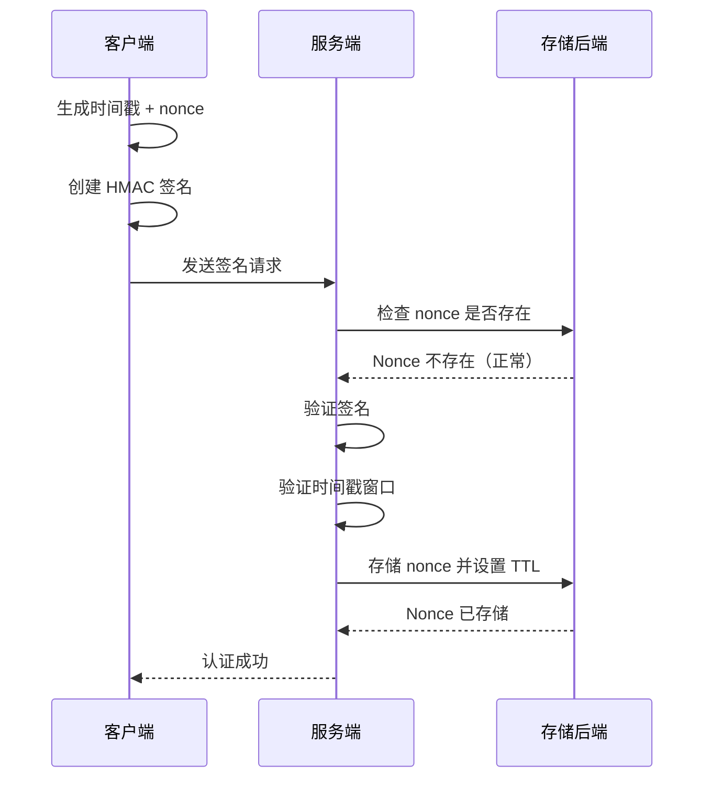
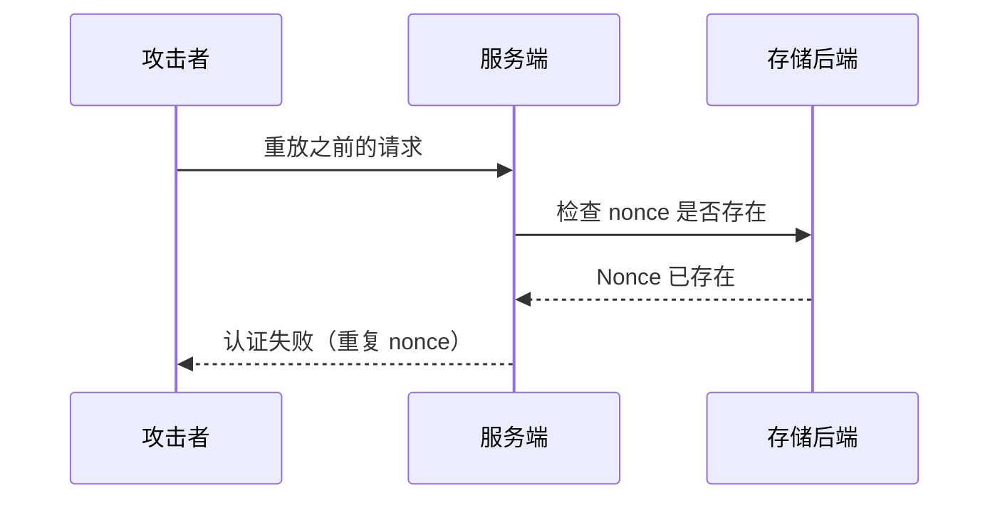

# Nonce Auth

[](https://github.com/kookyleo/nonce-auth/actions)
[](https://codecov.io/github/kookyleo/nonce-auth)
[](https://crates.io/crates/nonce-auth)
[](https://docs.rs/nonce-auth)
[](https://github.com/kookyleo/nonce-auth#license)

一个基于 Rust 的安全 nonce 认证库，提供一次性令牌（nonce）的生成、签名和验证功能，有效防止重放攻击。

## 功能特性

- 🔐 **HMAC-SHA256 签名** - 使用共享密钥对请求进行加密签名
- ⏰ **时间窗口验证** - 防止过期请求的重放攻击
- 🔑 **一次性 Nonce** - 确保每个 nonce 只能使用一次
- 💾 **可插拔存储** - 支持内存、SQLite、Redis 或自定义存储后端
- 🎯 **上下文隔离** - 支持不同业务场景的 nonce 隔离
- 🚀 **异步支持** - 完全异步的 API 设计
- 🛡️ **安全防护** - 常量时间比较防止时序攻击
- 📦 **客户端服务端分离** - 清晰的客户端和服务端职责分离
- 🔧 **灵活的签名算法** - 通过闭包自定义签名数据构造

## 架构说明

### 客户端和服务端分离设计

库提供了两个独立的管理器，实现了清晰的职责分离：

#### `NonceClient` - 客户端管理器
- 负责生成签名认证数据
- 无需数据库依赖
- 轻量级设计，适合客户端使用
- 通过闭包实现灵活的签名算法

#### `NonceServer` - 服务端管理器  
- 负责验证签名认证数据
- 通过可插拔后端管理 nonce 存储和清理
- 包含时间戳验证和防重放攻击机制
- 支持不同业务场景的上下文隔离

### 参数说明
- `default_ttl`: nonce 的有效期，表示从生成到过期的时间长度, 默认 5 分钟
- `time_window`: 时间戳验证窗口, 默认 1 分钟

两者共同作用，防止重放攻击。

### 注意事项
- 服务端使用可插拔存储后端，请根据部署场景选择合适的后端
- 签名算法通过闭包完全可定制，提供最大灵活性

## 快速开始

### 添加依赖

```toml
[dependencies]
nonce-auth = "0.4.0"
tokio = { version = "1", features = ["full"] }
serde = { version = "1.0", features = ["derive"] }
serde_json = "1.0"
warp = "0.3"
hmac = "0.12"
```

### 简单使用示例

```rust
use hmac::Mac;
use nonce_auth::{NonceClient, NonceServer, storage::MemoryStorage};
use std::sync::Arc;
use std::time::Duration;

#[tokio::main]
async fn main() -> Result<(), Box<dyn std::error::Error>> {
    // 客户端和服务端之间的预共享密钥
    let psk = b"my-secret-key";

    // 创建存储后端
    let storage = Arc::new(MemoryStorage::new());
    
    // 初始化服务端
    let server = NonceServer::new(
        psk,
        storage,
        Some(Duration::from_secs(300)), // 5 分钟 nonce 存储 TTL
        Some(Duration::from_secs(60)),  // 1 分钟时间戳验证窗口
    );
    
    // 初始化服务器
    server.init().await?;

    // 初始化客户端
    let client = NonceClient::new(psk);

    // 客户端生成带自定义签名的认证数据（时间戳 + nonce）
    let protection_data = client.create_protection_data(|mac, timestamp, nonce| {
        mac.update(timestamp.as_bytes());
        mac.update(nonce.as_bytes());
    })?;
    println!("生成的认证数据: {protection_data:?}");

    // 服务端使用匹配的签名算法验证认证数据
    match server
        .verify_protection_data(&protection_data, None, |mac| {
            mac.update(protection_data.timestamp.to_string().as_bytes());
            mac.update(protection_data.nonce.as_bytes());
        })
        .await
    {
        Ok(()) => println!("✅ 认证验证成功"),
        Err(e) => println!("❌ 认证验证失败: {e:?}"),
    }

    // 尝试再次使用相同的 nonce（应该失败）
    match server
        .verify_protection_data(&protection_data, None, |mac| {
            mac.update(protection_data.timestamp.to_string().as_bytes());
            mac.update(protection_data.nonce.as_bytes());
        })
        .await
    {
        Ok(()) => println!("❌ 这不应该发生 - 检测到 nonce 重用"),
        Err(e) => println!("✅ 正确拒绝了重复的 nonce: {e:?}"),
    }

    Ok(())
}
```

### 完整的 Web 应用示例

#### JavaScript 客户端

```javascript
// client.js
class NonceClient {
    constructor(psk) {
        this.psk = new TextEncoder().encode(psk);
        this.lastRequest = null;
    }

    async createSignedRequest(message) {
        const timestamp = Math.floor(Date.now() / 1000);
        const nonce = this.generateUUID();
        const signature = await this.sign(timestamp.toString(), nonce, message);
        
        const request = {
            timestamp,
            nonce,
            signature
        };
        
        // 保存最后的请求用于重复测试
        this.lastRequest = { message, auth: {...request} };
        
        return {
            payload: message,
            session_id: sessionId, // 来自服务端嵌入的变量
            auth: request
        };
    }

    async sign(timestamp, nonce, message) {
        try {
            const key = await crypto.subtle.importKey(
                'raw',
                this.psk,
                { name: 'HMAC', hash: 'SHA-256' },
                false,
                ['sign']
            );
            
            const data = new TextEncoder().encode(timestamp + nonce + message);
            const signature = await crypto.subtle.sign('HMAC', key, data);
            
            return Array.from(new Uint8Array(signature))
                .map(b => b.toString(16).padStart(2, '0'))
                .join('');
        } catch (error) {
            console.error('签名失败:', error);
            throw error;
        }
    }

    generateUUID() {
        return 'xxxxxxxx-xxxx-4xxx-yxxx-xxxxxxxxxxxx'.replace(/[xy]/g, function(c) {
            const r = Math.random() * 16 | 0;
            const v = c === 'x' ? r : (r & 0x3 | 0x8);
            return v.toString(16);
        });
    }
}

// 使用示例
async function makeAuthenticatedRequest() {
    const client = new NonceClient(currentPsk); // 从服务端嵌入的 PSK
    const message = "Hello, secure world!";
    
    try {
        const requestData = await client.createSignedRequest(message);
        
        const response = await fetch('/api/protected', {
            method: 'POST',
            headers: {
                'Content-Type': 'application/json',
            },
            body: JSON.stringify(requestData)
        });
        
        if (response.ok) {
            const result = await response.json();
            console.log('响应:', result);
        } else {
            console.error('请求失败:', response.status);
        }
    } catch (error) {
        console.error('请求错误:', error);
    }
}
```

#### Rust 服务端

```rust
// server.rs
use nonce_auth::{NonceServer, storage::MemoryStorage};
use std::sync::Arc;
use warp::Filter;
use serde::{Deserialize, Serialize};
use hmac::Mac;

#[derive(Deserialize)]
struct AuthData {
    timestamp: u64,
    nonce: String,
    signature: String,
}

#[derive(Deserialize)]
struct ProtectedRequest {
    payload: String,
    session_id: String,
    auth: AuthData,
}

#[derive(Serialize)]
struct ApiResponse {
    success: bool,
    message: String,
    echo: Option<String>,
}

#[tokio::main]
async fn main() {
    // 创建存储后端（可以使用 SQLite、Redis 等）
    let storage = Arc::new(MemoryStorage::new());
    
    // 创建服务器
    let server = NonceServer::new(
        b"shared-secret-key",
        storage,
        None, // 使用默认 TTL
        None, // 使用默认时间窗口
    );
    
    // 初始化服务器
    server.init().await.expect("Failed to initialize server");
    
    let server = Arc::new(server);

    // 创建 API 路由
    let api = warp::path("api")
        .and(warp::path("protected"))
        .and(warp::post())
        .and(warp::body::json())
        .and(warp::any().map(move || server.clone()))
        .and_then(handle_protected_request);

    // 启动服务器
    println!("服务器运行在 http://127.0.0.1:3030");
    warp::serve(api)
        .run(([127, 0, 0, 1], 3030))
        .await;
}

async fn handle_protected_request(
    req: ProtectedRequest,
    server: Arc<NonceServer<MemoryStorage>>,
) -> Result<impl warp::Reply, warp::Rejection> {
    // 从请求创建保护数据
    let protection_data = nonce_auth::ProtectionData {
        timestamp: req.auth.timestamp,
        nonce: req.auth.nonce,
        signature: req.auth.signature,
    };

    // 验证认证数据
    match server.verify_protection_data(&protection_data, Some(&req.session_id), |mac| {
        mac.update(protection_data.timestamp.to_string().as_bytes());
        mac.update(protection_data.nonce.as_bytes());
        mac.update(req.payload.as_bytes());
    }).await {
        Ok(()) => {
            let response = ApiResponse {
                success: true,
                message: "认证成功".to_string(),
                echo: Some(req.payload),
            };
            Ok(warp::reply::json(&response))
        }
        Err(e) => {
            let response = ApiResponse {
                success: false,
                message: format!("认证失败: {e}"),
                echo: None,
            };
            Ok(warp::reply::json(&response))
        }
    }
}
```

## 存储后端

库通过 `NonceStorage` trait 支持多种存储后端：

### 内置存储后端

#### 内存存储
```rust
use nonce_auth::storage::MemoryStorage;
use std::sync::Arc;

let storage = Arc::new(MemoryStorage::new());
```

**特点：**
- 使用 HashMap 的快速内存存储
- 使用 Arc<Mutex<HashMap>> 保证线程安全
- 适用于单实例应用
- 重启时不保留数据

### 自定义存储后端

#### SQLite 存储
参考 `examples/sqlite_storage.rs` 获取完整实现：

```rust
use nonce_auth::examples::SqliteStorage;
use std::sync::Arc;

let storage = Arc::new(SqliteStorage::new("nonce_auth.db")?);
```

#### Redis 存储（示例）
```rust
// 您可以类似地实现 Redis 存储
pub struct RedisStorage {
    client: redis::Client,
}

#[async_trait]
impl NonceStorage for RedisStorage {
    // 实现细节...
}
```

## 序列图

### 认证流程



### 重放攻击防护



## 配置

### 环境变量

```bash
# 安全配置
export NONCE_AUTH_DEFAULT_TTL=300                  # 默认 TTL (秒)
export NONCE_AUTH_DEFAULT_TIME_WINDOW=60           # 时间窗口 (秒)
```

### 程序化配置

```rust
use nonce_auth::{NonceServer, storage::MemoryStorage};
use std::sync::Arc;
use std::time::Duration;

let storage = Arc::new(MemoryStorage::new());
let server = NonceServer::new(
    b"your-secret-key",
    storage,
    Some(Duration::from_secs(600)),  // 自定义 TTL
    Some(Duration::from_secs(120)),  // 自定义时间窗口
);
```

## 错误类型

```rust
pub enum NonceError {
    DuplicateNonce,         // Nonce 已使用
    ExpiredNonce,           // Nonce 已过期
    InvalidSignature,       // 无效签名
    TimestampOutOfWindow,   // 时间戳超出窗口
    DatabaseError(String),  // 存储后端错误
    CryptoError(String),    // 加密错误
}
```

## 典型用例

### 1. API 认证
- 客户端为每个请求生成认证数据
- 服务端独立验证每个请求
- 每个认证数据只能使用一次

### 2. 表单提交保护
- 渲染表单时生成认证数据
- 提交时验证认证数据
- 防止重复表单提交

### 3. 微服务认证
- 服务 A 为请求生成认证数据
- 服务 B 验证来自服务 A 的请求
- 确保请求的唯一性和真实性

### 4. 基于会话的认证
- 服务端为每个会话生成随机 PSK
- 客户端使用会话 PSK 进行所有请求
- 提供带会话隔离的无状态认证

## 安全特性

### 重放攻击防护

1. **时间窗口限制**: 只接受指定时间窗口内的请求
2. **一次性 Nonce**: 每个 nonce 验证后删除，确保不会重用
3. **上下文隔离**: 不同业务场景的 nonce 相互隔离

### 时序攻击防护

- 签名验证使用常量时间比较算法

### 加密强度

- 使用 HMAC-SHA256 算法确保签名完整性和真实性
- 支持自定义密钥长度
- 通过闭包实现灵活的签名算法

## 性能优化

- 自动后台清理过期的 nonce 记录
- 可插拔存储后端提供最佳性能
- 异步设计支持高并发场景

## 依赖

- `hmac` - HMAC 签名
- `sha2` - SHA256 哈希
- `uuid` - UUID 生成
- `async-trait` - 异步 trait 支持
- `tokio` - 异步运行时

存储后端可能有额外的依赖（如 SQLite 存储需要 `rusqlite`）。

## 许可证

本项目采用以下任一许可证：

- Apache License, Version 2.0 ([LICENSE-APACHE](LICENSE-APACHE) 或 http://www.apache.org/licenses/LICENSE-2.0)
- MIT license ([LICENSE-MIT](LICENSE-MIT) 或 http://opensource.org/licenses/MIT)

您可以任选其一。 
