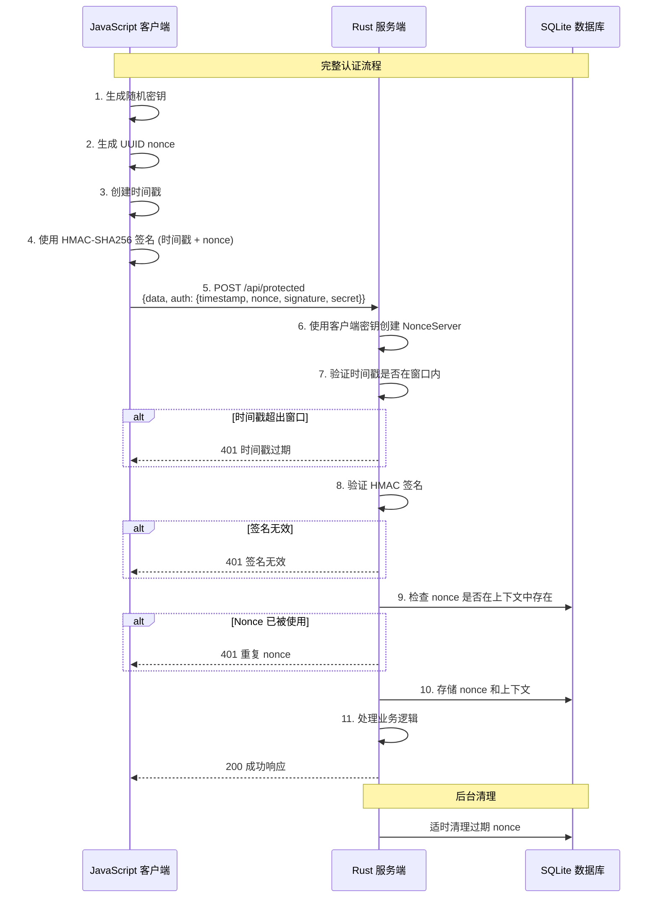

# Nonce Auth

[](https://github.com/kookyleo/nonce-auth/actions)
[](https://codecov.io/github/kookyleo/nonce-auth)
[](https://crates.io/crates/nonce-auth)
[](https://docs.rs/nonce-auth)
[](https://github.com/USERNAME/nonce-auth#license)

一个基于 Rust 的安全 nonce 认证库，提供一次性令牌（nonce）的生成、签名和验证功能，有效防止重放攻击。

## 功能特性

- 🔐 **HMAC-SHA256 签名** - 使用共享密钥对请求进行加密签名
- ⏰ **时间窗口验证** - 防止过期请求的重放攻击
- 🔑 **一次性 Nonce** - 确保每个 nonce 只能使用一次
- 💾 **SQLite 持久化** - 自动管理 nonce 的存储和清理
- 🎯 **上下文隔离** - 支持不同业务场景的 nonce 隔离
- 🚀 **异步支持** - 完全异步的 API 设计
- 🛡️ **安全防护** - 常量时间比较防止时序攻击
- 📦 **客户端服务端分离** - 清晰的客户端和服务端职责分离

## 架构说明

### 客户端和服务端分离设计

库提供了两个独立的管理器，实现了清晰的职责分离：

#### `NonceClient` - 客户端管理器
- 负责生成签名请求
- 无需数据库依赖
- 轻量级设计，适合客户端使用

#### `NonceServer` - 服务端管理器  
- 负责验证签名请求
- 管理 nonce 存储和清理
- 包含时间戳验证和防重放攻击机制

### 参数说明
- `default_ttl`: nonce 的有效期，表示从生成到过期的时间长度, 默认 5 分钟
- `time_window`: 时间戳验证窗口, 默认 1 分钟

两者共同作用，防止重放攻击。

### 注意事项
- 服务端使用了本地 sqlite 持久化 nonce, 请注意配合连接粘滞策略使用

## 快速开始

### 添加依赖

```toml
[dependencies]
nonce-auth = "0.1.0"
tokio = { version = "1", features = ["full"] }
serde = { version = "1.0", features = ["derive"] }
serde_json = "1.0"
```

### 完整的客户端-服务端示例

#### JavaScript 客户端

```javascript
// client.js
import crypto from 'crypto';

class NonceClient {
    constructor(secret) {
        this.secret = secret;
    }

    createSignedRequest() {
        const timestamp = Math.floor(Date.now() / 1000);
        const nonce = crypto.randomUUID();
        const signature = this.sign(timestamp.toString(), nonce);
        
        return {
            timestamp,
            nonce,
            signature,
            secret: this.secret // 包含密钥供服务端验证
        };
    }

    sign(timestamp, nonce) {
        const hmac = crypto.createHmac('sha256', this.secret);
        hmac.update(timestamp);
        hmac.update(nonce);
        return hmac.digest('hex');
    }
}

// 使用示例
async function makeAuthenticatedRequest() {
    // 为此会话生成随机密钥
    const secret = crypto.randomBytes(32).toString('hex');
    const client = new NonceClient(secret);
    
    const signedRequest = client.createSignedRequest();
    
    try {
        const response = await fetch('http://localhost:3000/api/protected', {
            method: 'POST',
            headers: {
                'Content-Type': 'application/json',
            },
            body: JSON.stringify({
                data: 'Hello, secure world!',
                auth: signedRequest
            })
        });
        
        const result = await response.json();
        console.log('服务器响应:', result);
    } catch (error) {
        console.error('请求失败:', error);
    }
}

makeAuthenticatedRequest();
```

#### Rust 服务端

```rust
// server.rs
use nonce_auth::NonceServer;
use serde::{Deserialize, Serialize};
use std::time::Duration;
use warp::Filter;

#[derive(Deserialize)]
struct AuthenticatedRequest {
    data: String,
    auth: AuthData,
}

#[derive(Deserialize)]
struct AuthData {
    timestamp: u64,
    nonce: String,
    signature: String,
    secret: String,
}

#[derive(Serialize)]
struct ApiResponse {
    success: bool,
    message: String,
    data: Option<String>,
}

#[tokio::main]
async fn main() {
    // 初始化 nonce 服务器数据库
    NonceServer::init().await.expect("Failed to initialize database");

    let protected_route = warp::path("api")
        .and(warp::path("protected"))
        .and(warp::post())
        .and(warp::body::json())
        .and_then(handle_protected_request);

    let cors = warp::cors()
        .allow_any_origin()
        .allow_headers(vec!["content-type"])
        .allow_methods(vec!["POST"]);

    println!("服务器运行在 http://localhost:3000");
    
    warp::serve(protected_route.with(cors))
        .run(([127, 0, 0, 1], 3000))
        .await;
}

async fn handle_protected_request(
    req: AuthenticatedRequest,
) -> Result<impl warp::Reply, warp::Rejection> {
    // 使用客户端的密钥创建服务器
    let server = NonceServer::new(
        req.auth.secret.as_bytes(),
        Some(Duration::from_secs(300)), // 5 分钟 TTL
        Some(Duration::from_secs(60)),  // 1 分钟时间窗口
    );

    // 从认证数据创建签名请求
    let signed_request = nonce_auth::SignedRequest {
        timestamp: req.auth.timestamp,
        nonce: req.auth.nonce,
        signature: req.auth.signature,
    };

    // 验证请求
    match server.verify_signed_request(&signed_request, Some("api_call")).await {
        Ok(()) => {
            let response = ApiResponse {
                success: true,
                message: "请求认证成功".to_string(),
                data: Some(format!("已处理: {}", req.data)),
            };
            Ok(warp::reply::json(&response))
        }
        Err(e) => {
            let response = ApiResponse {
                success: false,
                message: format!("认证失败: {:?}", e),
                data: None,
            };
            Ok(warp::reply::json(&response))
        }
    }
}
```

### 示例认证流程时序图



## API 文档

### NonceClient

#### 构造函数

```rust
pub fn new(secret: &[u8]) -> Self
```

- `secret`: 用于签名的密钥

#### 方法

##### 创建签名请求

```rust
pub fn create_signed_request(&self) -> Result<SignedRequest, NonceError>
```

生成包含时间戳、nonce 和签名的完整请求。

##### 签名

```rust
pub fn sign(&self, timestamp: &str, nonce: &str) -> Result<String, NonceError>
```

为给定的时间戳和 nonce 生成 HMAC-SHA256 签名。

### NonceServer

#### 构造函数

```rust
pub fn new(
    secret: &[u8], 
    default_ttl: Option<Duration>, 
    time_window: Option<Duration>
) -> Self
```

- `secret`: 用于验证的密钥
- `default_ttl`: 默认 nonce 过期时间（默认：5 分钟）
- `time_window`: 时间戳验证允许的时间窗口（默认：1 分钟）

#### 方法

##### 验证签名请求

```rust
pub async fn verify_signed_request(
    &self, 
    request: &SignedRequest, 
    context: Option<&str>
) -> Result<(), NonceError>
```

验证请求的完整性，包括时间窗口、nonce 有效性和签名正确性。

##### 初始化数据库

```rust
pub async fn init() -> Result<(), NonceError>
```

创建必要的数据库表和索引。

### SignedRequest

```rust
pub struct SignedRequest {
    pub timestamp: u64,    // Unix 时间戳
    pub nonce: String,     // UUID 格式的一次性令牌
    pub signature: String, // HMAC-SHA256 签名
}
```

### 错误类型

```rust
pub enum NonceError {
    DuplicateNonce,         // Nonce 已被使用
    ExpiredNonce,           // Nonce 已过期
    InvalidSignature,       // 签名无效
    TimestampOutOfWindow,   // 时间戳超出允许窗口
    DatabaseError(String),  // 数据库错误
    CryptoError(String),    // 加密错误
}
```

## 典型使用场景

### 1. API 认证
- 客户端首先获取认证令牌
- 使用令牌访问受保护的 API
- 每个令牌只能使用一次

### 2. 表单提交防重复
- 渲染表单时生成 nonce
- 提交时验证 nonce
- 防止表单重复提交

### 3. 微服务间认证
- 服务 A 为请求生成 nonce
- 服务 B 验证来自服务 A 的请求
- 确保请求的唯一性和真实性

### 4. 基于会话的认证
- 客户端为每个会话生成随机密钥
- 服务端使用客户端的密钥验证请求
- 提供无状态认证

## 安全特性

### 防重放攻击

1. **时间窗口限制**: 只接受指定时间窗口内的请求
2. **一次性 Nonce**: 每个 nonce 验证后立即删除，确保无法重复使用
3. **上下文隔离**: 不同业务场景的 nonce 相互隔离

### 防时序攻击

- 使用常量时间比较算法验证签名

### 加密强度

- 使用 HMAC-SHA256 算法确保签名的完整性和真实性
- 支持自定义密钥长度

## 性能优化

- 自动后台清理过期 nonce 记录
- 数据库索引优化查询性能
- 异步设计支持高并发场景

## 依赖

- `hmac` - HMAC 签名
- `sha2` - SHA256 哈希
- `turbosql` - SQLite ORM
- `uuid` - UUID 生成
- `serde` - 序列化支持
- `tokio` - 异步运行时
- `thiserror` - 错误处理

## 许可证

MIT

## 贡献

欢迎提交 Issue 和 Pull Request！ 
