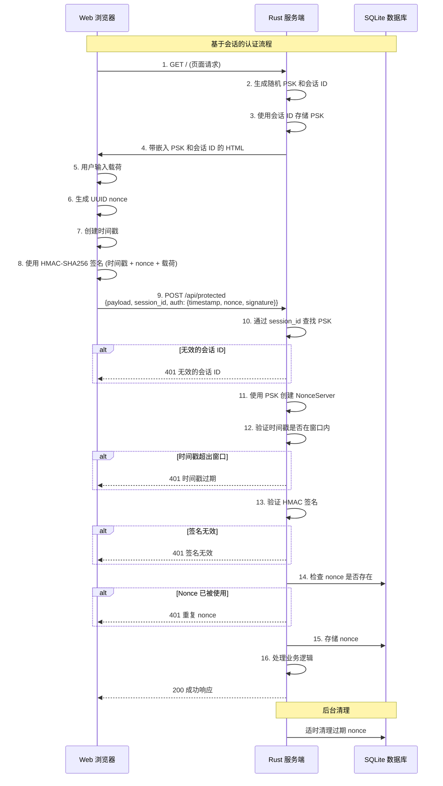

# Nonce Auth

[](https://github.com/kookyleo/nonce-auth/actions)
[](https://codecov.io/github/kookyleo/nonce-auth)
[](https://crates.io/crates/nonce-auth)
[](https://docs.rs/nonce-auth)
[](https://github.com/kookyleo/nonce-auth#license)

一个基于 Rust 的安全 nonce 认证库，提供一次性令牌（nonce）的生成、签名和验证功能，有效防止重放攻击。

## 功能特性

- 🔐 **HMAC-SHA256 签名** - 使用共享密钥对请求进行加密签名
- ⏰ **时间窗口验证** - 防止过期请求的重放攻击
- 🔑 **一次性 Nonce** - 确保每个 nonce 只能使用一次
- 💾 **SQLite 持久化** - 自动管理 nonce 的存储和清理
- 🎯 **上下文隔离** - 支持不同业务场景的 nonce 隔离
- 🚀 **异步支持** - 完全异步的 API 设计
- 🛡️ **安全防护** - 常量时间比较防止时序攻击
- 📦 **客户端服务端分离** - 清晰的客户端和服务端职责分离
- 🔧 **灵活的签名算法** - 通过闭包自定义签名数据构造

## 架构说明

### 客户端和服务端分离设计

库提供了两个独立的管理器，实现了清晰的职责分离：

#### `NonceClient` - 客户端管理器
- 负责生成签名认证数据
- 无需数据库依赖
- 轻量级设计，适合客户端使用
- 通过闭包实现灵活的签名算法

#### `NonceServer` - 服务端管理器  
- 负责验证签名认证数据
- 管理 nonce 存储和清理
- 包含时间戳验证和防重放攻击机制
- 支持不同业务场景的上下文隔离

### 参数说明
- `default_ttl`: nonce 的有效期，表示从生成到过期的时间长度, 默认 5 分钟
- `time_window`: 时间戳验证窗口, 默认 1 分钟

两者共同作用，防止重放攻击。

### 注意事项
- 服务端使用了本地 sqlite 持久化 nonce, 请注意配合连接粘滞策略使用
- 签名算法通过闭包完全可定制，提供最大灵活性

## 快速开始

### 添加依赖

```toml
[dependencies]
nonce-auth = "0.2.0"
tokio = { version = "1", features = ["full"] }
serde = { version = "1.0", features = ["derive"] }
serde_json = "1.0"
warp = "0.3"
hmac = "0.12"
```

### 简单使用示例

```rust
use hmac::Mac;
use nonce_auth::{NonceClient, NonceServer};
use std::time::Duration;

#[tokio::main]
async fn main() -> Result<(), Box<dyn std::error::Error>> {
    // 客户端和服务端之间的预共享密钥
    let psk = b"my-secret-key";

    // 初始化服务端
    NonceServer::init().await?;
    let server = NonceServer::new(
        psk,
        Some(Duration::from_secs(300)), // 5 分钟 nonce 存储 TTL
        Some(Duration::from_secs(60)),  // 1 分钟时间戳验证窗口
    );

    // 初始化客户端
    let client = NonceClient::new(psk);

    // 客户端生成带自定义签名的认证数据（时间戳 + nonce）
    let auth_data = client.create_auth_data(|mac, timestamp, nonce| {
        mac.update(timestamp.as_bytes());
        mac.update(nonce.as_bytes());
    })?;
    println!("生成的认证数据: {auth_data:?}");

    // 服务端使用匹配的签名算法验证认证数据
    match server
        .verify_auth_data(&auth_data, None, |mac| {
            mac.update(auth_data.timestamp.to_string().as_bytes());
            mac.update(auth_data.nonce.as_bytes());
        })
        .await
    {
        Ok(()) => println!("✅ 认证验证成功"),
        Err(e) => println!("❌ 认证验证失败: {e:?}"),
    }

    // 尝试再次使用相同的 nonce（应该失败）
    match server
        .verify_auth_data(&auth_data, None, |mac| {
            mac.update(auth_data.timestamp.to_string().as_bytes());
            mac.update(auth_data.nonce.as_bytes());
        })
        .await
    {
        Ok(()) => println!("❌ 这不应该发生 - 检测到 nonce 重用"),
        Err(e) => println!("✅ 正确拒绝了重复的 nonce: {e:?}"),
    }

    Ok(())
}
```

### 完整的 Web 应用示例

#### JavaScript 客户端

```javascript
// client.js
class NonceClient {
    constructor(psk) {
        this.psk = new TextEncoder().encode(psk);
        this.lastRequest = null;
    }

    async createSignedRequest(message) {
        const timestamp = Math.floor(Date.now() / 1000);
        const nonce = this.generateUUID();
        const signature = await this.sign(timestamp.toString(), nonce, message);
        
        const request = {
            timestamp,
            nonce,
            signature
        };
        
        // 保存最后的请求用于重复测试
        this.lastRequest = { message, auth: {...request} };
        
        return {
            payload: message,
            session_id: sessionId, // 来自服务端嵌入的变量
            auth: request
        };
    }

    async sign(timestamp, nonce, message) {
        try {
            const key = await crypto.subtle.importKey(
                'raw',
                this.psk,
                { name: 'HMAC', hash: 'SHA-256' },
                false,
                ['sign']
            );
            
            const data = new TextEncoder().encode(timestamp + nonce + message);
            const signature = await crypto.subtle.sign('HMAC', key, data);
            
            return Array.from(new Uint8Array(signature))
                .map(b => b.toString(16).padStart(2, '0'))
                .join('');
        } catch (error) {
            console.error('签名失败:', error);
            throw error;
        }
    }

    generateUUID() {
        return 'xxxxxxxx-xxxx-4xxx-yxxx-xxxxxxxxxxxx'.replace(/[xy]/g, function(c) {
            const r = Math.random() * 16 | 0;
            const v = c === 'x' ? r : (r & 0x3 | 0x8);
            return v.toString(16);
        });
    }
}

// 使用示例
async function makeAuthenticatedRequest() {
    const client = new NonceClient(currentPsk); // 从服务端嵌入的 PSK
    const message = "Hello, secure world!";
    
    try {
        const requestData = await client.createSignedRequest(message);
        
        const response = await fetch('/api/protected', {
            method: 'POST',
            headers: {
                'Content-Type': 'application/json',
            },
            body: JSON.stringify(requestData)
        });
        
        const result = await response.json();
        console.log('服务器响应:', result);
    } catch (error) {
        console.error('请求失败:', error);
    }
}
```

#### Rust 服务端

```rust
// server.rs
use hmac::Mac;
use nonce_auth::NonceServer;
use serde::{Deserialize, Serialize};
use std::collections::HashMap;
use std::sync::Arc;
use std::time::Duration;
use warp::Filter;

#[derive(Deserialize)]
struct AuthenticatedRequest {
    payload: String,
    session_id: String,
    auth: nonce_auth::AuthData,
}

#[derive(Serialize)]
struct ApiResponse {
    success: bool,
    message: String,
    data: Option<String>,
}

// 为每个会话存储 PSK
type PskStore = Arc<std::sync::Mutex<HashMap<String, String>>>;

#[tokio::main]
async fn main() {
    // 初始化 nonce 服务器数据库
    NonceServer::init()
        .await
        .expect("Failed to initialize database");

    // 创建 PSK 存储
    let psk_store: PskStore = Arc::new(std::sync::Mutex::new(HashMap::new()));

    // 在根路径提供带嵌入 PSK 的 index.html
    let psk_store_filter = warp::any().map(move || psk_store.clone());
    let index_route = warp::path::end()
        .and(psk_store_filter.clone())
        .and_then(handle_index_request);

    // 受保护的 API 路由
    let protected_route = warp::path("api")
        .and(warp::path("protected"))
        .and(warp::post())
        .and(warp::body::json())
        .and(psk_store_filter)
        .and_then(handle_protected_request);

    // 组合路由
    let routes = index_route.or(protected_route).with(
        warp::cors()
            .allow_any_origin()
            .allow_headers(vec!["content-type"])
            .allow_methods(vec!["GET", "POST"]),
    );

    println!("服务器运行在 http://localhost:3000");
    println!("在浏览器中打开此 URL 来测试认证");
    println!("每次页面刷新都会生成新的 PSK");

    warp::serve(routes).run(([127, 0, 0, 1], 3000)).await;
}

async fn handle_protected_request(
    req: AuthenticatedRequest,
    psk_store: PskStore,
) -> Result<impl warp::Reply, warp::Rejection> {
    // 使用会话 ID 从存储中获取 PSK
    let psk = {
        let store = psk_store.lock().unwrap();
        println!("查找会话 ID: {}", req.session_id);
        store.get(&req.session_id).cloned()
    };

    let psk = match psk {
        Some(psk) => psk,
        None => {
            let response = ApiResponse {
                success: false,
                message: "无效的会话 ID。请刷新页面。".to_string(),
                data: None,
            };
            return Ok(warp::reply::json(&response));
        }
    };

    // 使用 PSK 创建服务器
    let server = NonceServer::new(
        psk.as_bytes(),
        Some(Duration::from_secs(60)), // 1 分钟 TTL
        Some(Duration::from_secs(15)), // 15 秒时间窗口
    );

    // 使用包含载荷的自定义签名验证请求
    match server
        .verify_auth_data(&req.auth, None, |mac| {
            mac.update(req.auth.timestamp.to_string().as_bytes());
            mac.update(req.auth.nonce.as_bytes());
            mac.update(req.payload.as_bytes());
        })
        .await
    {
        Ok(()) => {
            let response = ApiResponse {
                success: true,
                message: "请求认证成功".to_string(),
                data: Some(format!("已处理: {}", req.payload)),
            };
            Ok(warp::reply::json(&response))
        }
        Err(e) => {
            let response = ApiResponse {
                success: false,
                message: format!("认证失败: {e:?}"),
                data: None,
            };
            Ok(warp::reply::json(&response))
        }
    }
}
```

### 示例认证流程时序图



## API 文档

### NonceClient

#### 构造函数

```rust
pub fn new(secret: &[u8]) -> Self
```

- `secret`: 用于签名的密钥

#### 方法

##### 创建认证数据

```rust
pub fn create_auth_data<F>(&self, signature_builder: F) -> Result<AuthData, NonceError>
where
    F: FnOnce(&mut hmac::Hmac<sha2::Sha256>, &str, &str),
```

使用自定义签名算法生成认证数据。闭包接收 MAC 实例、时间戳字符串和 nonce 字符串。

##### 生成签名

```rust
pub fn generate_signature<F>(&self, data_builder: F) -> Result<String, NonceError>
where
    F: FnOnce(&mut hmac::Hmac<sha2::Sha256>),
```

使用自定义数据构建器生成 HMAC-SHA256 签名。

### NonceServer

#### 构造函数

```rust
pub fn new(
    secret: &[u8], 
    default_ttl: Option<Duration>, 
    time_window: Option<Duration>
) -> Self
```

- `secret`: 用于验证的密钥
- `default_ttl`: 默认 nonce 过期时间（默认：5 分钟）
- `time_window`: 时间戳验证允许的时间窗口（默认：1 分钟）

#### 方法

##### 验证认证数据

```rust
pub async fn verify_auth_data<F>(
    &self, 
    auth_data: &AuthData, 
    context: Option<&str>,
    signature_builder: F,
) -> Result<(), NonceError>
where
    F: FnOnce(&mut hmac::Hmac<sha2::Sha256>),
```

使用自定义签名算法验证认证数据。闭包应与客户端使用的匹配。

##### 初始化数据库

```rust
pub async fn init() -> Result<(), NonceError>
```

创建必要的数据库表和索引。

### AuthData

```rust
pub struct AuthData {
    pub timestamp: u64,    // Unix 时间戳
    pub nonce: String,     // UUID 格式的一次性令牌
    pub signature: String, // HMAC-SHA256 签名
}
```

### 错误类型

```rust
pub enum NonceError {
    DuplicateNonce,         // Nonce 已被使用
    ExpiredNonce,           // Nonce 已过期
    InvalidSignature,       // 签名无效
    TimestampOutOfWindow,   // 时间戳超出允许窗口
    DatabaseError(String),  // 数据库错误
    CryptoError(String),    // 加密错误
}
```

## 典型使用场景

### 1. API 认证
- 客户端为每个请求生成认证数据
- 服务端独立验证每个请求
- 每个认证数据只能使用一次

### 2. 表单提交防重复
- 渲染表单时生成认证数据
- 提交时验证认证数据
- 防止表单重复提交

### 3. 微服务间认证
- 服务 A 为请求生成认证数据
- 服务 B 验证来自服务 A 的请求
- 确保请求的唯一性和真实性

### 4. 基于会话的认证
- 服务端为每个会话生成随机 PSK
- 客户端使用会话 PSK 进行所有请求
- 提供带会话隔离的无状态认证

## 安全特性

### 防重放攻击

1. **时间窗口限制**: 只接受指定时间窗口内的请求
2. **一次性 Nonce**: 每个 nonce 验证后立即删除，确保无法重复使用
3. **上下文隔离**: 不同业务场景的 nonce 相互隔离

### 防时序攻击

- 使用常量时间比较算法验证签名

### 加密强度

- 使用 HMAC-SHA256 算法确保签名的完整性和真实性
- 支持自定义密钥长度
- 通过闭包实现灵活的签名算法

## 性能优化

- 自动后台清理过期 nonce 记录
- 数据库索引优化查询性能
- 异步设计支持高并发场景

## 依赖

- `hmac` - HMAC 签名
- `sha2` - SHA256 哈希
- `turbosql` - SQLite ORM
- `uuid` - UUID 生成
- `serde` - 序列化支持
- `tokio` - 异步运行时
- `thiserror` - 错误处理

## 许可证

MIT

## 贡献

欢迎提交 Issue 和 Pull Request！ 
