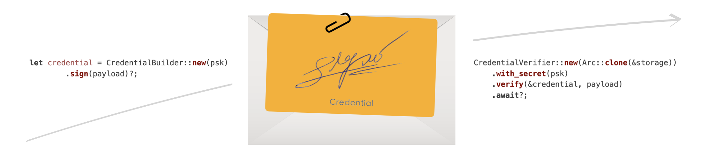

# Nonce Auth



[](https://github.com/kookyleo/nonce-auth/actions)
[](https://crates.io/crates/nonce-auth)
[](https://docs.rs/nonce-auth)
[](https://github.com/kookyleo/nonce-auth#license)

一个轻量、安全的 nonce 认证库，专为 Rust 设计，旨在有效防止 API 和其他服务中的重放攻击。

## 核心特性

- **防重放攻击**: 结合使用 Nonce、时间戳和 HMAC-SHA256 签名，确保每个请求的唯一性和真实性。
- **安全且易用的 API**: 采用构建者模式 (`credential_builder`)，引导开发者安全使用，避免常见的安全陷阱。
- **异步与可插拔存储**: 完全异步的设计，以及基于 trait 的存储系统，允许轻松集成内存、SQLite 或 Redis 等后端。

## 快速上手

```rust
use nonce_auth::{NonceClient, NonceServer};

#[tokio::main]
async fn main() -> Result<(), Box<dyn std::error::Error>> {
    // 客户端与服务端的共享密钥
    let secret = b"my-super-secret-key";
    let payload = b"important_api_request_data";

    // 创建服务端（默认使用内存存储）
    let server = NonceServer::builder()
        .build_and_init()
        .await?;

    // 创建客户端并生成凭证
    let client = NonceClient::new(secret);
    let credential = client.credential_builder().sign(payload)?;

    // 服务端使用密钥验证凭证
    let result = server
        .credential_verifier(&credential)
        .with_secret(secret)
        .verify(payload)
        .await;
    
    assert!(result.is_ok());
    println!("✅ 首次验证成功!");

    // 重放攻击会被自动拒绝
    let replay_result = server
        .credential_verifier(&credential)
        .with_secret(secret)
        .verify(payload)
        .await;
    
    assert!(replay_result.is_err());
    println!("✅ 成功拒绝重放攻击!");

    Ok(())
}
```

## 配置与示例

- 关于 TTL、时间窗口、存储后端和客户端自定义的详细配置，请参阅 [CONFIGURATION.zh.md](docs/CONFIGURATION.zh.md)。
- 更多高级用法，包括一个完整的 Web 服务器实现，请参阅 [examples](examples/) 目录。

## 许可证

本项目采用以下任一许可证：

- Apache License, Version 2.0 ([LICENSE-APACHE](LICENSE-APACHE) 或 http://www.apache.org/licenses/LICENSE-2.0)
- MIT license ([LICENSE-MIT](LICENSE-MIT) 或 http://opensource.org/licenses/MIT)

您可以任选其一。