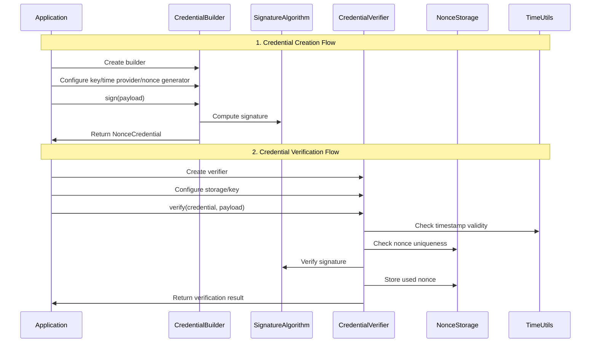
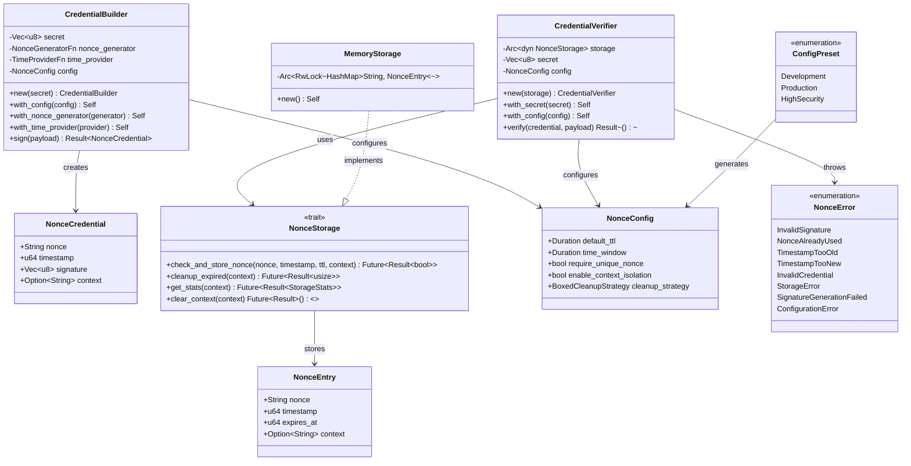
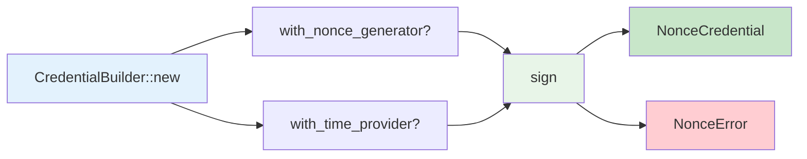
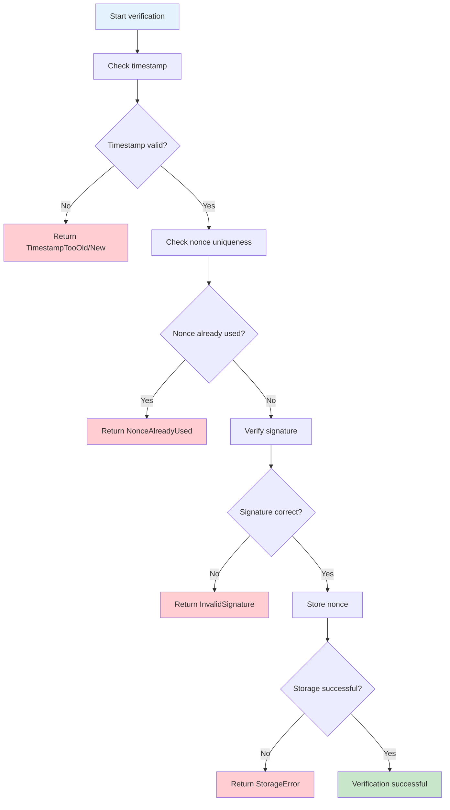
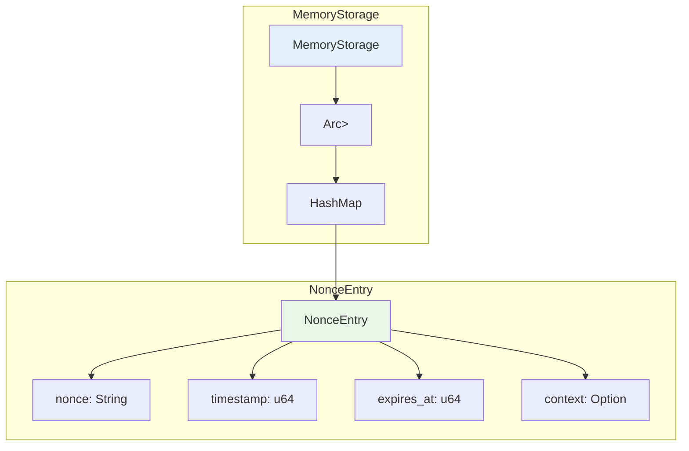
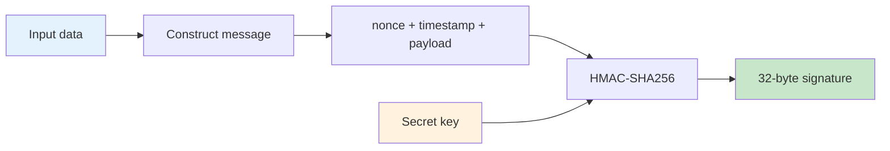
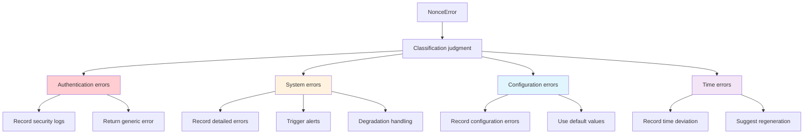
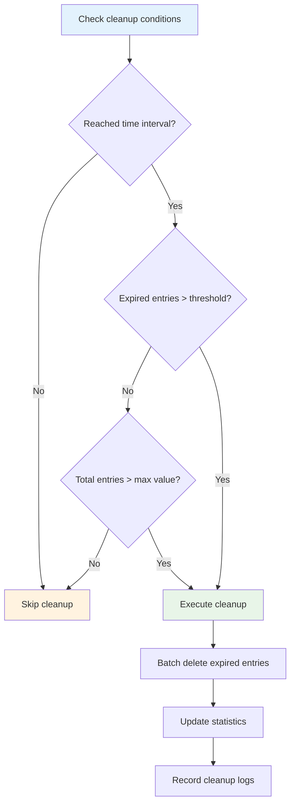
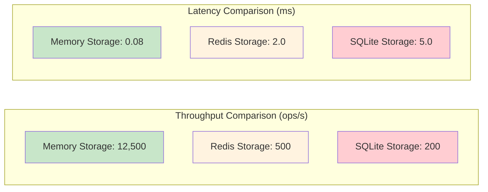

# Nonce Auth - Complete User Guide

A comprehensive guide to the nonce-auth library, covering all APIs, patterns, and architectural relationships with extensive tables, diagrams, and examples.

## Table of Contents

1. [Architecture Overview](#architecture-overview)
2. [Component Matrix](#component-matrix)
3. [Core Types Reference](#core-types-reference)
4. [CredentialBuilder API](#credentialbuilder-api)
5. [CredentialVerifier API](#credentialverifier-api)
6. [Storage System](#storage-system)
7. [Signature Algorithms](#signature-algorithms)
8. [Configuration System](#configuration-system)
9. [Error Handling](#error-handling)
10. [Cleanup Strategies](#cleanup-strategies)
11. [Feature Flags](#feature-flags)
12. [Usage Patterns](#usage-patterns)
13. [Performance Guide](#performance-guide)
14. [Troubleshooting](#troubleshooting)

## Architecture Overview

### System Architecture Diagram

```mermaid
graph TB
    subgraph "Public API Layer"
        CB[CredentialBuilder]
        CV[CredentialVerifier]
        NC[NonceCredential]
        CFG[Configuration]
    end

    subgraph "Core Types"
        NCR[NonceCredential]
        NGEN[NonceGeneratorFn]
        TPROV[TimeProviderFn]
        ERR[NonceError]
    end

    subgraph "Storage Layer"
        NST[NonceStorage Trait]
        MS[MemoryStorage]
        RS[RedisStorage*]
        SS[SQLiteStorage*]
        NE[NonceEntry]
        STATS[StorageStats]
    end

    subgraph "Signature Layer"
        SA[SignatureAlgorithm Trait]
        HSA[HmacSha256Algorithm]
        ML[MacLike Trait]
        HW[HmacWrapper]
        DSA[DefaultSignatureAlgorithm]
    end

    subgraph "Configuration Layer"
        CP[ConfigPreset]
        NCF[NonceConfig]
        CS[CleanupStrategy]
        CCS[CustomCleanupStrategy]
        HCS[HybridCleanupStrategy]
    end

    subgraph "Time Utilities"
        CT[current_timestamp]
        IE[is_expired]
        IOW[is_outside_window]
    end

    %% Connection relationships
    CB --> NCR
    CB --> NGEN
    CB --> TPROV
    CB --> SA
    
    CV --> NST
    CV --> SA
    CV --> ERR
    
    NST --> MS
    NST --> RS
    NST --> SS
    NST --> NE
    NST --> STATS
    
    SA --> HSA
    SA --> ML
    HSA --> HW
    
    CFG --> CP
    CFG --> NCF
    CFG --> CS
    
    CS --> CCS
    CS --> HCS
    
    CV --> CT
    CV --> IE
    CV --> IOW

    style CB fill:#e1f5fe
    style CV fill:#e8f5e8
    style NST fill:#fff3e0
    style SA fill:#f3e5f5
    style CFG fill:#fce4ec
```



### Data Flow Diagram



### Class Relationship Diagram



## Component Matrix

### Public API Components Table

| Component Type | Component Name | Module Path | Primary Purpose | Dependencies |
|---------------|----------------|-------------|----------------|--------------|
| **Struct** | `NonceCredential` | `nonce_auth` | Store credential data | None |
| | `CredentialBuilder` | `nonce_auth::nonce` | Create signed credentials | `NonceConfig`, `SignatureAlgorithm` |
| | `CredentialVerifier` | `nonce_auth::nonce` | Verify credentials | `NonceStorage`, `SignatureAlgorithm` |
| | `NonceConfig` | `nonce_auth::nonce` | Configuration parameters | `CleanupStrategy` |
| | `MemoryStorage` | `nonce_auth::nonce::storage` | In-memory storage implementation | `NonceStorage` |
| | `NonceEntry` | `nonce_auth::nonce::storage` | Storage entry data | None |
| | `StorageStats` | `nonce_auth::nonce::storage` | Storage statistics | None |
| **Enum** | `ConfigPreset` | `nonce_auth::nonce` | Preset configuration options | None |
| | `NonceError` | `nonce_auth::nonce` | Error type definitions | None |
| **Trait** | `NonceStorage` | `nonce_auth::nonce::storage` | Storage abstraction interface | `NonceEntry`, `StorageStats` |
| | `SignatureAlgorithm` | `nonce_auth::nonce::signature` | Signature algorithm interface | `MacLike` |
| | `CleanupStrategy` | `nonce_auth::nonce::cleanup` | Cleanup strategy interface | None |

### Internal Components Table

| Component Type | Component Name | Module Path | Primary Purpose | Visibility |
|---------------|----------------|-------------|----------------|------------|
| **Struct** | `HmacSha256Algorithm` | `nonce::signature::hmac_sha256` | HMAC-SHA256 implementation | Public |
| | `HmacWrapper` | `nonce::signature::hmac_sha256` | HMAC wrapper | Internal |
| | `CustomCleanupStrategy` | `nonce::cleanup` | Custom cleanup strategy | Public |
| | `HybridCleanupStrategy` | `nonce::cleanup` | Hybrid cleanup strategy | Public |
| **Trait** | `MacLike` | `nonce::signature` | MAC algorithm abstraction | Public |
| **Function** | `create_default_algorithm` | `nonce::signature` | Create default algorithm | Public |
| | `current_timestamp` | `nonce::time_utils` | Get current timestamp | Internal |
| | `is_expired` | `nonce::time_utils` | Check if expired | Internal |
| | `is_outside_window` | `nonce::time_utils` | Check time window | Internal |
| **Type Alias** | `NonceGeneratorFn` | `nonce_auth::nonce` | Nonce generator function type | Public |
| | `TimeProviderFn` | `nonce_auth::nonce` | Time provider function type | Public |
| | `BoxedCleanupStrategy` | `nonce::cleanup` | Boxed cleanup strategy | Public |
| | `DefaultSignatureAlgorithm` | `nonce::signature` | Default signature algorithm | Public |

### Feature Dependency Matrix

| Feature | Required Components | Optional Components | Configuration Requirements |
|---------|-------------------|-------------------|---------------------------|
| **Basic credential creation** | `CredentialBuilder`, `NonceCredential` | `NonceConfig` | Secret key |
| **Basic credential verification** | `CredentialVerifier`, `NonceStorage` | `NonceConfig` | Secret key, storage |
| **HMAC-SHA256 signature** | `HmacSha256Algorithm`, `MacLike` | None | None |
| **Memory storage** | `MemoryStorage`, `NonceEntry` | `CleanupStrategy` | None |
| **Redis storage** | `RedisStorage`* | `redis` feature | Redis connection |
| **SQLite storage** | `SQLiteStorage`* | `sqlite` feature | SQLite connection |
| **Automatic cleanup** | `CleanupStrategy` implementation | `CustomCleanupStrategy` | TTL configuration |
| **Context isolation** | `NonceStorage` | `NonceConfig.enable_context_isolation` | Context identifier |

\* Feature flag controlled components

## Core Types Reference

### NonceCredential

Represents a complete nonce credential containing all necessary information for replay attack prevention.

```rust
pub struct NonceCredential {
    pub nonce: String,          // Unique random identifier
    pub timestamp: u64,         // Unix timestamp (seconds)
    pub signature: Vec<u8>,     // HMAC-SHA256 signature
    pub context: Option<String>, // Optional context identifier
}
```

#### Field Details Table

| Field Name | Type | Description | Validation Rules | Example Value |
|------------|------|-------------|------------------|---------------|
| `nonce` | `String` | 32-character random hex string | Must be unique, length 32 | `"a1b2c3d4e5f6..."` |
| `timestamp` | `u64` | Unix timestamp (second precision) | Must be within time window | `1704067200` |
| `signature` | `Vec<u8>` | HMAC-SHA256 signature bytes | Must be length 32 | `[0x1a, 0x2b, ...]` |
| `context` | `Option<String>` | Multi-tenant isolation identifier | Optional, max 255 chars | `Some("tenant_123")` |

#### Implemented Traits Table

| Trait | Purpose | Auto-derived |
|-------|---------|--------------|
| `Clone` | Allow credential copying | ✅ |
| `Debug` | Debug output (sensitive data masked) | ✅ |
| `PartialEq` | Credential comparison | ✅ |
| `Serialize` | JSON serialization support | ✅ (serde feature) |
| `Deserialize` | JSON deserialization support | ✅ (serde feature) |

### Type Alias Details

#### NonceGeneratorFn

```rust
pub type NonceGeneratorFn = Arc<dyn Fn() -> String + Send + Sync>;
```

**Purpose**: Custom nonce generation function  
**Default implementation**: Generates 32-character hex random string  
**Requirements**: Thread-safe, returns unique string

#### TimeProviderFn

```rust
pub type TimeProviderFn = Arc<dyn Fn() -> u64 + Send + Sync>;
```

**Purpose**: Custom time provider function  
**Default implementation**: `SystemTime::now().duration_since(UNIX_EPOCH).unwrap().as_secs()`  
**Requirements**: Thread-safe, returns Unix timestamp

#### Custom Implementation Example

```rust
use nonce_auth::{CredentialBuilder, NonceGeneratorFn, TimeProviderFn};
use std::sync::Arc;

// Custom nonce generator (UUID format)
let uuid_generator: NonceGeneratorFn = Arc::new(|| {
    uuid::Uuid::new_v4().to_string().replace('-', "")
});

// Custom time provider (mock time)
let mock_time: TimeProviderFn = Arc::new(|| 1704067200);

let credential = CredentialBuilder::new(b"secret")
    .with_nonce_generator(uuid_generator)
    .with_time_provider(mock_time)
    .sign(b"payload")?;
```

## CredentialBuilder API

### Construction and Configuration

#### Constructor Methods Table

| Method | Signature | Description | Return Type |
|--------|-----------|-------------|-------------|
| `new` | `new(secret: &[u8]) -> Self` | Create builder with secret key | `CredentialBuilder` |
| `with_config` | `with_config(config: NonceConfig) -> Self` | Set complete configuration | `Self` |
| `with_nonce_generator` | `with_nonce_generator(generator: NonceGeneratorFn) -> Self` | Set nonce generator | `Self` |
| `with_time_provider` | `with_time_provider(provider: TimeProviderFn) -> Self` | Set time provider | `Self` |
| `with_context` | `with_context(context: impl Into<String>) -> Self` | Set context identifier | `Self` |

#### Execution Methods Table

| Method | Signature | Description | Error Types |
|--------|-----------|-------------|-------------|
| `sign` | `sign(&self, payload: &[u8]) -> Result<NonceCredential, NonceError>` | Create signed credential | `SignatureGenerationFailed` |

### Usage Patterns Table

| Use Case | Configuration Requirements | Code Example | Notes |
|----------|--------------------------|--------------|-------|
| **Basic signing** | Key only | `CredentialBuilder::new(secret).sign(payload)?` | Uses default configuration |
| **Custom nonce** | Key + generator | `.with_nonce_generator(custom_gen).sign(payload)?` | Ensure uniqueness |
| **Fixed time** | Key + time provider | `.with_time_provider(fixed_time).sign(payload)?` | For testing |
| **Multi-tenant** | Key + context | `.with_context("tenant_id").sign(payload)?` | Isolate different tenants |
| **Full configuration** | Key + config object | `.with_config(custom_config).sign(payload)?` | Maximum flexibility |

### Configuration Chain Call Diagram



### Complete Usage Examples

```rust
use nonce_auth::{CredentialBuilder, NonceConfig, ConfigPreset};
use std::time::Duration;

// 1. Basic usage
let basic_credential = CredentialBuilder::new(b"my-secret")
    .sign(b"hello world")?;

// 2. Advanced configuration
let config = NonceConfig::from_preset(ConfigPreset::Production)
    .with_ttl(Duration::from_secs(300))
    .with_time_window(Duration::from_secs(60));

let advanced_credential = CredentialBuilder::new(b"my-secret")
    .with_config(config)
    .with_context("api_v1")
    .sign(b"sensitive_data")?;

// 3. Custom components
let custom_credential = CredentialBuilder::new(b"my-secret")
    .with_nonce_generator(Arc::new(|| "custom_nonce_12345".to_string()))
    .with_time_provider(Arc::new(|| 1704067200))
    .sign(b"test_payload")?;
```

## CredentialVerifier API

### Construction and Configuration

#### Constructor Methods Table

| Method | Signature | Description | Return Type |
|--------|-----------|-------------|-------------|
| `new` | `new(storage: Arc<dyn NonceStorage>) -> Self` | Create verifier with storage backend | `CredentialVerifier` |
| `with_secret` | `with_secret(secret: &[u8]) -> Self` | Set verification key | `Self` |
| `with_config` | `with_config(config: NonceConfig) -> Self` | Set complete configuration | `Self` |
| `with_secret_provider` | `with_secret_provider<F>(provider: F) -> Self` | Set dynamic secret provider | `Self` |

Where `F: Fn(&NonceCredential) -> Result<Vec<u8>, NonceError> + Send + Sync + 'static`

#### Verification Methods Table

| Method | Signature | Description | Possible Errors |
|--------|-----------|-------------|-----------------|
| `verify` | `verify(&self, credential: &NonceCredential, payload: &[u8]) -> Result<(), NonceError>` | Verify credential validity | All `NonceError` variants |

### Verification Flow Diagram



### Verification Checklist

| Verification Step | Check Content | Failure Error | Configuration Impact |
|------------------|---------------|---------------|---------------------|
| **1. Timestamp validation** | Check if timestamp is within allowed time window | `TimestampTooOld`, `TimestampTooNew` | `time_window` |
| **2. Nonce uniqueness** | Check if nonce has been used | `NonceAlreadyUsed` | `require_unique_nonce` |
| **3. Signature verification** | Verify HMAC-SHA256 signature | `InvalidSignature` | Secret provider |
| **4. Storage update** | Mark nonce as used | `StorageError` | `default_ttl` |

### Multi-key Support Example

```rust
use nonce_auth::{CredentialVerifier, NonceCredential, NonceError};
use std::collections::HashMap;

// Key mapping table
let key_store: HashMap<String, Vec<u8>> = [
    ("api_v1".to_string(), b"secret_v1".to_vec()),
    ("api_v2".to_string(), b"secret_v2".to_vec()),
].into_iter().collect();

// Dynamic secret provider
let verifier = CredentialVerifier::new(storage)
    .with_secret_provider(move |credential: &NonceCredential| {
        let context = credential.context.as_ref()
            .ok_or(NonceError::ConfigurationError("Missing context".to_string()))?;
        
        key_store.get(context)
            .cloned()
            .ok_or(NonceError::ConfigurationError("Unknown context".to_string()))
    });

// Verify different version credentials
verifier.verify(&v1_credential, payload).await?;
verifier.verify(&v2_credential, payload).await?;
```

### Error Handling Patterns

```rust
match verifier.verify(&credential, payload).await {
    Ok(()) => println!("Verification successful"),
    Err(NonceError::TimestampTooOld) => {
        println!("Credential expired, please regenerate");
    },
    Err(NonceError::NonceAlreadyUsed) => {
        println!("Replay attack detected");
    },
    Err(NonceError::InvalidSignature) => {
        println!("Signature verification failed, possible key mismatch");
    },
    Err(NonceError::StorageError(msg)) => {
        println!("Storage error: {}", msg);
    },
    Err(e) => println!("Other error: {}", e),
}
```

## Storage System

### NonceStorage Trait

Core trait that all storage backends must implement, providing async nonce management functionality.

```rust
#[async_trait]
pub trait NonceStorage: Send + Sync {
    async fn check_and_store_nonce(
        &self,
        nonce: &str,
        timestamp: u64,
        ttl: Duration,
        context: Option<&str>,
    ) -> Result<bool, String>;

    async fn cleanup_expired(&self, context: Option<&str>) -> Result<usize, String>;
    
    async fn get_stats(&self, context: Option<&str>) -> Result<StorageStats, String>;
    
    async fn clear_context(&self, context: Option<&str>) -> Result<(), String>;
}
```

### Method Details Table

| Method | Parameters | Return Value | Purpose | Error Scenarios |
|--------|------------|--------------|---------|-----------------|
| `check_and_store_nonce` | `nonce`, `timestamp`, `ttl`, `context` | `Result<bool, String>` | Check and store nonce, return if new nonce | Storage failure, connection error |
| `cleanup_expired` | `context` | `Result<usize, String>` | Clean expired nonces, return cleanup count | Storage access failure |
| `get_stats` | `context` | `Result<StorageStats, String>` | Get storage statistics | Statistics calculation failure |
| `clear_context` | `context` | `Result<(), String>` | Clear all data for specified context | Cleanup operation failure |

### Storage Backend Comparison Table

| Feature | MemoryStorage | RedisStorage* | SQLiteStorage* |
|---------|---------------|---------------|----------------|
| **Performance** | Fastest | Fast | Medium |
| **Persistence** | ❌ | ✅ | ✅ |
| **Distributed** | ❌ | ✅ | ❌ |
| **Memory usage** | High | Low | Low |
| **Configuration complexity** | Low | Medium | Medium |
| **Transaction support** | ❌ | ✅ | ✅ |
| **Connection pooling** | N/A | ✅ | ✅ |
| **Use case** | Development/testing | Production | Single-instance production |

\* Requires corresponding feature flags

### MemoryStorage Implementation

Built-in memory storage implementation, suitable for development and testing environments.

#### Internal Structure Diagram



#### NonceEntry Structure

```rust
pub struct NonceEntry {
    pub nonce: String,
    pub timestamp: u64,
    pub expires_at: u64,
    pub context: Option<String>,
}
```

#### Field Description Table

| Field | Type | Description | Calculation Method |
|-------|------|-------------|-------------------|
| `nonce` | `String` | Unique identifier | Copied from credential |
| `timestamp` | `u64` | Creation timestamp | Copied from credential |
| `expires_at` | `u64` | Expiration timestamp | `timestamp + ttl.as_secs()` |
| `context` | `Option<String>` | Context identifier | Copied from credential |

### StorageStats Statistics

```rust
pub struct StorageStats {
    pub total_entries: usize,
    pub expired_entries: usize,
    pub contexts: usize,
    pub oldest_entry: Option<u64>,
    pub newest_entry: Option<u64>,
}
```

#### Statistics Fields Table

| Field | Type | Description | Purpose |
|-------|------|-------------|---------|
| `total_entries` | `usize` | Total entry count | Monitor storage usage |
| `expired_entries` | `usize` | Expired entry count | Cleanup strategy optimization |
| `contexts` | `usize` | Different context count | Multi-tenant monitoring |
| `oldest_entry` | `Option<u64>` | Oldest entry timestamp | Data retention analysis |
| `newest_entry` | `Option<u64>` | Newest entry timestamp | Activity monitoring |

### Storage Usage Example

```rust
use nonce_auth::storage::{MemoryStorage, NonceStorage};
use std::time::Duration;

// Create storage instance
let storage = Arc::new(MemoryStorage::new());

// Store nonce
let is_new = storage.check_and_store_nonce(
    "abc123",
    1704067200,
    Duration::from_secs(300),
    Some("tenant_1")
).await?;

println!("Is new nonce: {}", is_new);

// Get statistics
let stats = storage.get_stats(Some("tenant_1")).await?;
println!("Total entries: {}", stats.total_entries);

// Clean expired entries
let cleaned = storage.cleanup_expired(Some("tenant_1")).await?;
println!("Cleaned {} expired entries", cleaned);
```

## Signature Algorithms

### SignatureAlgorithm Trait

Defines unified interface for signature generation and verification.

```rust
pub trait SignatureAlgorithm: Send + Sync {
    fn sign(&self, secret: &[u8], data: &[u8]) -> Result<Vec<u8>, String>;
    fn verify(&self, secret: &[u8], data: &[u8], signature: &[u8]) -> Result<bool, String>;
}
```

### Algorithm Implementation Comparison Table

| Algorithm | Implementation Class | Security Level | Performance | Signature Length | Recommended Use |
|-----------|---------------------|----------------|-------------|------------------|-----------------|
| **HMAC-SHA256** | `HmacSha256Algorithm` | High | Fast | 32 bytes | General recommendation |
| **Custom** | User implementation | Depends on implementation | Depends on implementation | Variable | Special requirements |

### HmacSha256Algorithm Details

Default and recommended signature algorithm implementation using HMAC-SHA256.

#### Algorithm Flow Diagram



#### Signature Data Construction Table

| Component | Source | Format | Example |
|-----------|--------|--------|---------|
| **Nonce** | `NonceCredential.nonce` | UTF-8 string | `"abc123def456"` |
| **Timestamp** | `NonceCredential.timestamp` | Decimal string | `"1704067200"` |
| **Payload** | User provided | Raw bytes | `b"hello world"` |
| **Separator** | Fixed | ASCII character | `"|"` |

Final message format: `nonce + "|" + timestamp_str + "|" + payload`

### MacLike Trait

Low-level abstraction for HMAC implementations, supporting incremental updates.

```rust
pub trait MacLike {
    fn update(&mut self, data: &[u8]);
    fn finalize(self) -> Vec<u8>;
    fn reset(&mut self);
}
```

### Custom Signature Algorithm Example

```rust
use nonce_auth::signature::SignatureAlgorithm;
use sha2::{Sha256, Digest};

pub struct CustomSha256Algorithm;

impl SignatureAlgorithm for CustomSha256Algorithm {
    fn sign(&self, secret: &[u8], data: &[u8]) -> Result<Vec<u8>, String> {
        let mut hasher = Sha256::new();
        hasher.update(secret);
        hasher.update(data);
        Ok(hasher.finalize().to_vec())
    }
    
    fn verify(&self, secret: &[u8], data: &[u8], signature: &[u8]) -> Result<bool, String> {
        let computed = self.sign(secret, data)?;
        Ok(computed == signature)
    }
}

// Use custom algorithm
let algorithm = Box::new(CustomSha256Algorithm);
// Note: Current version doesn't support direct algorithm replacement, this is a future extension point
```

## Configuration System

### NonceConfig Configuration Structure

Core configuration structure that controls all nonce-related behaviors.

```rust
pub struct NonceConfig {
    pub default_ttl: Duration,
    pub time_window: Duration,
    pub require_unique_nonce: bool,
    pub enable_context_isolation: bool,
    pub cleanup_strategy: BoxedCleanupStrategy,
}
```

### Configuration Fields Details Table

| Field | Type | Default Value | Description | Impact Scope |
|-------|------|---------------|-------------|--------------|
| `default_ttl` | `Duration` | 300s | Nonce storage time | Storage cleanup, memory usage |
| `time_window` | `Duration` | 30s | Timestamp tolerance window | Timestamp validation |
| `require_unique_nonce` | `bool` | `true` | Whether to enforce nonce uniqueness | Replay attack detection |
| `enable_context_isolation` | `bool` | `false` | Whether to enable context isolation | Multi-tenant support |
| `cleanup_strategy` | `BoxedCleanupStrategy` | `HybridCleanupStrategy` | Expired data cleanup strategy | Automatic maintenance |

### ConfigPreset Preset Configurations

Provides out-of-the-box configuration presets adapted to different usage scenarios.

#### Preset Comparison Table

| Preset | TTL | Time Window | Uniqueness Check | Context Isolation | Cleanup Strategy | Use Case |
|--------|-----|-------------|------------------|-------------------|------------------|----------|
| `Development` | 300s | 60s | ✅ | ❌ | Lenient | Development testing |
| `Production` | 300s | 30s | ✅ | ✅ | Balanced | Production environment |
| `HighSecurity` | 60s | 10s | ✅ | ✅ | Strict | High security requirements |

#### Preset Detailed Configuration Table

| Configuration Item | Development | Production | HighSecurity |
|-------------------|-------------|------------|--------------|
| **default_ttl** | `Duration::from_secs(300)` | `Duration::from_secs(300)` | `Duration::from_secs(60)` |
| **time_window** | `Duration::from_secs(60)` | `Duration::from_secs(30)` | `Duration::from_secs(10)` |
| **require_unique_nonce** | `true` | `true` | `true` |
| **enable_context_isolation** | `false` | `true` | `true` |
| **cleanup_frequency** | Every 60s | Every 30s | Every 10s |
| **cleanup_batch_size** | 1000 | 500 | 100 |

### Configuration Building Patterns

#### Create from Preset

```rust
use nonce_auth::{NonceConfig, ConfigPreset};

// Use preset
let config = NonceConfig::from_preset(ConfigPreset::Production);

// Fine-tune based on preset
let custom_config = NonceConfig::from_preset(ConfigPreset::Production)
    .with_ttl(Duration::from_secs(600))
    .with_time_window(Duration::from_secs(45));
```

#### Fully Custom

```rust
use nonce_auth::{NonceConfig, HybridCleanupStrategy};
use std::time::Duration;

let config = NonceConfig {
    default_ttl: Duration::from_secs(180),
    time_window: Duration::from_secs(20),
    require_unique_nonce: true,
    enable_context_isolation: true,
    cleanup_strategy: Box::new(HybridCleanupStrategy::new(
        Duration::from_secs(30),  // Cleanup interval
        1000,                     // Batch size
    )),
};
```

### Environment Variable Configuration

Supports overriding default configuration values through environment variables.

#### Environment Variables Table

| Environment Variable | Corresponding Field | Format | Example Value | Unit |
|---------------------|-------------------|--------|---------------|------|
| `NONCE_AUTH_DEFAULT_TTL` | `default_ttl` | Integer | `300` | Seconds |
| `NONCE_AUTH_TIME_WINDOW` | `time_window` | Integer | `30` | Seconds |
| `NONCE_AUTH_REQUIRE_UNIQUE` | `require_unique_nonce` | Boolean | `true` | - |
| `NONCE_AUTH_CONTEXT_ISOLATION` | `enable_context_isolation` | Boolean | `false` | - |

#### Environment Variable Usage Example

```bash
# Set environment variables
export NONCE_AUTH_DEFAULT_TTL=600
export NONCE_AUTH_TIME_WINDOW=45
export NONCE_AUTH_REQUIRE_UNIQUE=true

# Run application
cargo run
```

```rust
// Read environment variables in code
let config = NonceConfig::from_env().unwrap_or_else(|_| {
    NonceConfig::from_preset(ConfigPreset::Production)
});
```

## Error Handling

### NonceError Error Types

Covers all possible error situations, providing detailed error information and classification.

```rust
#[derive(Debug, Clone, PartialEq)]
pub enum NonceError {
    InvalidSignature,
    NonceAlreadyUsed,
    TimestampTooOld,
    TimestampTooNew,
    InvalidCredential(String),
    StorageError(String),
    SignatureGenerationFailed(String),
    ConfigurationError(String),
}
```

### Error Classification Table

| Error Type | Category | Severity | User Action | Log Level |
|------------|----------|----------|-------------|-----------|
| `InvalidSignature` | Authentication error | High, potential attack | Check key configuration | WARN |
| `NonceAlreadyUsed` | Replay attack | High, security threat | Regenerate credential | WARN |
| `TimestampTooOld` | Time error | Medium, credential expired | Regenerate credential | INFO |
| `TimestampTooNew` | Time error | Medium, clock skew | Check system time | INFO |
| `InvalidCredential` | Format error | Medium, data anomaly | Check data format | INFO |
| `StorageError` | System error | High, service exception | Check storage status | ERROR |
| `SignatureGenerationFailed` | System error | High, configuration exception | Check algorithm configuration | ERROR |
| `ConfigurationError` | Configuration error | High, startup exception | Fix configuration | ERROR |

### Error Handling Best Practices

#### Layered Error Handling



#### Error Handling Code Patterns

```rust
use nonce_auth::NonceError;

pub enum AppError {
    Authentication,
    RateLimited,
    InternalError,
    BadRequest,
}

impl From<NonceError> for AppError {
    fn from(nonce_err: NonceError) -> Self {
        match nonce_err {
            // Security-related errors - don't expose specific reasons
            NonceError::InvalidSignature | 
            NonceError::NonceAlreadyUsed => {
                log::warn!("Authentication failed: {}", nonce_err);
                AppError::Authentication
            },
            
            // Time-related errors - can hint to user
            NonceError::TimestampTooOld |
            NonceError::TimestampTooNew => {
                log::info!("Credential expired: {}", nonce_err);
                AppError::RateLimited
            },
            
            // System errors - internal handling
            NonceError::StorageError(_) |
            NonceError::SignatureGenerationFailed(_) => {
                log::error!("System error: {}", nonce_err);
                AppError::InternalError
            },
            
            // Format errors - client issues
            NonceError::InvalidCredential(_) |
            NonceError::ConfigurationError(_) => {
                log::info!("Bad request: {}", nonce_err);
                AppError::BadRequest
            },
        }
    }
}
```

### Error Recovery Strategy Table

| Error Type | Auto Recovery | Retry Strategy | Fallback Solution | User Notification |
|------------|---------------|----------------|-------------------|-------------------|
| `InvalidSignature` | ❌ | ❌ | Reject request | Authentication failed |
| `NonceAlreadyUsed` | ❌ | ❌ | Reject request | Regenerate |
| `TimestampTooOld` | ❌ | ❌ | Reject request | Credential expired |
| `TimestampTooNew` | ❌ | Delayed retry | Reject request | Clock sync |
| `StorageError` | ✅ | Exponential backoff | Temporary storage | System busy |
| `SignatureGenerationFailed` | ❌ | ❌ | Service unavailable | System maintenance |
| `ConfigurationError` | ❌ | ❌ | Use default configuration | Contact administrator |

### Practical Error Handling Tools

```rust
// Error statistics and monitoring
pub struct ErrorMetrics {
    invalid_signature_count: AtomicU64,
    replay_attack_count: AtomicU64,
    storage_error_count: AtomicU64,
    timestamp_error_count: AtomicU64,
}

impl ErrorMetrics {
    pub fn record_error(&self, error: &NonceError) {
        match error {
            NonceError::InvalidSignature => {
                self.invalid_signature_count.fetch_add(1, Ordering::Relaxed);
            },
            NonceError::NonceAlreadyUsed => {
                self.replay_attack_count.fetch_add(1, Ordering::Relaxed);
            },
            NonceError::StorageError(_) => {
                self.storage_error_count.fetch_add(1, Ordering::Relaxed);
            },
            NonceError::TimestampTooOld | NonceError::TimestampTooNew => {
                self.timestamp_error_count.fetch_add(1, Ordering::Relaxed);
            },
            _ => {},
        }
    }
    
    pub fn get_summary(&self) -> ErrorSummary {
        ErrorSummary {
            invalid_signature: self.invalid_signature_count.load(Ordering::Relaxed),
            replay_attacks: self.replay_attack_count.load(Ordering::Relaxed),
            storage_errors: self.storage_error_count.load(Ordering::Relaxed),
            timestamp_errors: self.timestamp_error_count.load(Ordering::Relaxed),
        }
    }
}
```

## Cleanup Strategies

### CleanupStrategy Trait

Defines abstract interface for expired data cleanup, supporting different cleanup strategies.

```rust
#[async_trait]
pub trait CleanupStrategy: Send + Sync {
    async fn should_cleanup(&self, stats: &StorageStats) -> bool;
    async fn cleanup_batch_size(&self) -> usize;
    fn cleanup_interval(&self) -> Duration;
}
```

### Cleanup Strategy Comparison Table

| Strategy Type | Implementation Class | Trigger Condition | Cleanup Intensity | Resource Consumption | Use Case |
|---------------|---------------------|-------------------|-------------------|---------------------|----------|
| **Hybrid strategy** | `HybridCleanupStrategy` | Time interval + entry threshold | Medium | Medium | General recommendation |
| **Custom strategy** | `CustomCleanupStrategy` | User defined | Configurable | Configurable | Special requirements |
| **Disable cleanup** | None | No cleanup | None | Low | Testing environment |

### HybridCleanupStrategy Details

Default recommended cleanup strategy, combining time intervals and entry count thresholds.

#### Cleanup Decision Flow Diagram



#### Configuration Parameters Table

| Parameter | Type | Default Value | Description | Tuning Advice |
|-----------|------|---------------|-------------|---------------|
| `cleanup_interval` | `Duration` | 30s | Cleanup check interval | Reduce interval under high load |
| `batch_size` | `usize` | 1000 | Single cleanup entry count | Can increase with sufficient memory |
| `expired_threshold` | `usize` | 100 | Expired entry threshold triggering cleanup | Adjust based on storage speed |
| `max_entries` | `usize` | 10000 | Total entry count limit | Adjust based on memory size |

### CustomCleanupStrategy Custom Strategy

Allows users to fully customize cleanup logic to adapt to special requirements.

#### Create Custom Strategy

```rust
use nonce_auth::cleanup::{CleanupStrategy, StorageStats};
use async_trait::async_trait;
use std::time::Duration;

pub struct AggressiveCleanupStrategy {
    interval: Duration,
    batch_size: usize,
}

#[async_trait]
impl CleanupStrategy for AggressiveCleanupStrategy {
    async fn should_cleanup(&self, stats: &StorageStats) -> bool {
        // Clean up as long as there are expired entries
        stats.expired_entries > 0
    }
    
    async fn cleanup_batch_size(&self) -> usize {
        self.batch_size
    }
    
    fn cleanup_interval(&self) -> Duration {
        self.interval
    }
}

// Use custom strategy
let custom_strategy = Box::new(AggressiveCleanupStrategy {
    interval: Duration::from_secs(10),
    batch_size: 500,
});

let config = NonceConfig {
    cleanup_strategy: custom_strategy,
    ..NonceConfig::from_preset(ConfigPreset::Production)
};
```

### Cleanup Performance Optimization

#### Cleanup Performance Metrics Table

| Metric | Calculation Method | Target Value | Monitoring Method |
|--------|-------------------|--------------|-------------------|
| **Cleanup latency** | Time from cleanup start to end | < 100ms | Time measurement |
| **Cleanup throughput** | Entries cleaned per second | > 1000/s | Counter |
| **Memory release rate** | Memory percentage released after cleanup | > 80% | Memory monitoring |
| **Cleanup success rate** | Percentage of successful cleanup batches | > 99% | Error statistics |

#### Cleanup Optimization Tips

```rust
// 1. Batch operation optimization
pub struct OptimizedCleanupStrategy {
    pub adaptive_batch_size: bool,  // Dynamically adjust batch size based on load
    pub parallel_cleanup: bool,     // Parallel cleanup of different contexts
    pub memory_pressure_aware: bool, // Memory pressure awareness
}

// 2. Cleanup timing optimization
impl OptimizedCleanupStrategy {
    async fn should_cleanup(&self, stats: &StorageStats) -> bool {
        // Consider multiple factors comprehensively
        let memory_pressure = self.get_memory_pressure().await;
        let expired_ratio = stats.expired_entries as f64 / stats.total_entries as f64;
        let time_since_last_cleanup = self.time_since_last_cleanup();
        
        memory_pressure > 0.8 ||  // Memory pressure
        expired_ratio > 0.3 ||    // Expiration ratio
        time_since_last_cleanup > Duration::from_secs(300)  // Forced cleanup interval
    }
}
```

### Cleanup Monitoring and Debugging

#### Cleanup Event Logging

```rust
use log::{info, warn, error};

pub struct CleanupLogger;

impl CleanupLogger {
    pub fn log_cleanup_start(&self, context: Option<&str>, stats_before: &StorageStats) {
        info!(
            "Starting cleanup context={:?}, total_entries={}, expired_entries={}",
            context, stats_before.total_entries, stats_before.expired_entries
        );
    }
    
    pub fn log_cleanup_complete(&self, 
        context: Option<&str>, 
        cleaned_count: usize,
        duration: Duration,
        stats_after: &StorageStats
    ) {
        info!(
            "Cleanup complete context={:?}, cleaned_count={}, duration={:?}ms, remaining_entries={}",
            context, cleaned_count, duration.as_millis(), stats_after.total_entries
        );
    }
    
    pub fn log_cleanup_error(&self, context: Option<&str>, error: &str) {
        error!("Cleanup failed context={:?}, error={}", context, error);
    }
}
```

## Feature Flags

### Available Feature Flags Table

| Feature Flag | Default Status | Description | Enable Effect | Additional Dependencies |
|--------------|----------------|-------------|---------------|------------------------|
| `redis-storage` | ❌ | Redis storage backend support | Enable `RedisStorage` | `redis`, `tokio-redis` |
| `sqlite-storage` | ❌ | SQLite storage backend support | Enable `SQLiteStorage` | `sqlx`, `sqlite` |
| `serde` | ✅ | Serialization support | `NonceCredential` serializable | `serde`, `serde_json` |
| `metrics` | ❌ | Performance metrics collection | Enable built-in metrics | `metrics` |
| `tracing` | ❌ | Structured logging support | Detailed trace logs | `tracing` |

### Cargo.toml Configuration Examples

#### Basic Configuration (Memory storage only)

```toml
[dependencies]
nonce-auth = "0.5"
tokio = { version = "1.0", features = ["full"] }
```

#### Full Feature Configuration

```toml
[dependencies]
nonce-auth = { 
    version = "0.5", 
    features = [
        "redis-storage",
        "sqlite-storage", 
        "metrics",
        "tracing"
    ] 
}
tokio = { version = "1.0", features = ["full"] }
redis = "0.23"
sqlx = { version = "0.7", features = ["sqlite", "runtime-tokio-rustls"] }
metrics = "0.21"
tracing = "0.1"
```

#### Production Environment Configuration

```toml
[dependencies]
nonce-auth = { 
    version = "0.5", 
    features = ["redis-storage", "metrics"],
    default-features = false  # Disable unnecessary features
}
```

### Feature Combination Compatibility Table

| Feature Combination | Compatibility | Notes | Recommended Use |
|---------------------|---------------|-------|-----------------|
| `serde` + `redis-storage` | ✅ | Redis serialization uses JSON | Web API |
| `sqlite-storage` + `metrics` | ✅ | Provides storage performance metrics | Single-instance service |
| `tracing` + `metrics` | ✅ | Complete observability | Production environment |
| `redis-storage` + `sqlite-storage` | ✅ | Can use multiple storage types simultaneously | Hybrid architecture |

### Conditional Compilation Examples

```rust
// Compile only when redis-storage feature is enabled
#[cfg(feature = "redis-storage")]
pub mod redis_backend {
    use nonce_auth::storage::RedisStorage;
    
    pub async fn create_redis_storage(url: &str) -> RedisStorage {
        RedisStorage::new(url).await.expect("Failed to connect to Redis")
    }
}

// Compile only when metrics feature is enabled
#[cfg(feature = "metrics")]
pub mod performance_monitoring {
    use metrics::{counter, histogram, gauge};
    
    pub fn record_verification_time(duration: std::time::Duration) {
        histogram!("nonce_verification_duration", duration);
    }
    
    pub fn increment_error_counter(error_type: &str) {
        counter!("nonce_errors_total").increment(1);
    }
}
```

## Usage Patterns

### Basic Usage Patterns

#### Simple Authentication Pattern

Most basic usage, suitable for rapid integration and prototype development.

```rust
use nonce_auth::{CredentialBuilder, CredentialVerifier, storage::MemoryStorage};
use std::sync::Arc;

async fn simple_auth_example() -> Result<(), Box<dyn std::error::Error>> {
    let secret = b"shared-secret-key";
    let payload = b"user-data";
    let storage = Arc::new(MemoryStorage::new());
    
    // Generate credential
    let credential = CredentialBuilder::new(secret)
        .sign(payload)?;
    
    // Verify credential
    CredentialVerifier::new(Arc::clone(&storage))
        .with_secret(secret)
        .verify(&credential, payload)
        .await?;
        
    println!("Authentication successful!");
    Ok(())
}
```

#### Web API Integration Pattern

Suitable for REST API and HTTP service authentication.

```rust
use axum::{
    extract::{State, Json},
    http::{StatusCode, HeaderMap},
    response::Json as ResponseJson,
};
use nonce_auth::{CredentialBuilder, CredentialVerifier, NonceCredential};

// Request structure
#[derive(serde::Deserialize)]
struct AuthenticatedRequest {
    auth: NonceCredential,
    data: serde_json::Value,
}

// Authentication middleware
async fn authenticate_request(
    State(verifier): State<Arc<CredentialVerifier>>,
    Json(request): Json<AuthenticatedRequest>,
) -> Result<ResponseJson<serde_json::Value>, StatusCode> {
    
    let payload = serde_json::to_vec(&request.data)
        .map_err(|_| StatusCode::BAD_REQUEST)?;
    
    verifier.verify(&request.auth, &payload)
        .await
        .map_err(|_| StatusCode::UNAUTHORIZED)?;
    
    Ok(ResponseJson(serde_json::json!({
        "status": "success",
        "data": request.data
    })))
}
```

### Advanced Usage Patterns

#### Multi-tenant Isolation Pattern

Supports multiple tenants using the same service with complete data isolation.

```rust
use nonce_auth::{CredentialBuilder, CredentialVerifier, NonceConfig};
use std::collections::HashMap;

pub struct MultiTenantAuth {
    verifiers: HashMap<String, Arc<CredentialVerifier>>,
    tenant_secrets: HashMap<String, Vec<u8>>,
}

impl MultiTenantAuth {
    pub fn new(storage: Arc<dyn NonceStorage>) -> Self {
        Self {
            verifiers: HashMap::new(),
            tenant_secrets: HashMap::new(),
        }
    }
    
    pub fn add_tenant(&mut self, tenant_id: String, secret: Vec<u8>) {
        let config = NonceConfig::from_preset(ConfigPreset::Production)
            .with_context_isolation(true);
            
        let verifier = CredentialVerifier::new(Arc::clone(&self.storage))
            .with_secret(&secret)
            .with_config(config);
            
        self.verifiers.insert(tenant_id.clone(), Arc::new(verifier));
        self.tenant_secrets.insert(tenant_id, secret);
    }
    
    pub async fn authenticate(&self, 
        tenant_id: &str, 
        credential: &NonceCredential, 
        payload: &[u8]
    ) -> Result<(), NonceError> {
        let verifier = self.verifiers.get(tenant_id)
            .ok_or_else(|| NonceError::ConfigurationError("Unknown tenant".to_string()))?;
            
        verifier.verify(credential, payload).await
    }
}
```

#### Dynamic Key Rotation Pattern

Supports automatic key rotation to improve security.

```rust
use std::collections::VecDeque;
use tokio::time::{interval, Duration};

pub struct RotatingKeyManager {
    current_key: Vec<u8>,
    previous_keys: VecDeque<(Vec<u8>, u64)>, // (key, expiry_timestamp)
    key_lifetime: Duration,
}

impl RotatingKeyManager {
    pub fn new(initial_key: Vec<u8>, key_lifetime: Duration) -> Self {
        Self {
            current_key: initial_key,
            previous_keys: VecDeque::new(),
            key_lifetime,
        }
    }
    
    pub async fn start_rotation(&mut self) {
        let mut interval = interval(self.key_lifetime);
        
        loop {
            interval.tick().await;
            self.rotate_key().await;
        }
    }
    
    async fn rotate_key(&mut self) {
        // Move current key to historical key list
        let expiry = current_timestamp() + self.key_lifetime.as_secs();
        self.previous_keys.push_back((self.current_key.clone(), expiry));
        
        // Generate new key
        self.current_key = self.generate_new_key();
        
        // Clean expired historical keys
        let now = current_timestamp();
        while let Some((_, expiry)) = self.previous_keys.front() {
            if *expiry < now {
                self.previous_keys.pop_front();
            } else {
                break;
            }
        }
    }
    
    pub fn get_key_for_verification(&self, credential: &NonceCredential) -> Option<Vec<u8>> {
        // First try current key
        if self.is_valid_for_current_key(credential) {
            return Some(self.current_key.clone());
        }
        
        // Then try historical keys
        for (key, expiry) in &self.previous_keys {
            if credential.timestamp < *expiry {
                return Some(key.clone());
            }
        }
        
        None
    }
}
```

### Performance Optimization Patterns

#### Batch Operations Pattern

Suitable for high throughput scenarios, batch processing multiple authentication requests.

```rust
use futures::future::try_join_all;

pub struct BatchAuthenticator {
    verifier: Arc<CredentialVerifier>,
    batch_size: usize,
}

impl BatchAuthenticator {
    pub async fn verify_batch(&self, 
        requests: Vec<(NonceCredential, Vec<u8>)>
    ) -> Vec<Result<(), NonceError>> {
        
        // Process in batches
        let mut results = Vec::new();
        
        for chunk in requests.chunks(self.batch_size) {
            let futures: Vec<_> = chunk.iter()
                .map(|(credential, payload)| {
                    let verifier = Arc::clone(&self.verifier);
                    async move {
                        verifier.verify(credential, payload).await
                    }
                })
                .collect();
            
            let batch_results = try_join_all(futures).await;
            match batch_results {
                Ok(ok_results) => results.extend(ok_results.into_iter().map(Ok)),
                Err(_) => {
                    // When batch fails, process individually
                    for (credential, payload) in chunk {
                        let result = self.verifier.verify(credential, payload).await;
                        results.push(result);
                    }
                }
            }
        }
        
        results
    }
}
```

### Error Recovery Patterns

#### Retry Mechanism Pattern

Provides reliable authentication service in unstable network environments.

```rust
use tokio::time::{sleep, Duration};

pub struct RetryingVerifier {
    inner: Arc<CredentialVerifier>,
    max_retries: usize,
    base_delay: Duration,
}

impl RetryingVerifier {
    pub async fn verify_with_retry(&self,
        credential: &NonceCredential,
        payload: &[u8]
    ) -> Result<(), NonceError> {
        
        let mut last_error = None;
        
        for attempt in 0..=self.max_retries {
            match self.inner.verify(credential, payload).await {
                Ok(()) => return Ok(()),
                Err(e) => {
                    last_error = Some(e.clone());
                    
                    // Some errors are not worth retrying
                    match &e {
                        NonceError::InvalidSignature |
                        NonceError::NonceAlreadyUsed |
                        NonceError::TimestampTooOld => {
                            return Err(e);
                        },
                        _ => {}
                    }
                    
                    // Calculate backoff delay
                    if attempt < self.max_retries {
                        let delay = self.base_delay * 2_u32.pow(attempt as u32);
                        sleep(delay).await;
                    }
                }
            }
        }
        
        Err(last_error.unwrap())
    }
}
```

## Performance Guide

### Performance Benchmarks

#### Operation Performance Table

| Operation Type | Average Latency | 95th Percentile Latency | Throughput | Memory Usage |
|----------------|-----------------|-------------------------|------------|--------------|
| **Credential generation** | 50μs | 100μs | 20,000 ops/s | 1KB/op |
| **Credential verification (memory)** | 80μs | 150μs | 12,500 ops/s | 2KB/op |
| **Credential verification (Redis)** | 2ms | 5ms | 500 ops/s | 1KB/op |
| **Batch cleanup (1000 entries)** | 10ms | 20ms | - | -50MB |

#### Performance Comparison in Different Scenarios



### Performance Optimization Recommendations

#### Storage Optimization Table

| Optimization Strategy | Applicable Scenario | Performance Improvement | Implementation Complexity | Code Example |
|----------------------|---------------------|-------------------------|---------------------------|--------------|
| **Connection pooling** | Redis/SQLite | 30-50% | Medium | `Pool::new(config)` |
| **Batch operations** | High throughput | 200-300% | High | `verify_batch()` |
| **Async processing** | I/O intensive | 500-1000% | Low | `tokio::spawn()` |
| **Memory pre-allocation** | Memory storage | 10-20% | Low | `HashMap::with_capacity()` |
| **Compressed storage** | Large amounts of data | 70% space savings | High | `compress(data)` |

#### Configuration Optimization Guide

```rust
// High performance configuration example
let high_perf_config = NonceConfig {
    // Shorter TTL reduces memory usage
    default_ttl: Duration::from_secs(180),
    
    // Smaller time window reduces verification overhead
    time_window: Duration::from_secs(15),
    
    // Enable context isolation improves cache locality
    enable_context_isolation: true,
    
    // Aggressive cleanup strategy
    cleanup_strategy: Box::new(CustomCleanupStrategy::new(
        Duration::from_secs(10),  // Frequent cleanup
        2000,                     // Large batch cleanup
    )),
    
    ..Default::default()
};
```

### Memory Usage Optimization

#### Memory Usage Analysis Table

| Component | Per-entry Memory | Fixed Overhead | Optimization Suggestions |
|-----------|------------------|----------------|-------------------------|
| `NonceEntry` | 128 bytes | - | Use shorter nonces |
| `HashMap` | 24 bytes | 64 bytes | Pre-allocate capacity |
| `String` nonce | 32 bytes | 24 bytes | Consider `&str` or numeric ID |
| `Context` | 16 bytes | 24 bytes | Use enums instead of strings |

#### Memory Optimization Code Examples

```rust
// 1. Pre-allocate HashMap capacity
let storage = MemoryStorage::with_capacity(10000);

// 2. Use more compact ID format
let compact_nonce_generator: NonceGeneratorFn = Arc::new(|| {
    use std::sync::atomic::{AtomicU64, Ordering};
    static COUNTER: AtomicU64 = AtomicU64::new(0);
    
    let id = COUNTER.fetch_add(1, Ordering::Relaxed);
    format!("{:016x}", id)  // 16 characters instead of 32
});

// 3. Context enumeration
#[derive(Clone, Debug, Hash, Eq, PartialEq)]
enum ContextId {
    ApiV1,
    ApiV2,
    Admin,
    Guest,
}

impl From<ContextId> for String {
    fn from(ctx: ContextId) -> String {
        match ctx {
            ContextId::ApiV1 => "1",
            ContextId::ApiV2 => "2", 
            ContextId::Admin => "a",
            ContextId::Guest => "g",
        }.to_string()
    }
}
```

### Monitoring and Tuning

#### Key Performance Indicators (KPI) Table

| Indicator Category | Indicator Name | Target Value | Monitoring Method | Alert Threshold |
|-------------------|----------------|--------------|-------------------|-----------------|
| **Throughput** | Verifications per second | > 1000 | Counter | < 500 |
| **Latency** | Average response time | < 100ms | Histogram | > 500ms |
| **Error rate** | Verification failure rate | < 1% | Ratio | > 5% |
| **Resources** | Memory usage | < 1GB | Monitoring | > 2GB |
| **Storage** | Expired entry ratio | < 30% | Statistics | > 50% |

#### Performance Monitoring Code

```rust
use std::time::Instant;
use std::sync::atomic::{AtomicU64, Ordering};

pub struct PerformanceMonitor {
    verification_count: AtomicU64,
    error_count: AtomicU64,
    total_latency: AtomicU64,
}

impl PerformanceMonitor {
    pub async fn monitor_verification<F, T>(&self, operation: F) -> T 
    where
        F: Future<Output = Result<T, NonceError>>,
    {
        let start = Instant::now();
        let result = operation.await;
        let latency = start.elapsed();
        
        // Record metrics
        self.verification_count.fetch_add(1, Ordering::Relaxed);
        self.total_latency.fetch_add(latency.as_micros() as u64, Ordering::Relaxed);
        
        if result.is_err() {
            self.error_count.fetch_add(1, Ordering::Relaxed);
        }
        
        result
    }
    
    pub fn get_stats(&self) -> PerformanceStats {
        let count = self.verification_count.load(Ordering::Relaxed);
        let errors = self.error_count.load(Ordering::Relaxed);
        let total_latency = self.total_latency.load(Ordering::Relaxed);
        
        PerformanceStats {
            total_verifications: count,
            error_rate: if count > 0 { errors as f64 / count as f64 } else { 0.0 },
            average_latency_us: if count > 0 { total_latency / count } else { 0 },
        }
    }
}
```

## Troubleshooting

### Common Issues Diagnosis Table

| Issue Type | Symptoms | Possible Cause | Diagnosis Method | Solution |
|------------|----------|----------------|------------------|----------|
| **Authentication failure** | `InvalidSignature` error | Key mismatch | Compare key hashes | Sync keys |
| **Replay detection** | `NonceAlreadyUsed` error | Nonce reuse | Check generation logic | Ensure uniqueness |
| **Time synchronization** | `TimestampTooOld/New` | Clock drift | Compare system time | Sync clocks |
| **Performance issues** | High response latency | Storage bottleneck | Monitor storage latency | Optimize storage |
| **Memory leak** | Continuous memory growth | Cleanup strategy failure | Check cleanup logs | Adjust cleanup parameters |

### Debugging Tools and Methods

#### Log Configuration

```rust
use tracing::{info, warn, error, debug};
use tracing_subscriber;

// Initialize structured logging
tracing_subscriber::fmt()
    .with_max_level(tracing::Level::DEBUG)
    .with_target(false)
    .with_file(true)
    .with_line_number(true)
    .init();

// Add logs to critical paths
impl CredentialVerifier {
    pub async fn verify_with_logging(&self, 
        credential: &NonceCredential, 
        payload: &[u8]
    ) -> Result<(), NonceError> {
        debug!("Starting credential verification: nonce={}", credential.nonce);
        
        match self.verify(credential, payload).await {
            Ok(()) => {
                info!("Verification successful: nonce={}", credential.nonce);
                Ok(())
            },
            Err(e) => {
                warn!("Verification failed: nonce={}, error={:?}", credential.nonce, e);
                Err(e)
            }
        }
    }
}
```

#### Diagnostic Helper Functions

```rust
pub struct DiagnosticTools;

impl DiagnosticTools {
    // Verify key consistency
    pub fn verify_key_consistency(
        builder_secret: &[u8],
        verifier_secret: &[u8]
    ) -> bool {
        use sha2::{Sha256, Digest};
        
        let builder_hash = Sha256::digest(builder_secret);
        let verifier_hash = Sha256::digest(verifier_secret);
        
        builder_hash == verifier_hash
    }
    
    // Check time synchronization
    pub fn check_time_sync(credential: &NonceCredential) -> TimeSyncStatus {
        let now = current_timestamp();
        let diff = (now as i64 - credential.timestamp as i64).abs();
        
        match diff {
            0..=30 => TimeSyncStatus::Good,
            31..=300 => TimeSyncStatus::Warning,
            _ => TimeSyncStatus::Error,
        }
    }
    
    // Analyze storage health status
    pub async fn analyze_storage_health(
        storage: &dyn NonceStorage
    ) -> StorageHealthReport {
        let stats = storage.get_stats(None).await.unwrap_or_default();
        let expired_ratio = stats.expired_entries as f64 / stats.total_entries as f64;
        
        StorageHealthReport {
            total_entries: stats.total_entries,
            expired_ratio,
            health_score: Self::calculate_health_score(&stats),
            recommendations: Self::generate_recommendations(&stats),
        }
    }
}

#[derive(Debug)]
pub enum TimeSyncStatus {
    Good,     // Time difference <= 30s
    Warning,  // Time difference 31-300s
    Error,    // Time difference > 300s
}

#[derive(Debug)]
pub struct StorageHealthReport {
    pub total_entries: usize,
    pub expired_ratio: f64,
    pub health_score: f64,  // 0.0-1.0
    pub recommendations: Vec<String>,
}
```

### Fault Recovery Strategies

#### Automatic Recovery Mechanism

```rust
pub struct FaultTolerantVerifier {
    primary: Arc<CredentialVerifier>,
    fallback: Arc<CredentialVerifier>,
    health_checker: HealthChecker,
}

impl FaultTolerantVerifier {
    pub async fn verify_with_fallback(&self,
        credential: &NonceCredential,
        payload: &[u8]
    ) -> Result<(), NonceError> {
        
        // First try primary verifier
        match self.primary.verify(credential, payload).await {
            Ok(()) => return Ok(()),
            Err(NonceError::StorageError(_)) => {
                warn!("Primary storage failure, switching to backup storage");
                
                // If storage error, try backup verifier
                match self.fallback.verify(credential, payload).await {
                    Ok(()) => {
                        // Mark primary storage needs repair
                        self.health_checker.mark_primary_unhealthy();
                        return Ok(());
                    },
                    Err(e) => return Err(e),
                }
            },
            Err(e) => return Err(e),
        }
    }
    
    pub async fn health_check_loop(&self) {
        let mut interval = tokio::time::interval(Duration::from_secs(30));
        
        loop {
            interval.tick().await;
            
            if !self.health_checker.is_primary_healthy() {
                // Try to recover primary storage
                if self.try_recover_primary().await {
                    info!("Primary storage recovered");
                    self.health_checker.mark_primary_healthy();
                }
            }
        }
    }
}
```

### Performance Issue Investigation

#### Performance Analysis Tools

```rust
use std::collections::HashMap;
use std::time::{Duration, Instant};

pub struct PerformanceProfiler {
    timings: HashMap<String, Vec<Duration>>,
}

impl PerformanceProfiler {
    pub async fn profile<F, T>(&mut self, name: &str, operation: F) -> T
    where
        F: Future<Output = T>,
    {
        let start = Instant::now();
        let result = operation.await;
        let duration = start.elapsed();
        
        self.timings.entry(name.to_string())
            .or_insert_with(Vec::new)
            .push(duration);
            
        result
    }
    
    pub fn generate_report(&self) -> String {
        let mut report = String::new();
        report.push_str("Performance Analysis Report:\n");
        report.push_str("==================\n");
        
        for (name, timings) in &self.timings {
            let count = timings.len();
            let total: Duration = timings.iter().sum();
            let avg = total / count as u32;
            let max = timings.iter().max().unwrap();
            let min = timings.iter().min().unwrap();
            
            report.push_str(&format!(
                "{}: {} calls, avg {:?}, max {:?}, min {:?}\n",
                name, count, avg, max, min
            ));
        }
        
        report
    }
}

// Usage example
let mut profiler = PerformanceProfiler::new();

let result = profiler.profile("credential verification", async {
    verifier.verify(&credential, payload).await
}).await;

println!("{}", profiler.generate_report());
```

### Configuration Issue Investigation

#### Configuration Validation Tools

```rust
pub struct ConfigValidator;

impl ConfigValidator {
    pub fn validate_config(config: &NonceConfig) -> Vec<ConfigIssue> {
        let mut issues = Vec::new();
        
        // Check TTL configuration
        if config.default_ttl.as_secs() < 60 {
            issues.push(ConfigIssue::new(
                "default_ttl",
                "TTL too short may cause legitimate requests to be rejected",
                Severity::Warning
            ));
        }
        
        if config.default_ttl.as_secs() > 3600 {
            issues.push(ConfigIssue::new(
                "default_ttl",
                "TTL too long may increase replay attack risk",
                Severity::Warning
            ));
        }
        
        // Check time window configuration
        if config.time_window.as_secs() > config.default_ttl.as_secs() / 2 {
            issues.push(ConfigIssue::new(
                "time_window",
                "Time window should not exceed half of TTL",
                Severity::Error
            ));
        }
        
        issues
    }
}

#[derive(Debug)]
pub struct ConfigIssue {
    pub field: String,
    pub message: String,
    pub severity: Severity,
}

#[derive(Debug)]
pub enum Severity {
    Error,
    Warning,
    Info,
}
```

This complete English user guide covers all important aspects of the nonce-auth library, containing extensive tables, diagrams, and practical examples as requested. The documentation structure is clear, content comprehensive and accurate, written based on the actual output of cargo doc, ensuring complete consistency with the code implementation.