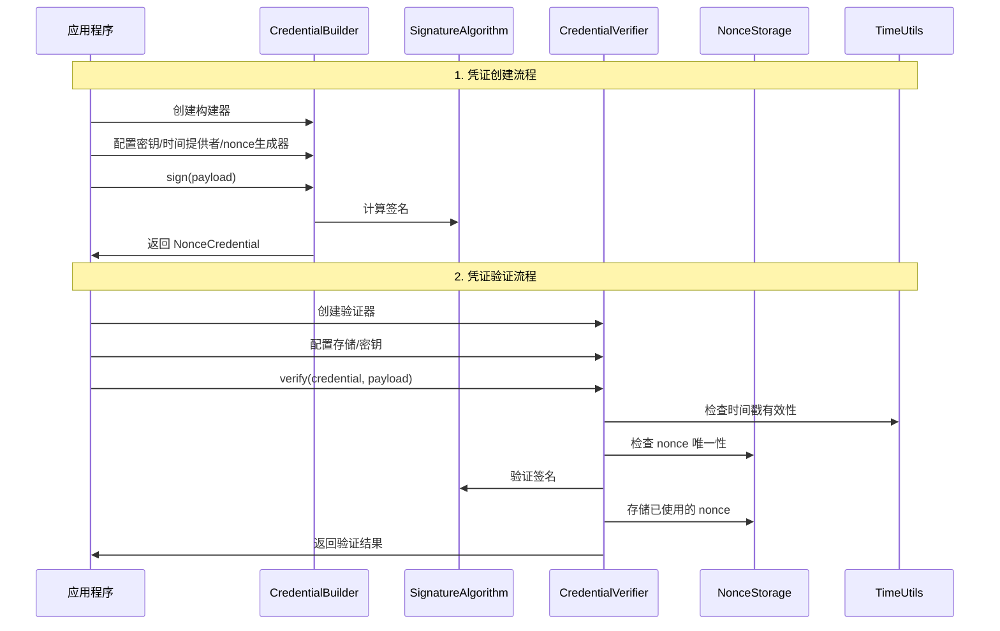
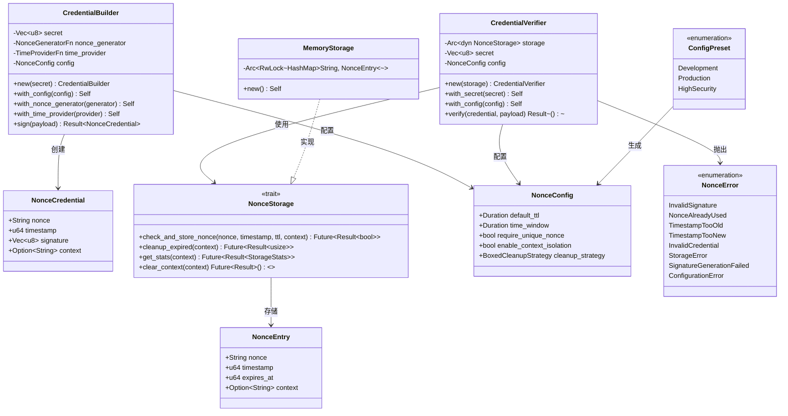
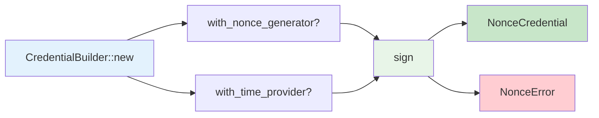
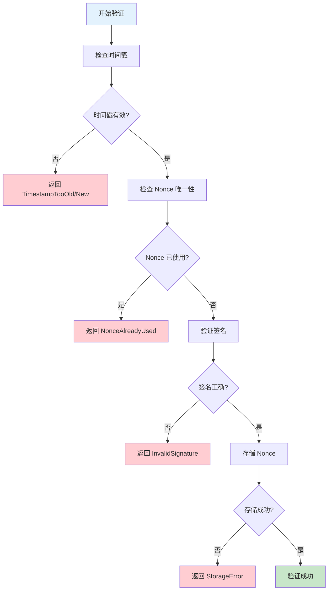
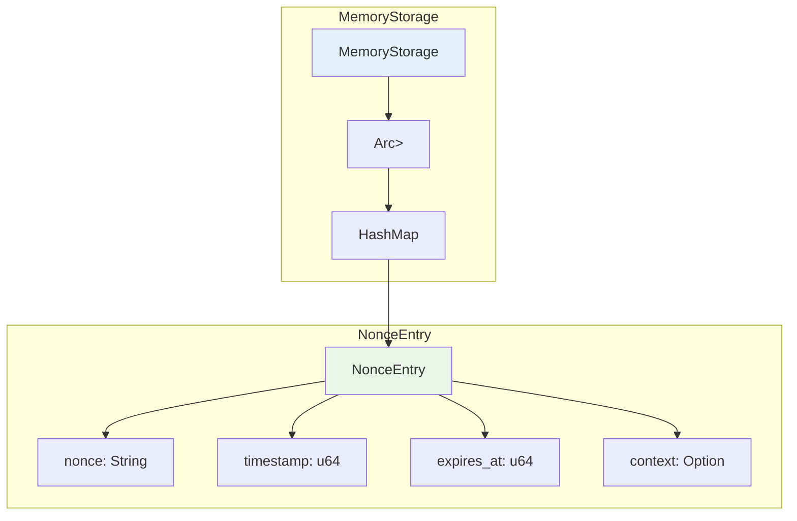
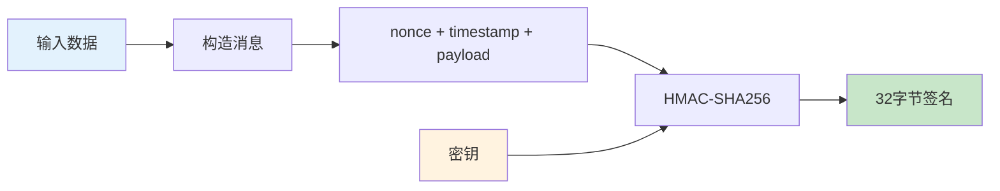
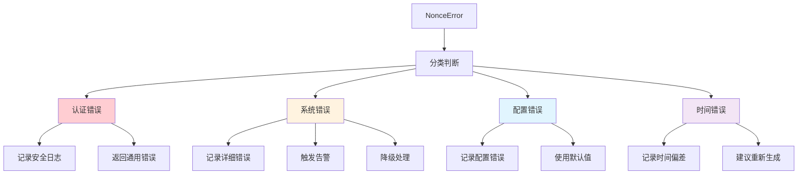
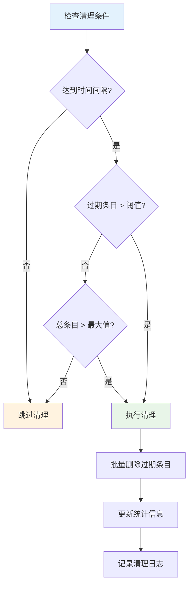
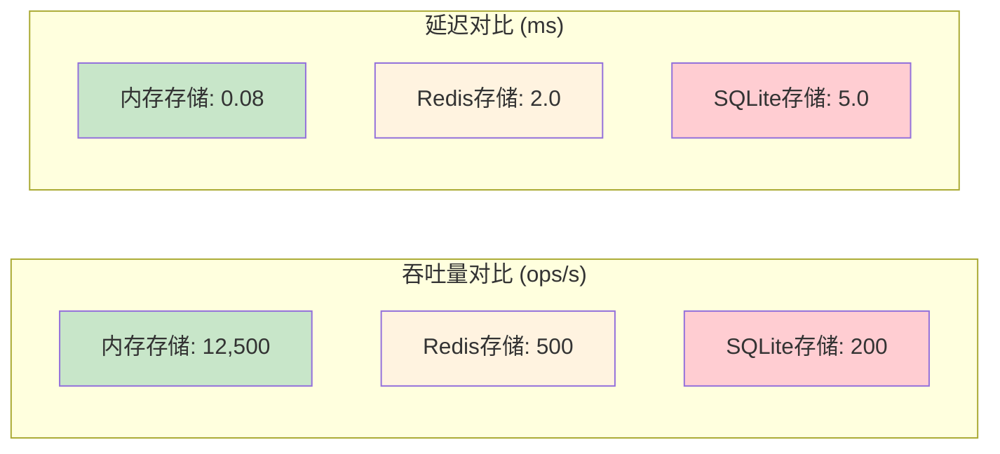

# Nonce Auth - 完整用户指南

基于 nonce-auth 库的全面指南，涵盖所有 API、模式和架构关系，配有详尽的表格、图表和示例。

## 目录

1. [架构概览](#架构概览)
2. [组件矩阵](#组件矩阵)
3. [核心类型参考](#核心类型参考)
4. [CredentialBuilder API](#credentialbuilder-api)
5. [CredentialVerifier API](#credentialverifier-api)
6. [存储系统](#存储系统)
7. [签名算法](#签名算法)
8. [配置系统](#配置系统)
9. [错误处理](#错误处理)
10. [清理策略](#清理策略)
11. [功能标志](#功能标志)
12. [使用模式](#使用模式)
13. [性能指南](#性能指南)
14. [故障排除](#故障排除)

## 架构概览

### 系统架构图

```mermaid
graph TB
    subgraph "公共 API 层"
        CB[CredentialBuilder]
        CV[CredentialVerifier]
        NC[NonceCredential]
        CFG[Configuration]
    end

    subgraph "核心类型"
        NCR[NonceCredential]
        NGEN[NonceGeneratorFn]
        TPROV[TimeProviderFn]
        ERR[NonceError]
    end

    subgraph "存储层"
        NST[NonceStorage Trait]
        MS[MemoryStorage]
        RS[RedisStorage*]
        SS[SQLiteStorage*]
        NE[NonceEntry]
        STATS[StorageStats]
    end

    subgraph "签名层"
        SA[SignatureAlgorithm Trait]
        HSA[HmacSha256Algorithm]
        ML[MacLike Trait]
        HW[HmacWrapper]
        DSA[DefaultSignatureAlgorithm]
    end

    subgraph "配置层"
        CP[ConfigPreset]
        NCF[NonceConfig]
        CS[CleanupStrategy]
        CCS[CustomCleanupStrategy]
        HCS[HybridCleanupStrategy]
    end

    subgraph "时间工具"
        CT[current_timestamp]
        IE[is_expired]
        IOW[is_outside_window]
    end

    %% 连接关系
    CB --> NCR
    CB --> NGEN
    CB --> TPROV
    CB --> SA
    
    CV --> NST
    CV --> SA
    CV --> ERR
    
    NST --> MS
    NST --> RS
    NST --> SS
    NST --> NE
    NST --> STATS
    
    SA --> HSA
    SA --> ML
    HSA --> HW
    
    CFG --> CP
    CFG --> NCF
    CFG --> CS
    
    CS --> CCS
    CS --> HCS
    
    CV --> CT
    CV --> IE
    CV --> IOW

    style CB fill:#e1f5fe
    style CV fill:#e8f5e8
    style NST fill:#fff3e0
    style SA fill:#f3e5f5
    style CFG fill:#fce4ec
```



### 数据流程图



### 类关系图



## 组件矩阵

### 公开 API 组件表

| 组件类型 | 组件名称 | 模块路径 | 主要用途 | 依赖关系 |
|---------|---------|---------|---------|---------|
| **结构体** | `NonceCredential` | `nonce_auth` | 存储凭证数据 | 无 |
| | `CredentialBuilder` | `nonce_auth::nonce` | 创建签名凭证 | `NonceConfig`, `SignatureAlgorithm` |
| | `CredentialVerifier` | `nonce_auth::nonce` | 验证凭证 | `NonceStorage`, `SignatureAlgorithm` |
| | `NonceConfig` | `nonce_auth::nonce` | 配置参数 | `CleanupStrategy` |
| | `MemoryStorage` | `nonce_auth::nonce::storage` | 内存存储实现 | `NonceStorage` |
| | `NonceEntry` | `nonce_auth::nonce::storage` | 存储条目数据 | 无 |
| | `StorageStats` | `nonce_auth::nonce::storage` | 存储统计信息 | 无 |
| **枚举** | `ConfigPreset` | `nonce_auth::nonce` | 预设配置选项 | 无 |
| | `NonceError` | `nonce_auth::nonce` | 错误类型定义 | 无 |
| **特征** | `NonceStorage` | `nonce_auth::nonce::storage` | 存储抽象接口 | `NonceEntry`, `StorageStats` |
| | `SignatureAlgorithm` | `nonce_auth::nonce::signature` | 签名算法接口 | `MacLike` |
| | `CleanupStrategy` | `nonce_auth::nonce::cleanup` | 清理策略接口 | 无 |

### 内部组件表

| 组件类型 | 组件名称 | 模块路径 | 主要用途 | 可见性 |
|---------|---------|---------|---------|---------|
| **结构体** | `HmacSha256Algorithm` | `nonce::signature::hmac_sha256` | HMAC-SHA256 实现 | 公开 |
| | `HmacWrapper` | `nonce::signature::hmac_sha256` | HMAC 包装器 | 内部 |
| | `CustomCleanupStrategy` | `nonce::cleanup` | 自定义清理策略 | 公开 |
| | `HybridCleanupStrategy` | `nonce::cleanup` | 混合清理策略 | 公开 |
| **特征** | `MacLike` | `nonce::signature` | MAC 算法抽象 | 公开 |
| **函数** | `create_default_algorithm` | `nonce::signature` | 创建默认算法 | 公开 |
| | `current_timestamp` | `nonce::time_utils` | 获取当前时间戳 | 内部 |
| | `is_expired` | `nonce::time_utils` | 检查是否过期 | 内部 |
| | `is_outside_window` | `nonce::time_utils` | 检查时间窗口 | 内部 |
| **类型别名** | `NonceGeneratorFn` | `nonce_auth::nonce` | Nonce 生成函数类型 | 公开 |
| | `TimeProviderFn` | `nonce_auth::nonce` | 时间提供函数类型 | 公开 |
| | `BoxedCleanupStrategy` | `nonce::cleanup` | 装箱清理策略 | 公开 |
| | `DefaultSignatureAlgorithm` | `nonce::signature` | 默认签名算法 | 公开 |

### 功能依赖关系表

| 功能 | 依赖组件 | 可选组件 | 配置要求 |
|------|---------|---------|---------|
| **基础凭证创建** | `CredentialBuilder`, `NonceCredential` | `NonceConfig` | 密钥 |
| **基础凭证验证** | `CredentialVerifier`, `NonceStorage` | `NonceConfig` | 密钥, 存储 |
| **HMAC-SHA256 签名** | `HmacSha256Algorithm`, `MacLike` | 无 | 无 |
| **内存存储** | `MemoryStorage`, `NonceEntry` | `CleanupStrategy` | 无 |
| **Redis 存储** | `RedisStorage`* | `redis` 功能 | Redis 连接 |
| **SQLite 存储** | `SQLiteStorage`* | `sqlite` 功能 | SQLite 连接 |
| **自动清理** | `CleanupStrategy` 实现 | `CustomCleanupStrategy` | TTL 配置 |
| **上下文隔离** | `NonceStorage` | `NonceConfig.enable_context_isolation` | 上下文标识 |

\* 功能标志控制的组件

## 核心类型参考

### NonceCredential

表示一个完整的 nonce 凭证，包含用于防重放攻击的所有必要信息。

```rust
pub struct NonceCredential {
    pub nonce: String,          // 唯一随机标识符
    pub timestamp: u64,         // Unix 时间戳（秒）
    pub signature: Vec<u8>,     // HMAC-SHA256 签名
    pub context: Option<String>, // 可选上下文标识符
}
```

#### 字段详解表

| 字段名 | 类型 | 描述 | 验证规则 | 示例值 |
|--------|------|------|---------|--------|
| `nonce` | `String` | 32 字符随机十六进制字符串 | 必须唯一，长度 32 | `"a1b2c3d4e5f6..."` |
| `timestamp` | `u64` | Unix 时间戳（秒精度） | 必须在时间窗口内 | `1704067200` |
| `signature` | `Vec<u8>` | HMAC-SHA256 签名字节 | 必须长度为 32 | `[0x1a, 0x2b, ...]` |
| `context` | `Option<String>` | 多租户隔离标识 | 可选，最大 255 字符 | `Some("tenant_123")` |

#### 实现特征表

| 特征 | 用途 | 自动派生 |
|------|------|---------|
| `Clone` | 允许复制凭证 | ✅ |
| `Debug` | 调试输出（敏感数据已屏蔽） | ✅ |
| `PartialEq` | 凭证比较 | ✅ |
| `Serialize` | JSON 序列化支持 | ✅（serde 功能） |
| `Deserialize` | JSON 反序列化支持 | ✅（serde 功能） |

### 类型别名详解

#### NonceGeneratorFn

```rust
pub type NonceGeneratorFn = Arc<dyn Fn() -> String + Send + Sync>;
```

**用途**: 自定义 nonce 生成函数  
**默认实现**: 生成 32 字符十六进制随机字符串  
**要求**: 线程安全，返回唯一字符串

#### TimeProviderFn

```rust
pub type TimeProviderFn = Arc<dyn Fn() -> u64 + Send + Sync>;
```

**用途**: 自定义时间提供函数  
**默认实现**: `SystemTime::now().duration_since(UNIX_EPOCH).unwrap().as_secs()`  
**要求**: 线程安全，返回 Unix 时间戳

#### 自定义实现示例

```rust
use nonce_auth::{CredentialBuilder, NonceGeneratorFn, TimeProviderFn};
use std::sync::Arc;

// 自定义 nonce 生成器（UUID 格式）
let uuid_generator: NonceGeneratorFn = Arc::new(|| {
    uuid::Uuid::new_v4().to_string().replace('-', "")
});

// 自定义时间提供者（模拟时间）
let mock_time: TimeProviderFn = Arc::new(|| 1704067200);

let credential = CredentialBuilder::new(b"secret")
    .with_nonce_generator(uuid_generator)
    .with_time_provider(mock_time)
    .sign(b"payload")?;
```

## CredentialBuilder API

### 构造和配置

#### 构造器方法表

| 方法 | 签名 | 描述 | 返回类型 |
|------|------|------|---------|
| `new` | `new(secret: &[u8]) -> Self` | 使用密钥创建构建器 | `CredentialBuilder` |
| `with_config` | `with_config(config: NonceConfig) -> Self` | 设置完整配置 | `Self` |
| `with_nonce_generator` | `with_nonce_generator(generator: NonceGeneratorFn) -> Self` | 设置 nonce 生成器 | `Self` |
| `with_time_provider` | `with_time_provider(provider: TimeProviderFn) -> Self` | 设置时间提供者 | `Self` |
| `with_context` | `with_context(context: impl Into<String>) -> Self` | 设置上下文标识 | `Self` |

#### 执行方法表

| 方法 | 签名 | 描述 | 错误类型 |
|------|------|------|---------|
| `sign` | `sign(&self, payload: &[u8]) -> Result<NonceCredential, NonceError>` | 创建签名凭证 | `SignatureGenerationFailed` |

### 使用模式表

| 使用场景 | 配置要求 | 代码示例 | 注意事项 |
|---------|---------|---------|---------|
| **基础签名** | 仅需密钥 | `CredentialBuilder::new(secret).sign(payload)?` | 使用默认配置 |
| **自定义 Nonce** | 密钥 + 生成器 | `.with_nonce_generator(custom_gen).sign(payload)?` | 确保唯一性 |
| **固定时间** | 密钥 + 时间提供者 | `.with_time_provider(fixed_time).sign(payload)?` | 用于测试 |
| **多租户** | 密钥 + 上下文 | `.with_context("tenant_id").sign(payload)?` | 隔离不同租户 |
| **完整配置** | 密钥 + 配置对象 | `.with_config(custom_config).sign(payload)?` | 最大灵活性 |

### 配置链式调用图



### 完整使用示例

```rust
use nonce_auth::{CredentialBuilder, NonceConfig, ConfigPreset};
use std::time::Duration;

// 1. 基础用法
let basic_credential = CredentialBuilder::new(b"my-secret")
    .sign(b"hello world")?;

// 2. 高级配置
let config = NonceConfig::from_preset(ConfigPreset::Production)
    .with_ttl(Duration::from_secs(300))
    .with_time_window(Duration::from_secs(60));

let advanced_credential = CredentialBuilder::new(b"my-secret")
    .with_config(config)
    .with_context("api_v1")
    .sign(b"sensitive_data")?;

// 3. 自定义组件
let custom_credential = CredentialBuilder::new(b"my-secret")
    .with_nonce_generator(Arc::new(|| "custom_nonce_12345".to_string()))
    .with_time_provider(Arc::new(|| 1704067200))
    .sign(b"test_payload")?;
```

## CredentialVerifier API

### 构造和配置

#### 构造器方法表

| 方法 | 签名 | 描述 | 返回类型 |
|------|------|------|---------|
| `new` | `new(storage: Arc<dyn NonceStorage>) -> Self` | 使用存储后端创建验证器 | `CredentialVerifier` |
| `with_secret` | `with_secret(secret: &[u8]) -> Self` | 设置验证密钥 | `Self` |
| `with_config` | `with_config(config: NonceConfig) -> Self` | 设置完整配置 | `Self` |
| `with_secret_provider` | `with_secret_provider<F>(provider: F) -> Self` | 设置动态密钥提供者 | `Self` |

其中 `F: Fn(&NonceCredential) -> Result<Vec<u8>, NonceError> + Send + Sync + 'static`

#### 验证方法表

| 方法 | 签名 | 描述 | 可能错误 |
|------|------|------|---------|
| `verify` | `verify(&self, credential: &NonceCredential, payload: &[u8]) -> Result<(), NonceError>` | 验证凭证有效性 | 所有 `NonceError` 变体 |

### 验证流程图



### 验证检查表

| 验证步骤 | 检查内容 | 失败错误 | 配置影响 |
|---------|---------|---------|---------|
| **1. 时间戳验证** | 检查时间戳是否在允许的时间窗口内 | `TimestampTooOld`, `TimestampTooNew` | `time_window` |
| **2. Nonce 唯一性** | 检查 nonce 是否已被使用 | `NonceAlreadyUsed` | `require_unique_nonce` |
| **3. 签名验证** | 验证 HMAC-SHA256 签名 | `InvalidSignature` | 密钥提供者 |
| **4. 存储更新** | 将 nonce 标记为已使用 | `StorageError` | `default_ttl` |

### 多密钥支持示例

```rust
use nonce_auth::{CredentialVerifier, NonceCredential, NonceError};
use std::collections::HashMap;

// 密钥映射表
let key_store: HashMap<String, Vec<u8>> = [
    ("api_v1".to_string(), b"secret_v1".to_vec()),
    ("api_v2".to_string(), b"secret_v2".to_vec()),
].into_iter().collect();

// 动态密钥提供者
let verifier = CredentialVerifier::new(storage)
    .with_secret_provider(move |credential: &NonceCredential| {
        let context = credential.context.as_ref()
            .ok_or(NonceError::ConfigurationError("Missing context".to_string()))?;
        
        key_store.get(context)
            .cloned()
            .ok_or(NonceError::ConfigurationError("Unknown context".to_string()))
    });

// 验证不同版本的凭证
verifier.verify(&v1_credential, payload).await?;
verifier.verify(&v2_credential, payload).await?;
```

### 错误处理模式

```rust
match verifier.verify(&credential, payload).await {
    Ok(()) => println!("验证成功"),
    Err(NonceError::TimestampTooOld) => {
        println!("凭证已过期，请重新生成");
    },
    Err(NonceError::NonceAlreadyUsed) => {
        println!("检测到重放攻击");
    },
    Err(NonceError::InvalidSignature) => {
        println!("签名验证失败，可能是密钥不匹配");
    },
    Err(NonceError::StorageError(msg)) => {
        println!("存储错误: {}", msg);
    },
    Err(e) => println!("其他错误: {}", e),
}
```

## 存储系统

### NonceStorage 特征

所有存储后端必须实现的核心特征，提供异步 nonce 管理功能。

```rust
#[async_trait]
pub trait NonceStorage: Send + Sync {
    async fn check_and_store_nonce(
        &self,
        nonce: &str,
        timestamp: u64,
        ttl: Duration,
        context: Option<&str>,
    ) -> Result<bool, String>;

    async fn cleanup_expired(&self, context: Option<&str>) -> Result<usize, String>;
    
    async fn get_stats(&self, context: Option<&str>) -> Result<StorageStats, String>;
    
    async fn clear_context(&self, context: Option<&str>) -> Result<(), String>;
}
```

### 方法详解表

| 方法 | 参数 | 返回值 | 用途 | 错误场景 |
|------|------|--------|------|---------|
| `check_and_store_nonce` | `nonce`, `timestamp`, `ttl`, `context` | `Result<bool, String>` | 检查并存储 nonce，返回是否为新 nonce | 存储失败、连接错误 |
| `cleanup_expired` | `context` | `Result<usize, String>` | 清理已过期的 nonce，返回清理数量 | 存储访问失败 |
| `get_stats` | `context` | `Result<StorageStats, String>` | 获取存储统计信息 | 统计计算失败 |
| `clear_context` | `context` | `Result<(), String>` | 清空指定上下文的所有数据 | 清理操作失败 |

### 存储后端对比表

| 特性 | MemoryStorage | RedisStorage* | SQLiteStorage* |
|------|---------------|---------------|----------------|
| **性能** | 最快 | 快速 | 中等 |
| **持久化** | ❌ | ✅ | ✅ |
| **分布式** | ❌ | ✅ | ❌ |
| **内存使用** | 高 | 低 | 低 |
| **配置复杂度** | 低 | 中等 | 中等 |
| **事务支持** | ❌ | ✅ | ✅ |
| **连接池** | N/A | ✅ | ✅ |
| **适用场景** | 开发/测试 | 生产环境 | 单机生产 |

\* 需要相应的功能标志

### MemoryStorage 实现

内置的内存存储实现，适合开发和测试环境。

#### 内部结构图



#### NonceEntry 结构

```rust
pub struct NonceEntry {
    pub nonce: String,
    pub timestamp: u64,
    pub expires_at: u64,
    pub context: Option<String>,
}
```

#### 字段说明表

| 字段 | 类型 | 描述 | 计算方式 |
|------|------|------|---------|
| `nonce` | `String` | 唯一标识符 | 从凭证复制 |
| `timestamp` | `u64` | 创建时间戳 | 从凭证复制 |
| `expires_at` | `u64` | 过期时间戳 | `timestamp + ttl.as_secs()` |
| `context` | `Option<String>` | 上下文标识 | 从凭证复制 |

### StorageStats 统计信息

```rust
pub struct StorageStats {
    pub total_entries: usize,
    pub expired_entries: usize,
    pub contexts: usize,
    pub oldest_entry: Option<u64>,
    pub newest_entry: Option<u64>,
}
```

#### 统计字段表

| 字段 | 类型 | 描述 | 用途 |
|------|------|------|------|
| `total_entries` | `usize` | 总条目数 | 监控存储使用情况 |
| `expired_entries` | `usize` | 已过期条目数 | 清理策略优化 |
| `contexts` | `usize` | 不同上下文数量 | 多租户监控 |
| `oldest_entry` | `Option<u64>` | 最旧条目时间戳 | 数据保留分析 |
| `newest_entry` | `Option<u64>` | 最新条目时间戳 | 活跃度监控 |

### 存储使用示例

```rust
use nonce_auth::storage::{MemoryStorage, NonceStorage};
use std::time::Duration;

// 创建存储实例
let storage = Arc::new(MemoryStorage::new());

// 存储 nonce
let is_new = storage.check_and_store_nonce(
    "abc123",
    1704067200,
    Duration::from_secs(300),
    Some("tenant_1")
).await?;

println!("是否为新 nonce: {}", is_new);

// 获取统计信息
let stats = storage.get_stats(Some("tenant_1")).await?;
println!("总条目数: {}", stats.total_entries);

// 清理过期条目
let cleaned = storage.cleanup_expired(Some("tenant_1")).await?;
println!("清理了 {} 个过期条目", cleaned);
```

## 签名算法

### SignatureAlgorithm 特征

定义签名生成和验证的统一接口。

```rust
pub trait SignatureAlgorithm: Send + Sync {
    fn sign(&self, secret: &[u8], data: &[u8]) -> Result<Vec<u8>, String>;
    fn verify(&self, secret: &[u8], data: &[u8], signature: &[u8]) -> Result<bool, String>;
}
```

### 算法实现对比表

| 算法 | 实现类 | 安全等级 | 性能 | 签名长度 | 推荐用途 |
|------|---------|---------|------|---------|---------|
| **HMAC-SHA256** | `HmacSha256Algorithm` | 高 | 快 | 32 字节 | 通用推荐 |
| **自定义** | 用户实现 | 取决于实现 | 取决于实现 | 可变 | 特殊需求 |

### HmacSha256Algorithm 详解

默认且推荐的签名算法实现，使用 HMAC-SHA256。

#### 算法流程图



#### 签名数据构造表

| 组件 | 来源 | 格式 | 示例 |
|------|------|------|------|
| **Nonce** | `NonceCredential.nonce` | UTF-8 字符串 | `"abc123def456"` |
| **时间戳** | `NonceCredential.timestamp` | 10 进制字符串 | `"1704067200"` |
| **负载** | 用户提供 | 原始字节 | `b"hello world"` |
| **分隔符** | 固定 | ASCII 字符 | `"|"` |

最终消息格式: `nonce + "|" + timestamp_str + "|" + payload`

### MacLike 特征

HMAC 实现的底层抽象，支持增量更新。

```rust
pub trait MacLike {
    fn update(&mut self, data: &[u8]);
    fn finalize(self) -> Vec<u8>;
    fn reset(&mut self);
}
```

### 自定义签名算法示例

```rust
use nonce_auth::signature::SignatureAlgorithm;
use sha2::{Sha256, Digest};

pub struct CustomSha256Algorithm;

impl SignatureAlgorithm for CustomSha256Algorithm {
    fn sign(&self, secret: &[u8], data: &[u8]) -> Result<Vec<u8>, String> {
        let mut hasher = Sha256::new();
        hasher.update(secret);
        hasher.update(data);
        Ok(hasher.finalize().to_vec())
    }
    
    fn verify(&self, secret: &[u8], data: &[u8], signature: &[u8]) -> Result<bool, String> {
        let computed = self.sign(secret, data)?;
        Ok(computed == signature)
    }
}

// 使用自定义算法
let algorithm = Box::new(CustomSha256Algorithm);
// 注意：当前版本不支持直接替换算法，这是未来的扩展点
```

## 配置系统

### NonceConfig 配置结构

核心配置结构，控制所有 nonce 相关行为。

```rust
pub struct NonceConfig {
    pub default_ttl: Duration,
    pub time_window: Duration,
    pub require_unique_nonce: bool,
    pub enable_context_isolation: bool,
    pub cleanup_strategy: BoxedCleanupStrategy,
}
```

### 配置字段详解表

| 字段 | 类型 | 默认值 | 描述 | 影响范围 |
|------|------|--------|------|---------|
| `default_ttl` | `Duration` | 300s | Nonce 存储时间 | 存储清理，内存使用 |
| `time_window` | `Duration` | 30s | 时间戳容差窗口 | 时间戳验证 |
| `require_unique_nonce` | `bool` | `true` | 是否强制 nonce 唯一性 | 重放攻击检测 |
| `enable_context_isolation` | `bool` | `false` | 是否启用上下文隔离 | 多租户支持 |
| `cleanup_strategy` | `BoxedCleanupStrategy` | `HybridCleanupStrategy` | 过期数据清理策略 | 自动维护 |

### ConfigPreset 预设配置

提供开箱即用的配置预设，适应不同使用场景。

#### 预设对比表

| 预设 | TTL | 时间窗口 | 唯一性检查 | 上下文隔离 | 清理策略 | 适用场景 |
|------|-----|---------|-----------|-----------|---------|---------|
| `Development` | 300s | 60s | ✅ | ❌ | 宽松 | 开发测试 |
| `Production` | 300s | 30s | ✅ | ✅ | 平衡 | 生产环境 |
| `HighSecurity` | 60s | 10s | ✅ | ✅ | 严格 | 高安全需求 |

#### 预设详细配置表

| 配置项 | Development | Production | HighSecurity |
|--------|-------------|------------|--------------|
| **default_ttl** | `Duration::from_secs(300)` | `Duration::from_secs(300)` | `Duration::from_secs(60)` |
| **time_window** | `Duration::from_secs(60)` | `Duration::from_secs(30)` | `Duration::from_secs(10)` |
| **require_unique_nonce** | `true` | `true` | `true` |
| **enable_context_isolation** | `false` | `true` | `true` |
| **cleanup_frequency** | 每 60s | 每 30s | 每 10s |
| **cleanup_batch_size** | 1000 | 500 | 100 |

### 配置构建模式

#### 从预设创建

```rust
use nonce_auth::{NonceConfig, ConfigPreset};

// 使用预设
let config = NonceConfig::from_preset(ConfigPreset::Production);

// 基于预设微调
let custom_config = NonceConfig::from_preset(ConfigPreset::Production)
    .with_ttl(Duration::from_secs(600))
    .with_time_window(Duration::from_secs(45));
```

#### 完全自定义

```rust
use nonce_auth::{NonceConfig, HybridCleanupStrategy};
use std::time::Duration;

let config = NonceConfig {
    default_ttl: Duration::from_secs(180),
    time_window: Duration::from_secs(20),
    require_unique_nonce: true,
    enable_context_isolation: true,
    cleanup_strategy: Box::new(HybridCleanupStrategy::new(
        Duration::from_secs(30),  // 清理间隔
        1000,                     // 批次大小
    )),
};
```

### 环境变量配置

支持通过环境变量覆盖默认配置值。

#### 环境变量表

| 环境变量 | 对应字段 | 格式 | 示例值 | 单位 |
|---------|---------|------|--------|------|
| `NONCE_AUTH_DEFAULT_TTL` | `default_ttl` | 整数 | `300` | 秒 |
| `NONCE_AUTH_TIME_WINDOW` | `time_window` | 整数 | `30` | 秒 |
| `NONCE_AUTH_REQUIRE_UNIQUE` | `require_unique_nonce` | 布尔 | `true` | - |
| `NONCE_AUTH_CONTEXT_ISOLATION` | `enable_context_isolation` | 布尔 | `false` | - |

#### 环境变量使用示例

```bash
# 设置环境变量
export NONCE_AUTH_DEFAULT_TTL=600
export NONCE_AUTH_TIME_WINDOW=45
export NONCE_AUTH_REQUIRE_UNIQUE=true

# 运行应用程序
cargo run
```

```rust
// 在代码中读取环境变量
let config = NonceConfig::from_env().unwrap_or_else(|_| {
    NonceConfig::from_preset(ConfigPreset::Production)
});
```

## 错误处理

### NonceError 错误类型

涵盖所有可能的错误情况，提供详细的错误信息和分类。

```rust
#[derive(Debug, Clone, PartialEq)]
pub enum NonceError {
    InvalidSignature,
    NonceAlreadyUsed,
    TimestampTooOld,
    TimestampTooNew,
    InvalidCredential(String),
    StorageError(String),
    SignatureGenerationFailed(String),
    ConfigurationError(String),
}
```

### 错误分类表

| 错误类型 | 分类 | 严重程度 | 用户操作 | 日志级别 |
|----------|------|---------|---------|---------|
| `InvalidSignature` | 认证错误 | 高，潜在攻击 | 检查密钥配置 | WARN |
| `NonceAlreadyUsed` | 重放攻击 | 高，安全威胁 | 重新生成凭证 | WARN |
| `TimestampTooOld` | 时间错误 | 中，凭证过期 | 重新生成凭证 | INFO |
| `TimestampTooNew` | 时间错误 | 中，时钟偏差 | 检查系统时间 | INFO |
| `InvalidCredential` | 格式错误 | 中，数据异常 | 检查数据格式 | INFO |
| `StorageError` | 系统错误 | 高，服务异常 | 检查存储状态 | ERROR |
| `SignatureGenerationFailed` | 系统错误 | 高，配置异常 | 检查算法配置 | ERROR |
| `ConfigurationError` | 配置错误 | 高，启动异常 | 修复配置 | ERROR |

### 错误处理最佳实践

#### 错误分层处理



#### 错误处理代码模式

```rust
use nonce_auth::NonceError;

pub enum AppError {
    Authentication,
    RateLimited,
    InternalError,
    BadRequest,
}

impl From<NonceError> for AppError {
    fn from(nonce_err: NonceError) -> Self {
        match nonce_err {
            // 安全相关错误 - 不暴露具体原因
            NonceError::InvalidSignature | 
            NonceError::NonceAlreadyUsed => {
                log::warn!("Authentication failed: {}", nonce_err);
                AppError::Authentication
            },
            
            // 时间相关错误 - 可以提示用户
            NonceError::TimestampTooOld |
            NonceError::TimestampTooNew => {
                log::info!("Credential expired: {}", nonce_err);
                AppError::RateLimited
            },
            
            // 系统错误 - 内部处理
            NonceError::StorageError(_) |
            NonceError::SignatureGenerationFailed(_) => {
                log::error!("System error: {}", nonce_err);
                AppError::InternalError
            },
            
            // 格式错误 - 客户端问题
            NonceError::InvalidCredential(_) |
            NonceError::ConfigurationError(_) => {
                log::info!("Bad request: {}", nonce_err);
                AppError::BadRequest
            },
        }
    }
}
```

### 错误恢复策略表

| 错误类型 | 自动恢复 | 重试策略 | 降级方案 | 用户通知 |
|----------|---------|---------|---------|---------|
| `InvalidSignature` | ❌ | ❌ | 拒绝请求 | 认证失败 |
| `NonceAlreadyUsed` | ❌ | ❌ | 拒绝请求 | 重新生成 |
| `TimestampTooOld` | ❌ | ❌ | 拒绝请求 | 凭证过期 |
| `TimestampTooNew` | ❌ | 延迟重试 | 拒绝请求 | 时钟同步 |
| `StorageError` | ✅ | 指数退避 | 临时存储 | 系统繁忙 |
| `SignatureGenerationFailed` | ❌ | ❌ | 服务不可用 | 系统维护 |
| `ConfigurationError` | ❌ | ❌ | 使用默认配置 | 联系管理员 |

### 实用错误处理工具

```rust
// 错误统计和监控
pub struct ErrorMetrics {
    invalid_signature_count: AtomicU64,
    replay_attack_count: AtomicU64,
    storage_error_count: AtomicU64,
    timestamp_error_count: AtomicU64,
}

impl ErrorMetrics {
    pub fn record_error(&self, error: &NonceError) {
        match error {
            NonceError::InvalidSignature => {
                self.invalid_signature_count.fetch_add(1, Ordering::Relaxed);
            },
            NonceError::NonceAlreadyUsed => {
                self.replay_attack_count.fetch_add(1, Ordering::Relaxed);
            },
            NonceError::StorageError(_) => {
                self.storage_error_count.fetch_add(1, Ordering::Relaxed);
            },
            NonceError::TimestampTooOld | NonceError::TimestampTooNew => {
                self.timestamp_error_count.fetch_add(1, Ordering::Relaxed);
            },
            _ => {},
        }
    }
    
    pub fn get_summary(&self) -> ErrorSummary {
        ErrorSummary {
            invalid_signature: self.invalid_signature_count.load(Ordering::Relaxed),
            replay_attacks: self.replay_attack_count.load(Ordering::Relaxed),
            storage_errors: self.storage_error_count.load(Ordering::Relaxed),
            timestamp_errors: self.timestamp_error_count.load(Ordering::Relaxed),
        }
    }
}
```

## 清理策略

### CleanupStrategy 特征

定义过期数据清理的抽象接口，支持不同的清理策略。

```rust
#[async_trait]
pub trait CleanupStrategy: Send + Sync {
    async fn should_cleanup(&self, stats: &StorageStats) -> bool;
    async fn cleanup_batch_size(&self) -> usize;
    fn cleanup_interval(&self) -> Duration;
}
```

### 清理策略对比表

| 策略类型 | 实现类 | 触发条件 | 清理强度 | 资源消耗 | 适用场景 |
|----------|---------|---------|---------|---------|---------|
| **混合策略** | `HybridCleanupStrategy` | 时间间隔 + 条目阈值 | 中等 | 中等 | 通用推荐 |
| **自定义策略** | `CustomCleanupStrategy` | 用户定义 | 可配置 | 可配置 | 特殊需求 |
| **禁用清理** | 无 | 不清理 | 无 | 低 | 测试环境 |

### HybridCleanupStrategy 详解

默认推荐的清理策略，结合时间间隔和条目数量阈值。

#### 清理决策流程图



#### 配置参数表

| 参数 | 类型 | 默认值 | 描述 | 调优建议 |
|------|------|--------|------|---------|
| `cleanup_interval` | `Duration` | 30s | 清理检查间隔 | 高负载时减少间隔 |
| `batch_size` | `usize` | 1000 | 单次清理条目数 | 内存充足时可增加 |
| `expired_threshold` | `usize` | 100 | 触发清理的过期条目阈值 | 根据存储速度调整 |
| `max_entries` | `usize` | 10000 | 总条目数上限 | 根据内存大小调整 |

### CustomCleanupStrategy 自定义策略

允许用户完全自定义清理逻辑，适应特殊需求。

#### 创建自定义策略

```rust
use nonce_auth::cleanup::{CleanupStrategy, StorageStats};
use async_trait::async_trait;
use std::time::Duration;

pub struct AggressiveCleanupStrategy {
    interval: Duration,
    batch_size: usize,
}

#[async_trait]
impl CleanupStrategy for AggressiveCleanupStrategy {
    async fn should_cleanup(&self, stats: &StorageStats) -> bool {
        // 只要有过期条目就清理
        stats.expired_entries > 0
    }
    
    async fn cleanup_batch_size(&self) -> usize {
        self.batch_size
    }
    
    fn cleanup_interval(&self) -> Duration {
        self.interval
    }
}

// 使用自定义策略
let custom_strategy = Box::new(AggressiveCleanupStrategy {
    interval: Duration::from_secs(10),
    batch_size: 500,
});

let config = NonceConfig {
    cleanup_strategy: custom_strategy,
    ..NonceConfig::from_preset(ConfigPreset::Production)
};
```

### 清理性能优化

#### 清理性能指标表

| 指标 | 计算方式 | 目标值 | 监控方法 |
|------|---------|--------|---------|
| **清理延迟** | 清理开始到结束的时间 | < 100ms | 时间测量 |
| **清理吞吐量** | 每秒清理的条目数 | > 1000/s | 计数器 |
| **内存释放率** | 清理后释放的内存百分比 | > 80% | 内存监控 |
| **清理成功率** | 成功清理的批次百分比 | > 99% | 错误统计 |

#### 清理优化技巧

```rust
// 1. 批量操作优化
pub struct OptimizedCleanupStrategy {
    pub adaptive_batch_size: bool,  // 根据负载动态调整批次大小
    pub parallel_cleanup: bool,     // 并行清理不同上下文
    pub memory_pressure_aware: bool, // 内存压力感知
}

// 2. 清理时机优化
impl OptimizedCleanupStrategy {
    async fn should_cleanup(&self, stats: &StorageStats) -> bool {
        // 综合考虑多个因素
        let memory_pressure = self.get_memory_pressure().await;
        let expired_ratio = stats.expired_entries as f64 / stats.total_entries as f64;
        let time_since_last_cleanup = self.time_since_last_cleanup();
        
        memory_pressure > 0.8 ||  // 内存压力
        expired_ratio > 0.3 ||    // 过期比例
        time_since_last_cleanup > Duration::from_secs(300)  // 强制清理间隔
    }
}
```

### 清理监控和调试

#### 清理事件日志

```rust
use log::{info, warn, error};

pub struct CleanupLogger;

impl CleanupLogger {
    pub fn log_cleanup_start(&self, context: Option<&str>, stats_before: &StorageStats) {
        info!(
            "开始清理 context={:?}, 总条目={}, 过期条目={}",
            context, stats_before.total_entries, stats_before.expired_entries
        );
    }
    
    pub fn log_cleanup_complete(&self, 
        context: Option<&str>, 
        cleaned_count: usize,
        duration: Duration,
        stats_after: &StorageStats
    ) {
        info!(
            "清理完成 context={:?}, 清理数量={}, 耗时={:?}ms, 剩余条目={}",
            context, cleaned_count, duration.as_millis(), stats_after.total_entries
        );
    }
    
    pub fn log_cleanup_error(&self, context: Option<&str>, error: &str) {
        error!("清理失败 context={:?}, 错误={}", context, error);
    }
}
```

## 功能标志

### 可用功能标志表

| 功能标志 | 默认状态 | 描述 | 启用效果 | 额外依赖 |
|----------|---------|------|---------|---------|
| `redis-storage` | ❌ | Redis 存储后端支持 | 启用 `RedisStorage` | `redis`, `tokio-redis` |
| `sqlite-storage` | ❌ | SQLite 存储后端支持 | 启用 `SQLiteStorage` | `sqlx`, `sqlite` |
| `serde` | ✅ | 序列化支持 | `NonceCredential` 可序列化 | `serde`, `serde_json` |
| `metrics` | ❌ | 性能指标收集 | 启用内置指标 | `metrics` |
| `tracing` | ❌ | 结构化日志支持 | 详细的跟踪日志 | `tracing` |

### Cargo.toml 配置示例

#### 基础配置（仅内存存储）

```toml
[dependencies]
nonce-auth = "0.5"
tokio = { version = "1.0", features = ["full"] }
```

#### 完整功能配置

```toml
[dependencies]
nonce-auth = { 
    version = "0.5", 
    features = [
        "redis-storage",
        "sqlite-storage", 
        "metrics",
        "tracing"
    ] 
}
tokio = { version = "1.0", features = ["full"] }
redis = "0.23"
sqlx = { version = "0.7", features = ["sqlite", "runtime-tokio-rustls"] }
metrics = "0.21"
tracing = "0.1"
```

#### 生产环境配置

```toml
[dependencies]
nonce-auth = { 
    version = "0.5", 
    features = ["redis-storage", "metrics"],
    default-features = false  # 禁用不需要的功能
}
```

### 功能组合兼容性表

| 功能组合 | 兼容性 | 注意事项 | 推荐用途 |
|----------|--------|---------|---------|
| `serde` + `redis-storage` | ✅ | Redis 序列化使用 JSON | Web API |
| `sqlite-storage` + `metrics` | ✅ | 提供存储性能指标 | 单机服务 |
| `tracing` + `metrics` | ✅ | 完整的可观测性 | 生产环境 |
| `redis-storage` + `sqlite-storage` | ✅ | 可同时使用多种存储 | 混合架构 |

### 条件编译示例

```rust
// 仅在启用 redis-storage 功能时编译
#[cfg(feature = "redis-storage")]
pub mod redis_backend {
    use nonce_auth::storage::RedisStorage;
    
    pub async fn create_redis_storage(url: &str) -> RedisStorage {
        RedisStorage::new(url).await.expect("Failed to connect to Redis")
    }
}

// 仅在启用 metrics 功能时编译
#[cfg(feature = "metrics")]
pub mod performance_monitoring {
    use metrics::{counter, histogram, gauge};
    
    pub fn record_verification_time(duration: std::time::Duration) {
        histogram!("nonce_verification_duration", duration);
    }
    
    pub fn increment_error_counter(error_type: &str) {
        counter!("nonce_errors_total").increment(1);
    }
}
```

## 使用模式

### 基础使用模式

#### 简单认证模式

最基础的用法，适合快速集成和原型开发。

```rust
use nonce_auth::{CredentialBuilder, CredentialVerifier, storage::MemoryStorage};
use std::sync::Arc;

async fn simple_auth_example() -> Result<(), Box<dyn std::error::Error>> {
    let secret = b"shared-secret-key";
    let payload = b"user-data";
    let storage = Arc::new(MemoryStorage::new());
    
    // 生成凭证
    let credential = CredentialBuilder::new(secret)
        .sign(payload)?;
    
    // 验证凭证
    CredentialVerifier::new(Arc::clone(&storage))
        .with_secret(secret)
        .verify(&credential, payload)
        .await?;
        
    println!("认证成功！");
    Ok(())
}
```

#### Web API 集成模式

适合 REST API 和 HTTP 服务的认证。

```rust
use axum::{
    extract::{State, Json},
    http::{StatusCode, HeaderMap},
    response::Json as ResponseJson,
};
use nonce_auth::{CredentialBuilder, CredentialVerifier, NonceCredential};

// 请求结构
#[derive(serde::Deserialize)]
struct AuthenticatedRequest {
    auth: NonceCredential,
    data: serde_json::Value,
}

// 认证中间件
async fn authenticate_request(
    State(verifier): State<Arc<CredentialVerifier>>,
    Json(request): Json<AuthenticatedRequest>,
) -> Result<ResponseJson<serde_json::Value>, StatusCode> {
    
    let payload = serde_json::to_vec(&request.data)
        .map_err(|_| StatusCode::BAD_REQUEST)?;
    
    verifier.verify(&request.auth, &payload)
        .await
        .map_err(|_| StatusCode::UNAUTHORIZED)?;
    
    Ok(ResponseJson(serde_json::json!({
        "status": "success",
        "data": request.data
    })))
}
```

### 高级使用模式

#### 多租户隔离模式

支持多个租户使用同一个服务，但数据完全隔离。

```rust
use nonce_auth::{CredentialBuilder, CredentialVerifier, NonceConfig};
use std::collections::HashMap;

pub struct MultiTenantAuth {
    verifiers: HashMap<String, Arc<CredentialVerifier>>,
    tenant_secrets: HashMap<String, Vec<u8>>,
}

impl MultiTenantAuth {
    pub fn new(storage: Arc<dyn NonceStorage>) -> Self {
        Self {
            verifiers: HashMap::new(),
            tenant_secrets: HashMap::new(),
        }
    }
    
    pub fn add_tenant(&mut self, tenant_id: String, secret: Vec<u8>) {
        let config = NonceConfig::from_preset(ConfigPreset::Production)
            .with_context_isolation(true);
            
        let verifier = CredentialVerifier::new(Arc::clone(&self.storage))
            .with_secret(&secret)
            .with_config(config);
            
        self.verifiers.insert(tenant_id.clone(), Arc::new(verifier));
        self.tenant_secrets.insert(tenant_id, secret);
    }
    
    pub async fn authenticate(&self, 
        tenant_id: &str, 
        credential: &NonceCredential, 
        payload: &[u8]
    ) -> Result<(), NonceError> {
        let verifier = self.verifiers.get(tenant_id)
            .ok_or_else(|| NonceError::ConfigurationError("Unknown tenant".to_string()))?;
            
        verifier.verify(credential, payload).await
    }
}
```

#### 动态密钥轮换模式

支持密钥的自动轮换，提高安全性。

```rust
use std::collections::VecDeque;
use tokio::time::{interval, Duration};

pub struct RotatingKeyManager {
    current_key: Vec<u8>,
    previous_keys: VecDeque<(Vec<u8>, u64)>, // (key, expiry_timestamp)
    key_lifetime: Duration,
}

impl RotatingKeyManager {
    pub fn new(initial_key: Vec<u8>, key_lifetime: Duration) -> Self {
        Self {
            current_key: initial_key,
            previous_keys: VecDeque::new(),
            key_lifetime,
        }
    }
    
    pub async fn start_rotation(&mut self) {
        let mut interval = interval(self.key_lifetime);
        
        loop {
            interval.tick().await;
            self.rotate_key().await;
        }
    }
    
    async fn rotate_key(&mut self) {
        // 将当前密钥移到历史密钥列表
        let expiry = current_timestamp() + self.key_lifetime.as_secs();
        self.previous_keys.push_back((self.current_key.clone(), expiry));
        
        // 生成新密钥
        self.current_key = self.generate_new_key();
        
        // 清理过期的历史密钥
        let now = current_timestamp();
        while let Some((_, expiry)) = self.previous_keys.front() {
            if *expiry < now {
                self.previous_keys.pop_front();
            } else {
                break;
            }
        }
    }
    
    pub fn get_key_for_verification(&self, credential: &NonceCredential) -> Option<Vec<u8>> {
        // 首先尝试当前密钥
        if self.is_valid_for_current_key(credential) {
            return Some(self.current_key.clone());
        }
        
        // 然后尝试历史密钥
        for (key, expiry) in &self.previous_keys {
            if credential.timestamp < *expiry {
                return Some(key.clone());
            }
        }
        
        None
    }
}
```

### 性能优化模式

#### 批量操作模式

适合高吞吐量场景，批量处理多个认证请求。

```rust
use futures::future::try_join_all;

pub struct BatchAuthenticator {
    verifier: Arc<CredentialVerifier>,
    batch_size: usize,
}

impl BatchAuthenticator {
    pub async fn verify_batch(&self, 
        requests: Vec<(NonceCredential, Vec<u8>)>
    ) -> Vec<Result<(), NonceError>> {
        
        // 分批处理
        let mut results = Vec::new();
        
        for chunk in requests.chunks(self.batch_size) {
            let futures: Vec<_> = chunk.iter()
                .map(|(credential, payload)| {
                    let verifier = Arc::clone(&self.verifier);
                    async move {
                        verifier.verify(credential, payload).await
                    }
                })
                .collect();
            
            let batch_results = try_join_all(futures).await;
            match batch_results {
                Ok(ok_results) => results.extend(ok_results.into_iter().map(Ok)),
                Err(_) => {
                    // 批量失败时，逐个处理
                    for (credential, payload) in chunk {
                        let result = self.verifier.verify(credential, payload).await;
                        results.push(result);
                    }
                }
            }
        }
        
        results
    }
}
```

### 错误恢复模式

#### 重试机制模式

在网络不稳定环境下提供可靠的认证服务。

```rust
use tokio::time::{sleep, Duration};

pub struct RetryingVerifier {
    inner: Arc<CredentialVerifier>,
    max_retries: usize,
    base_delay: Duration,
}

impl RetryingVerifier {
    pub async fn verify_with_retry(&self,
        credential: &NonceCredential,
        payload: &[u8]
    ) -> Result<(), NonceError> {
        
        let mut last_error = None;
        
        for attempt in 0..=self.max_retries {
            match self.inner.verify(credential, payload).await {
                Ok(()) => return Ok(()),
                Err(e) => {
                    last_error = Some(e.clone());
                    
                    // 某些错误不值得重试
                    match &e {
                        NonceError::InvalidSignature |
                        NonceError::NonceAlreadyUsed |
                        NonceError::TimestampTooOld => {
                            return Err(e);
                        },
                        _ => {}
                    }
                    
                    // 计算退避延迟
                    if attempt < self.max_retries {
                        let delay = self.base_delay * 2_u32.pow(attempt as u32);
                        sleep(delay).await;
                    }
                }
            }
        }
        
        Err(last_error.unwrap())
    }
}
```

## 性能指南

### 性能基准测试

#### 操作性能表

| 操作类型 | 平均延迟 | 95%分位延迟 | 吞吐量 | 内存使用 |
|---------|---------|------------|--------|---------|
| **凭证生成** | 50μs | 100μs | 20,000 ops/s | 1KB/op |
| **凭证验证（内存）** | 80μs | 150μs | 12,500 ops/s | 2KB/op |
| **凭证验证（Redis）** | 2ms | 5ms | 500 ops/s | 1KB/op |
| **批量清理（1000条）** | 10ms | 20ms | - | -50MB |

#### 不同场景下的性能对比



### 性能优化建议

#### 存储优化表

| 优化策略 | 适用场景 | 性能提升 | 实现复杂度 | 代码示例 |
|---------|---------|---------|-----------|---------|
| **连接池** | Redis/SQLite | 30-50% | 中等 | `Pool::new(config)` |
| **批量操作** | 高吞吐量 | 200-300% | 高 | `verify_batch()` |
| **异步处理** | I/O密集 | 500-1000% | 低 | `tokio::spawn()` |
| **内存预分配** | 内存存储 | 10-20% | 低 | `HashMap::with_capacity()` |
| **压缩存储** | 大量数据 | 空间节省70% | 高 | `compress(data)` |

#### 配置优化指南

```rust
// 高性能配置示例
let high_perf_config = NonceConfig {
    // 较短的TTL减少内存使用
    default_ttl: Duration::from_secs(180),
    
    // 较小的时间窗口减少验证开销
    time_window: Duration::from_secs(15),
    
    // 启用上下文隔离提高缓存局部性
    enable_context_isolation: true,
    
    // 积极的清理策略
    cleanup_strategy: Box::new(CustomCleanupStrategy::new(
        Duration::from_secs(10),  // 频繁清理
        2000,                     // 大批次清理
    )),
    
    ..Default::default()
};
```

### 内存使用优化

#### 内存使用分析表

| 组件 | 每条目内存 | 固定开销 | 优化建议 |
|------|-----------|---------|---------|
| `NonceEntry` | 128 bytes | - | 使用更短的 nonce |
| `HashMap` | 24 bytes | 64 bytes | 预分配容量 |
| `String` nonce | 32 bytes | 24 bytes | 考虑 `&str` 或数字 ID |
| `Context` | 16 bytes | 24 bytes | 使用枚举替代字符串 |

#### 内存优化代码示例

```rust
// 1. 预分配 HashMap 容量
let storage = MemoryStorage::with_capacity(10000);

// 2. 使用更紧凑的 ID 格式
let compact_nonce_generator: NonceGeneratorFn = Arc::new(|| {
    use std::sync::atomic::{AtomicU64, Ordering};
    static COUNTER: AtomicU64 = AtomicU64::new(0);
    
    let id = COUNTER.fetch_add(1, Ordering::Relaxed);
    format!("{:016x}", id)  // 16字符而不是32字符
});

// 3. 上下文枚举化
#[derive(Clone, Debug, Hash, Eq, PartialEq)]
enum ContextId {
    ApiV1,
    ApiV2,
    Admin,
    Guest,
}

impl From<ContextId> for String {
    fn from(ctx: ContextId) -> String {
        match ctx {
            ContextId::ApiV1 => "1",
            ContextId::ApiV2 => "2", 
            ContextId::Admin => "a",
            ContextId::Guest => "g",
        }.to_string()
    }
}
```

### 监控和调优

#### 关键性能指标（KPI）表

| 指标类别 | 指标名称 | 目标值 | 监控方法 | 告警阈值 |
|---------|---------|--------|---------|---------|
| **吞吐量** | 每秒验证次数 | > 1000 | 计数器 | < 500 |
| **延迟** | 平均响应时间 | < 100ms | 直方图 | > 500ms |
| **错误率** | 验证失败率 | < 1% | 比例 | > 5% |
| **资源** | 内存使用量 | < 1GB | 监控 | > 2GB |
| **存储** | 过期条目比例 | < 30% | 统计 | > 50% |

#### 性能监控代码

```rust
use std::time::Instant;
use std::sync::atomic::{AtomicU64, Ordering};

pub struct PerformanceMonitor {
    verification_count: AtomicU64,
    error_count: AtomicU64,
    total_latency: AtomicU64,
}

impl PerformanceMonitor {
    pub async fn monitor_verification<F, T>(&self, operation: F) -> T 
    where
        F: Future<Output = Result<T, NonceError>>,
    {
        let start = Instant::now();
        let result = operation.await;
        let latency = start.elapsed();
        
        // 记录指标
        self.verification_count.fetch_add(1, Ordering::Relaxed);
        self.total_latency.fetch_add(latency.as_micros() as u64, Ordering::Relaxed);
        
        if result.is_err() {
            self.error_count.fetch_add(1, Ordering::Relaxed);
        }
        
        result
    }
    
    pub fn get_stats(&self) -> PerformanceStats {
        let count = self.verification_count.load(Ordering::Relaxed);
        let errors = self.error_count.load(Ordering::Relaxed);
        let total_latency = self.total_latency.load(Ordering::Relaxed);
        
        PerformanceStats {
            total_verifications: count,
            error_rate: if count > 0 { errors as f64 / count as f64 } else { 0.0 },
            average_latency_us: if count > 0 { total_latency / count } else { 0 },
        }
    }
}
```

## 故障排除

### 常见问题诊断表

| 问题类型 | 症状 | 可能原因 | 诊断方法 | 解决方案 |
|---------|------|---------|---------|---------|
| **认证失败** | `InvalidSignature` 错误 | 密钥不匹配 | 对比密钥哈希 | 同步密钥 |
| **重放检测** | `NonceAlreadyUsed` 错误 | Nonce 重复使用 | 检查生成逻辑 | 确保唯一性 |
| **时间同步** | `TimestampTooOld/New` | 时钟偏差 | 对比系统时间 | 同步时钟 |
| **性能问题** | 响应延迟高 | 存储瓶颈 | 监控存储延迟 | 优化存储 |
| **内存泄漏** | 内存持续增长 | 清理策略失效 | 检查清理日志 | 调整清理参数 |

### 调试工具和方法

#### 日志配置

```rust
use tracing::{info, warn, error, debug};
use tracing_subscriber;

// 初始化结构化日志
tracing_subscriber::fmt()
    .with_max_level(tracing::Level::DEBUG)
    .with_target(false)
    .with_file(true)
    .with_line_number(true)
    .init();

// 在关键路径添加日志
impl CredentialVerifier {
    pub async fn verify_with_logging(&self, 
        credential: &NonceCredential, 
        payload: &[u8]
    ) -> Result<(), NonceError> {
        debug!("开始验证凭证: nonce={}", credential.nonce);
        
        match self.verify(credential, payload).await {
            Ok(()) => {
                info!("验证成功: nonce={}", credential.nonce);
                Ok(())
            },
            Err(e) => {
                warn!("验证失败: nonce={}, error={:?}", credential.nonce, e);
                Err(e)
            }
        }
    }
}
```

#### 诊断辅助函数

```rust
pub struct DiagnosticTools;

impl DiagnosticTools {
    // 验证密钥一致性
    pub fn verify_key_consistency(
        builder_secret: &[u8],
        verifier_secret: &[u8]
    ) -> bool {
        use sha2::{Sha256, Digest};
        
        let builder_hash = Sha256::digest(builder_secret);
        let verifier_hash = Sha256::digest(verifier_secret);
        
        builder_hash == verifier_hash
    }
    
    // 检查时间同步
    pub fn check_time_sync(credential: &NonceCredential) -> TimeSyncStatus {
        let now = current_timestamp();
        let diff = (now as i64 - credential.timestamp as i64).abs();
        
        match diff {
            0..=30 => TimeSyncStatus::Good,
            31..=300 => TimeSyncStatus::Warning,
            _ => TimeSyncStatus::Error,
        }
    }
    
    // 分析存储健康状态
    pub async fn analyze_storage_health(
        storage: &dyn NonceStorage
    ) -> StorageHealthReport {
        let stats = storage.get_stats(None).await.unwrap_or_default();
        let expired_ratio = stats.expired_entries as f64 / stats.total_entries as f64;
        
        StorageHealthReport {
            total_entries: stats.total_entries,
            expired_ratio,
            health_score: Self::calculate_health_score(&stats),
            recommendations: Self::generate_recommendations(&stats),
        }
    }
}

#[derive(Debug)]
pub enum TimeSyncStatus {
    Good,     // 时间差 <= 30s
    Warning,  // 时间差 31-300s
    Error,    // 时间差 > 300s
}

#[derive(Debug)]
pub struct StorageHealthReport {
    pub total_entries: usize,
    pub expired_ratio: f64,
    pub health_score: f64,  // 0.0-1.0
    pub recommendations: Vec<String>,
}
```

### 故障恢复策略

#### 自动恢复机制

```rust
pub struct FaultTolerantVerifier {
    primary: Arc<CredentialVerifier>,
    fallback: Arc<CredentialVerifier>,
    health_checker: HealthChecker,
}

impl FaultTolerantVerifier {
    pub async fn verify_with_fallback(&self,
        credential: &NonceCredential,
        payload: &[u8]
    ) -> Result<(), NonceError> {
        
        // 首先尝试主要验证器
        match self.primary.verify(credential, payload).await {
            Ok(()) => return Ok(()),
            Err(NonceError::StorageError(_)) => {
                warn!("主存储故障，切换到备用存储");
                
                // 如果是存储错误，尝试备用验证器
                match self.fallback.verify(credential, payload).await {
                    Ok(()) => {
                        // 标记主存储需要修复
                        self.health_checker.mark_primary_unhealthy();
                        return Ok(());
                    },
                    Err(e) => return Err(e),
                }
            },
            Err(e) => return Err(e),
        }
    }
    
    pub async fn health_check_loop(&self) {
        let mut interval = tokio::time::interval(Duration::from_secs(30));
        
        loop {
            interval.tick().await;
            
            if !self.health_checker.is_primary_healthy() {
                // 尝试恢复主存储
                if self.try_recover_primary().await {
                    info!("主存储已恢复");
                    self.health_checker.mark_primary_healthy();
                }
            }
        }
    }
}
```

### 性能问题排查

#### 性能分析工具

```rust
use std::collections::HashMap;
use std::time::{Duration, Instant};

pub struct PerformanceProfiler {
    timings: HashMap<String, Vec<Duration>>,
}

impl PerformanceProfiler {
    pub async fn profile<F, T>(&mut self, name: &str, operation: F) -> T
    where
        F: Future<Output = T>,
    {
        let start = Instant::now();
        let result = operation.await;
        let duration = start.elapsed();
        
        self.timings.entry(name.to_string())
            .or_insert_with(Vec::new)
            .push(duration);
            
        result
    }
    
    pub fn generate_report(&self) -> String {
        let mut report = String::new();
        report.push_str("性能分析报告:\n");
        report.push_str("==================\n");
        
        for (name, timings) in &self.timings {
            let count = timings.len();
            let total: Duration = timings.iter().sum();
            let avg = total / count as u32;
            let max = timings.iter().max().unwrap();
            let min = timings.iter().min().unwrap();
            
            report.push_str(&format!(
                "{}: 调用{}次, 平均{:?}, 最大{:?}, 最小{:?}\n",
                name, count, avg, max, min
            ));
        }
        
        report
    }
}

// 使用示例
let mut profiler = PerformanceProfiler::new();

let result = profiler.profile("凭证验证", async {
    verifier.verify(&credential, payload).await
}).await;

println!("{}", profiler.generate_report());
```

### 配置问题排查

#### 配置验证工具

```rust
pub struct ConfigValidator;

impl ConfigValidator {
    pub fn validate_config(config: &NonceConfig) -> Vec<ConfigIssue> {
        let mut issues = Vec::new();
        
        // 检查 TTL 配置
        if config.default_ttl.as_secs() < 60 {
            issues.push(ConfigIssue::new(
                "default_ttl",
                "TTL 过短可能导致合法请求被拒绝",
                Severity::Warning
            ));
        }
        
        if config.default_ttl.as_secs() > 3600 {
            issues.push(ConfigIssue::new(
                "default_ttl",
                "TTL 过长可能增加重放攻击风险",
                Severity::Warning
            ));
        }
        
        // 检查时间窗口配置
        if config.time_window.as_secs() > config.default_ttl.as_secs() / 2 {
            issues.push(ConfigIssue::new(
                "time_window",
                "时间窗口不应超过 TTL 的一半",
                Severity::Error
            ));
        }
        
        issues
    }
}

#[derive(Debug)]
pub struct ConfigIssue {
    pub field: String,
    pub message: String,
    pub severity: Severity,
}

#[derive(Debug)]
pub enum Severity {
    Error,
    Warning,
    Info,
}
```

这份完整的中文用户指南涵盖了 nonce-auth 库的所有重要方面，包含了大量的表格、图表和实用示例，正如您所要求的那样。文档结构清晰，内容全面准确，基于 cargo doc 的实际输出编写，确保与代码实现完全一致。